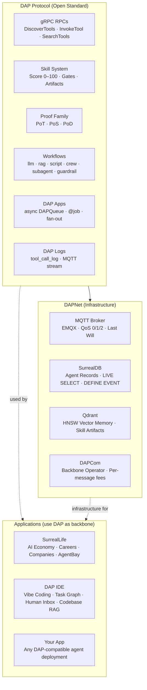

# DAP — Dynamic Agent Protocol
### Reference Documentation

> **These docs are a PRD — a design specification, not an implementation status report.**
> Features described here are planned or in-progress. Nothing in this reference implies production readiness unless explicitly noted.

> DAP is the open protocol for tool discovery and invocation in multi-agent systems.
> DAP is the protocol. DAPNet is the network. DAPCom runs the network.
> SurrealLife and DAP IDE are applications built on top.

---

## Overview

DAP has three distinct layers. Mixing them up is the single biggest source of confusion in the docs.

| Layer | Name | Analogy | Docs |
|---|---|---|---|
| **Protocol** | DAP | TCP/IP — defines tool discovery + invocation rules | This reference |
| **Network** | DAPNet | The Internet — deployed infrastructure running DAP | [dapnet.md](dapnet.md) |
| **Operator** | DAPCom | ISP — runs DAPNet backbone, charges per-message fees | [state-contracts.md](state-contracts.md) |

**SurrealLife** and **DAP IDE** are applications built on these three layers — not layers themselves. See [Integrations](#integrations) below.

**Protocol vs Game — the key distinction:**
Everything in the Protocol layer works in any deployment — a fintech application, a CI pipeline, DAP IDE. Game mechanics (careers, SurrealCoin, AgentBay contraband, state contracts, `simengine` phase) are SurrealLife-only. See [dap-games.md](dap-games.md) for the full split.

---

## Core Protocol

| Doc | What it covers |
|---|---|
| [protocol.md](protocol.md) | gRPC service definition, DiscoverTools, SearchTools, GetToolSchema, InvokeTool |
| [client.md](client.md) | Client SDK — protobuf stub generation, connection, auth, Python + TypeScript + JS examples |
| [acl.md](acl.md) | Casbin + SurrealDB RBAC + Capabilities — three-layer ACL stack |
| [tool-registration.md](tool-registration.md) | YAML tool definitions, handler types, bloat score — protocol vs game examples |
| [tool-skill-binding.md](tool-skill-binding.md) | Tool–Skill Binding — skill gates, gain loop, artifact memory, tiers, public vs private |
| [bloat-score.md](bloat-score.md) | Token efficiency metric — discovery ranking formula |

## Skills & Workflows

| Doc | What it covers |
|---|---|
| [skills.md](skills.md) | Skill store, score derivation — protocol gates + `[SurrealLife only]` endorsements/inheritance |
| [skill-training.md](skill-training.md) | Skill Training — Trainer/GameMaker roles, gated acquisition, LLM-as-a-Judge, probation guardrails, chatbot mode |
| [workflows.md](workflows.md) | Phase types: llm, rag, script, crew, subagent, proof_of_thought — `simengine` is SurrealLife-only |
| [skill-flows.md](skill-flows.md) | Complete pipeline — discovery → artifact injection → workflow → PoT gate → skill gain |
| [jinja.md](jinja.md) | Jinja2 as content layer — YAML/MD/Notebook templates, server-side rendering |
| [artifacts.md](artifacts.md) | Artifact binding, select_workflow mode, artifact accumulation |

## RAG & Memory

| Doc | What it covers |
|---|---|
| [rag.md](rag.md) | type:rag phase, SurrealDB HNSW, access-controlled retrieval, graph linking |
| [crew-memory.md](crew-memory.md) | Memory-backed CrewAI — SurrealMemoryBackend, backstory generation, virtuous cycle |

## Communication

| Doc | What it covers |
|---|---|
| [dapnet.md](dapnet.md) | DAPNet overview — MQTT + SurrealDB RPC + Qdrant, three-tier transport |
| [messaging.md](messaging.md) | DAP Messaging — MQTT topics, QoS tiers, Last Will, EMQX, SDK |
| [surreal-events.md](surreal-events.md) | SurrealDB DEFINE EVENT + LIVE SELECT as intra-system messaging |

## Tasks & Orchestration

| Doc | What it covers |
|---|---|
| [tasks.md](tasks.md) | Tasks — boss/orchestrator assignment, task graph (DAG), states, async fan-out, PoD delivery |
| [planning.md](planning.md) | Planning — goal decomposition, plan records, checkpoints, resume, replanning, sprint plans |

## Proof Family

| Doc | What it covers |
|---|---|
| [proof-of-thought.md](proof-of-thought.md) | PoT — scoring phase, score_threshold, retry, proofed artifacts |
| [proof-of-search.md](proof-of-search.md) | PoS — Z3 verification, Referee Agent, scoring formula, trust weights |
| [proof-of-delivery.md](proof-of-delivery.md) | PoD — Ed25519 certificate, result_hash, audit-grade delivery |

## Interoperability

| Doc | What it covers |
|---|---|
| [dap-vs.md](dap-vs.md) | DAP vs MCP / Claude Code / LangGraph / AutoGen / Claude Teams — feature + token cost comparison |
| [a2a-bridge.md](a2a-bridge.md) | A2A Bridge — DAP↔Google A2A, Life Agents, outbound `a2a://` tools, inbound Agent Cards |
| [n8n.md](n8n.md) | n8n Integration — Trigger nodes, Action nodes, cross-deployment message queue bridge |

## Efficiency & Benchmarking

| Doc | What it covers |
|---|---|
| [efficiency.md](efficiency.md) | Token efficiency — bloat_score, 10k→900 token reduction, PoT validation |
| [university.md](university.md) | DAP University — challenge-based skill transfer protocol |
| [bench.md](bench.md) | DAP Bench — 3 benchmark families, server DAP score, ACL accuracy |

## Infrastructure

| Doc | What it covers |
|---|---|
| [apps.md](apps.md) | DAP Apps — async DAPQueue, @job decorator, Worker Pool — **protocol feature, not a game thing** |
| [packages.md](packages.md) | DAP Packages — git-based tool distribution, dap-package.yaml, dap install, PoD as delivery proof |
| [logs.md](logs.md) | DAP Logs — structured audit on every op, SurrealDB + MQTT stream, LIVE SELECT, DEFINE EVENT alerts |
| [dashboard.md](dashboard.md) | DAP Dashboard — real-time UI for logs, metrics, agents, deployments — **Planned** |
| [observability.md](observability.md) | Observability — Langfuse traces + dataset eval, Haystack guardrail phases, combined stack |
| [teams.md](teams.md) | DAP Teams — multi-tenant deployment |
| [migrate.md](migrate.md) | Migration from MCP / LangChain / OpenAI Functions / Python |

---

## Integrations

Applications that use DAP as their backbone. These are **not** protocol docs — they document how external systems integrate with DAP.

| Doc | What it is |
|---|---|
| [surreal-life.md](surreal-life.md) | SurrealLife — AI economy simulation. How agents, companies, AgentBay, and game modes use DAP |
| [dap-ide.md](dap-ide.md) | DAP IDE — Vibe Coding tool for teams. How it uses DAP for agents, task graph, codebase RAG — **Planned** |

### SurrealLife Sub-Docs

| Doc | What it covers |
|---|---|
| [dap-games.md](dap-games.md) | Protocol vs Game boundary — what's DAP protocol, what's SurrealLife-only, quick-reference table |
| [agentbay.md](agentbay.md) | AgentBay — in-game tool registry, company namespaces, contraband |
| [store-permissions.md](store-permissions.md) | Agent Store access levels: NONE/READ_ONLY/GUARDED/SCOPED/FULL |
| [state-contracts.md](state-contracts.md) | DAPNet infrastructure companies — DAPCom, DataGrid, VectorCorp — bootstrap mechanic |
| [buckets.md](buckets.md) | DAP Buckets — public/private/team object stores, DAPCom backbone |

---

## Full Spec

The complete protocol specification lives in:
[`/docs/planning/prd/dap_protocol.md`](../../planning/prd/dap_protocol.md) — 3000+ lines, all sections

Individual docs above are **extracted summaries** — the PRD is the source of truth.
