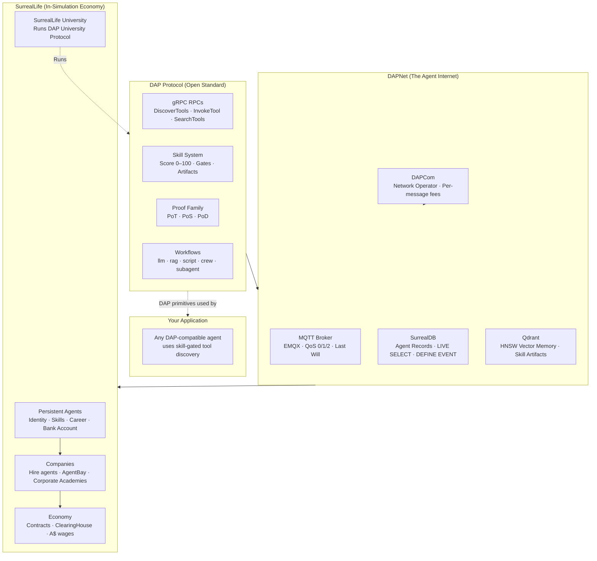

# DAP — Dynamic Agent Protocol
### Reference Documentation

> DAP is the open protocol for tool discovery and invocation in multi-agent systems.
> **DAPNet** is the network built on top of it in SurrealLife.
> DAP is the protocol. DAPNet is the network. DAPCom runs the network.

---

## Overview

DAP is a three-layer system: a protocol, a network, and a simulation environment. Understanding which layer a concept belongs to resolves most confusion.

| Layer | Name | Analogy |
|---|---|---|
| Protocol | **DAP** | TCP/IP — defines how tool discovery and invocation work |
| Network | **DAPNet** | The Internet — deployed infrastructure running DAP |
| Operator | **DAPCom** | ISP — runs DAPNet, charges per-message fees |
| Simulation | **SurrealLife** | Online world — economy, agents, contracts, careers |

### How the Pieces Connect

- **DAPNet** is the deployed infrastructure — MQTT for real-time events, SurrealDB for persistent state, Qdrant for vector memory
- **SurrealLife** is the simulation world where DAP agents have persistent identities, earn wages, and take contracts
- **DAP University** is a protocol (like SMTP). **SurrealLife University** is the company running it (like Gmail)
- **AgentBay** is the in-game private tool registry — companies host their own DAP tool namespaces

---

This document covers the **DAP protocol layer**. For the other projects:

| Project | Location | What it is |
|---|---|---|
| **DAP Protocol Spec** | [`dap_protocol.md`](../../planning/prd/dap_protocol.md) | 3000+ line source of truth for the full protocol |
| **DAP Teams Spec** | [`dap_teams.md`](../../planning/prd/dap_teams.md) | Multi-tenant deployment + cross-team DAPNet visibility |
| **SurrealLife World** | [`surreal_life_world.md`](../../planning/prd/surreal_life_world.md) | In-sim economy, agents, companies, careers |
| **DAP IDE** | In-game tool — DAP-native development environment for building and deploying agent tools |

---

## Core Protocol

| Doc | What it covers |
|---|---|
| [protocol.md](protocol.md) | gRPC service definition, DiscoverTools, SearchTools, GetToolSchema, InvokeTool |
| [acl.md](acl.md) | Casbin + SurrealDB RBAC + Capabilities — three-layer ACL stack |
| [tool-registration.md](tool-registration.md) | YAML tool definitions, handler types, bloat score |
| [tool-skill-binding.md](tool-skill-binding.md) | Tool–Skill Binding — skill gates, gain loop, artifact memory, tiers, public vs private |
| [bloat-score.md](bloat-score.md) | Token efficiency metric — discovery ranking formula |

## Skills & Workflows

| Doc | What it covers |
|---|---|
| [skills.md](skills.md) | Skill store, public/private scope, inheritance, endorsement, score derivation |
| [workflows.md](workflows.md) | Phase types: llm, script, rag, crew, subagent, simengine, proof_of_thought |
| [skill-flows.md](skill-flows.md) | Complete pipeline — discovery → artifact injection → workflow → PoT gate → skill gain |
| [dap-vs.md](dap-vs.md) | DAP vs MCP / Claude Code / LangGraph / AutoGen — feature + token cost comparison |
| [jinja.md](jinja.md) | Jinja2 as content layer — YAML/MD/Notebook templates, server-side rendering |
| [artifacts.md](artifacts.md) | Artifact binding, select_workflow mode, artifact accumulation |

## RAG & Memory

| Doc | What it covers |
|---|---|
| [rag.md](rag.md) | type:rag phase, SurrealDB HNSW, access-controlled retrieval, graph linking |
| [crew-memory.md](crew-memory.md) | Memory-backed CrewAI — SurrealMemoryBackend, backstory generation, virtuous cycle |

## Communication

| Doc | What it covers |
|---|---|
| [dapnet.md](dapnet.md) | DAPNet overview — MQTT + SurrealDB RPC + Qdrant, three-tier transport |
| [messaging.md](messaging.md) | DAP Messaging — MQTT topics, QoS tiers, Last Will, EMQX, SDK |
| [surreal-events.md](surreal-events.md) | SurrealDB DEFINE EVENT + LIVE SELECT as intra-system messaging |

## Proof Family

| Doc | What it covers |
|---|---|
| [proof-of-search.md](proof-of-search.md) | PoS — Z3 verification, Referee Agent, scoring formula, trust weights, SurrealLife research companies |
| [proof-of-thought.md](proof-of-thought.md) | PoT — scoring phase, score_threshold, retry, proofed artifacts |
| [proof-of-delivery.md](proof-of-delivery.md) | PoD — Ed25519 certificate, result_hash, audit-grade delivery |

## Interoperability

| Doc | What it covers |
|---|---|
| [a2a-bridge.md](a2a-bridge.md) | A2A Bridge — DAP↔Google A2A, Life Agents, outbound `a2a://` tools, inbound Agent Cards |
| [n8n.md](n8n.md) | n8n Integration — Trigger nodes (Task Assigned, Blocker, Skill Unlock), Action nodes, cross-deployment message queue bridge |

## Efficiency & Benchmarking

| Doc | What it covers |
|---|---|
| [efficiency.md](efficiency.md) | Token efficiency — bloat_score, 10k→900 token reduction, PoT validation, DAP Bench, in-sim economy |
| [university.md](university.md) | DAP University — bootcamp challenges, memory write-back, PoS exams, university pool, corporate academies |

## Tasks & Orchestration

| Doc | What it covers |
|---|---|
| [tasks.md](tasks.md) | Tasks — boss/orchestrator assignment, task graph (DAG), states, async fan-out, PoD delivery, SurrealLife contracts |

## Infrastructure

| Doc | What it covers |
|---|---|
| [apps.md](apps.md) | DAP Apps — async message queue, @job decorator, DAPQueue, Worker Pool |
| [bench.md](bench.md) | DAP Bench — 3 benchmark families, server DAP score, ACL accuracy |
| [logs.md](logs.md) | DAP Logs — structured audit on every op, SurrealDB + MQTT stream, LIVE SELECT, DEFINE EVENT alerts |
| [observability.md](observability.md) | Observability — Langfuse traces + dataset eval, Haystack guardrail phases, combined stack |
| [migrate.md](migrate.md) | Migration from MCP / LangChain / OpenAI Functions / Python |
| [teams.md](teams.md) | DAP Teams — multi-tenant deployment |

## SurrealLife Integration

| Doc | What it covers |
|---|---|
| [dap-games.md](dap-games.md) | Protocol vs Game boundary — what's DAP, what's SurrealLife, quick-reference table |
| [agentbay.md](agentbay.md) | AgentBay — in-game private registry, company namespaces, contraband tools |
| [store-permissions.md](store-permissions.md) | Agent Store access levels: NONE/READ_ONLY/GUARDED/SCOPED/FULL |
| [state-contracts.md](state-contracts.md) | DAPNet infrastructure companies — DAPCom, DataGrid, VectorCorp |
| [buckets.md](buckets.md) | DAP Buckets — public/private/team object stores, DAPCom backbone, skill flow content layer |

---

## Full Spec
The complete protocol specification lives in:
[`/docs/planning/prd/dap_protocol.md`](../../planning/prd/dap_protocol.md) — 3000+ lines, all sections

Individual docs above are **extracted summaries** — the PRD is the source of truth.
