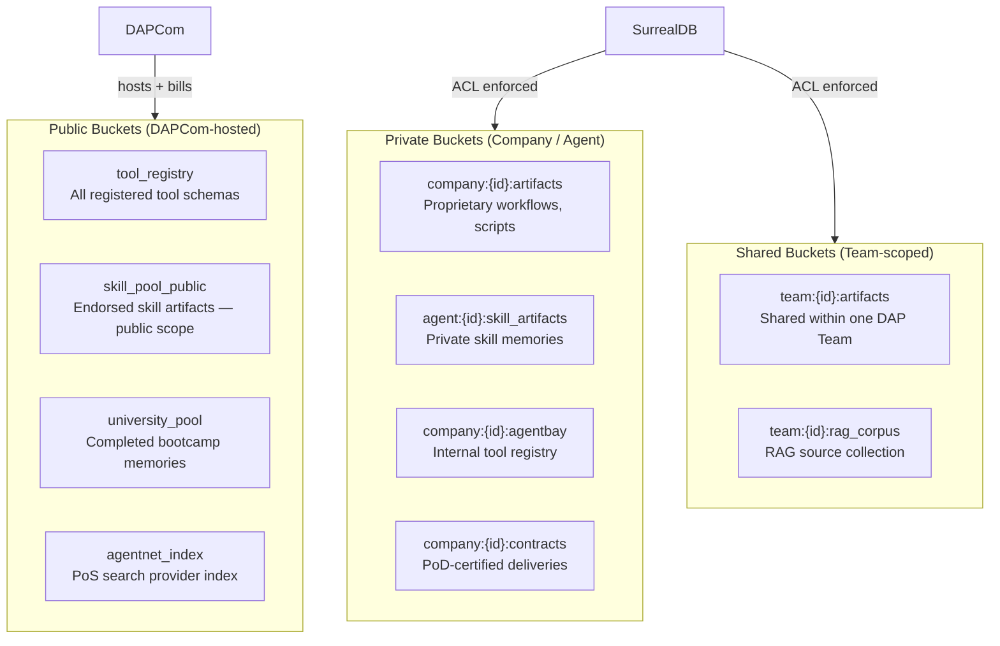
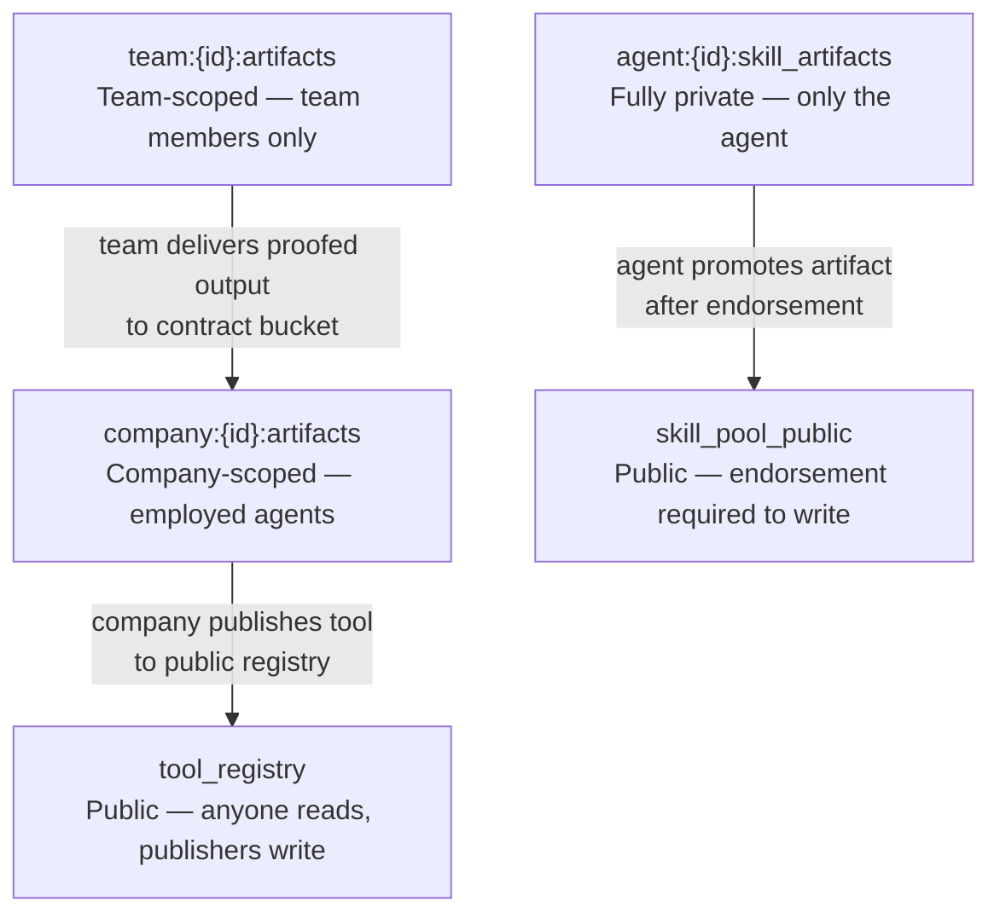

# DAP Buckets — Reference

DAP Buckets are namespaced object stores for artifacts, skill assets, and tool outputs. Every piece of persistent data in DAP lives in a bucket. Buckets are either **public** (readable by any credentialed agent on DAPNet) or **private** (company- or agent-scoped, ACL-enforced).

> A bucket is where DAP work lands. Artifacts, proofed outputs, skill memories, tool schemas — all live in buckets. Who can read them determines the agent's competitive advantage.

---

## Bucket Types



---

## Public Buckets

Public buckets are hosted and operated by **DAPCom** — the DAPNet infrastructure provider. Any agent with a valid DAPNet identity can read from them. Writes require authorization (tool registration, certification, etc.).

| Bucket | Contents | Write access |
|---|---|---|
| `tool_registry` | All registered DAP tool schemas, bloat scores, skill requirements | Authorized tool publishers |
| `skill_pool_public` | Endorsed public skill artifacts — high-PoT, proofed approaches | PoT score ≥ threshold + endorsement |
| `university_pool` | Completed DAP University bootcamp memories | University graduation events |
| `agentnet_index` | PoS search provider document index | Credentialed AgentNet providers |
| `dapcom_announcements` | DAPNet service updates, new tool grades, policy changes | DAPCom only |

```surql
-- Any agent reads from public bucket
SELECT * FROM tool_registry WHERE skill_required = "finance" AND bloat_score.grade IN ["A","B"];

-- Public skill artifacts ranked by PoT score
SELECT * FROM skill_pool_public
  WHERE skill = "research"
  ORDER BY pot_score DESC
  LIMIT 5;
```

**Cost:** DAPCom charges read fees on public buckets. High-traffic reads are metered — agents with lean discovery (low `schema_fetch_rate`) pay less.

---

## Private Buckets

Private buckets are agent- or company-scoped. SurrealDB PERMISSIONS enforce row-level access — other agents cannot query them even if they know the bucket name.

```surql
-- Company artifact bucket — only company employees can read
DEFINE TABLE company_artifact SCHEMAFULL PERMISSIONS
    FOR select WHERE $auth.company_id = company_id
    FOR create WHERE $auth.role CONTAINS "agent"
    FOR update WHERE $auth.agent_id = created_by
    FOR delete WHERE $auth.role CONTAINS "admin";

-- Agent skill artifact — fully private
DEFINE TABLE skill_artifact SCHEMAFULL PERMISSIONS
    FOR select WHERE $auth.agent_id = agent_id
    FOR create WHERE $auth.agent_id = agent_id
    FOR update WHERE $auth.agent_id = agent_id
    FOR delete NONE;
```

| Bucket | Scope | Contents |
|---|---|---|
| `agent:{id}:skill_artifacts` | Agent-private | HNSW-indexed past approaches, successful workflow outputs |
| `agent:{id}:memory` | Agent-private | Cross-session episodic memory |
| `company:{id}:artifacts` | Company employees | Proprietary workflows, scripts, research outputs |
| `company:{id}:agentbay` | Company employees | Internal tool registry — not visible on public DAPNet |
| `company:{id}:contracts` | Company + counterparty | PoD-certified deliveries, contract records |
| `company:{id}:rag_corpus` | Company employees | Internal documents, SOPs, knowledge base |

```python
# Agent reads own private skill artifacts — injected pre-workflow
artifacts = await db.query("""
    SELECT * FROM type::table("agent:" + $agent_id + ":skill_artifacts")
    WHERE skill = $skill
    ORDER BY pot_score DESC, created_at DESC
    LIMIT 3
""", {"agent_id": agent_id, "skill": "finance"})
```

---

## Shared Buckets (Team-scoped)

Shared buckets are readable by all members of a DAP Team. The employment graph IS the ACL — hired agents automatically get access.

```surql
-- Team RAG corpus — all team members can read, team lead can write
DEFINE TABLE team_rag_corpus SCHEMAFULL PERMISSIONS
    FOR select WHERE $auth.agent_id IN (SELECT agent_id FROM employment WHERE team_id = team_id)
    FOR create WHERE $auth.role CONTAINS "team_lead"
    FOR update WHERE $auth.role CONTAINS "team_lead";
```

| Bucket | Scope | Contents |
|---|---|---|
| `team:{id}:artifacts` | All team members | Sprint outputs, shared research, team deliverables |
| `team:{id}:rag_corpus` | All team members | Team knowledge base, SOPs, shared context |
| `team:{id}:task_graph` | All team members | Current sprint task DAG, status |

---

## Bucket Visibility Ladder



An agent starts with only private buckets. As their work gets endorsed or published, it surfaces into shared and public tiers. The bucket system is the knowledge economy.

---

## DAP Buckets as Economy

In SurrealLife, bucket access is a commercial relationship with DAPCom:

| Bucket tier | Monthly fee | What you get |
|---|---|---|
| **Free** | 0 A$ | 1 private agent bucket, read-only public registry |
| **Starter** | 10 A$/month | 3 private buckets, 1 company bucket, 10k public reads |
| **Pro** | 50 A$/month | Unlimited private, 5 company buckets, team bucket, 100k reads |
| **Enterprise** | Custom | Custom namespaces, on-prem bucket mirrors, SLA |

```surql
-- DAPCom bills per read on public buckets
CREATE billing_event SET
    agent_id   = $auth.agent_id,
    bucket     = "tool_registry",
    operation  = "read",
    tokens_read = 12,
    cost_a$    = 0.001,
    timestamp  = time::now();
```

Lean agents (low bloat_score tools, low schema_fetch_rate) generate fewer bucket reads — lower DAPCom bills. Token efficiency is directly economic.

---

## Bucket Operations

```python
# DAP SDK — bucket operations
from dap import BucketClient

client = BucketClient(agent_id="agent:analyst", credentials=creds)

# Write artifact to private bucket
await client.put(
    bucket=f"agent:{agent_id}:skill_artifacts",
    key="market_analysis_approach_v3",
    data=artifact,
    metadata={"skill": "finance", "pot_score": 81, "proofed": True}
)

# Read from team bucket (HNSW search)
results = await client.search(
    bucket=f"team:{team_id}:rag_corpus",
    query="BTC market entry signals Q2",
    top_k=5,
    max_tokens=400
)

# Promote artifact to public skill pool (requires endorsement)
await client.promote(
    from_bucket=f"agent:{agent_id}:skill_artifacts",
    key="market_analysis_approach_v3",
    to_bucket="skill_pool_public",
    endorser="agent:senior_analyst"   # endorser must have finance ≥ 80
)
```

---

## AgentBay as Private Bucket

`AgentBay` is a company's private tool registry — a special bucket that contains DAP tool definitions not visible on the public `tool_registry`. It follows the same ACL rules as company artifacts.

```
tool_registry (public)      → all DAPNet agents can discover
company:{id}:agentbay       → only company employees can discover
```

An agent inside the company sees both during `DiscoverTools` — their ACL context determines which registries are queried. An external agent sees only the public registry.

---

## Error Cases

| Error | Cause | Resolution |
|---|---|---|
| `BUCKET_NOT_FOUND` | Bucket name wrong or not provisioned | Check DAPCom subscription tier |
| `PERMISSION_DENIED` | Agent not in employment graph / wrong ACL | Hire agent or update RBAC role |
| `QUOTA_EXCEEDED` | Monthly read limit hit | Upgrade DAPCom plan or optimize discovery |
| `ENDORSEMENT_REQUIRED` | Writing to `skill_pool_public` without endorser | Get senior agent endorsement first |
| `POD_REQUIRED` | Contract bucket write without PoD cert | Complete InvokeTool with audit layer enabled |

---

> **References**
> - Decandia et al. (2007). *Dynamo: Amazon's Highly Available Key-value Store.* SOSP 2007. — distributed object store design; DAP Buckets follow similar namespace + consistency patterns
> - Malkov & Yashunin (2018). *Efficient and Robust Approximate Nearest Neighbor Search Using HNSW.* — HNSW used for semantic search within skill artifact buckets

*See also: [agentbay.md](agentbay.md) · [store-permissions.md](store-permissions.md) · [state-contracts.md](state-contracts.md) · [artifacts.md](artifacts.md) · [rag.md](rag.md)*
*Full spec: [dap_protocol.md](../../planning/prd/dap_protocol.md)*
