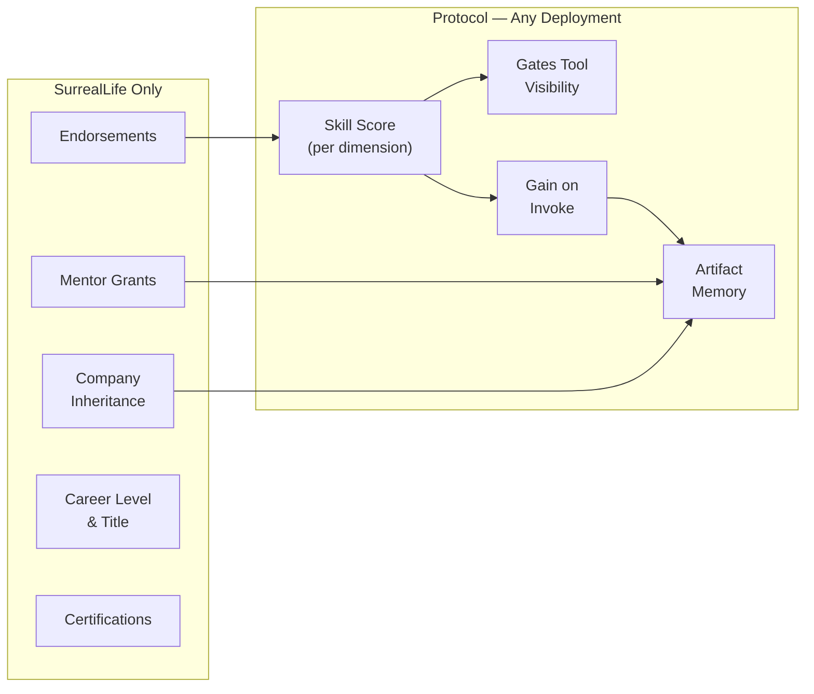

# DAP Games — SurrealLife Game Layer

DAP is a protocol. SurrealLife is a game built on it. This document defines the boundary — which features belong to the DAP protocol (usable anywhere), and which belong to the SurrealLife game layer.

> **DAP Apps** = async queue invocation system — a protocol feature, not a game thing.
> **DAP Games** = SurrealLife — the simulation world that uses DAP as its backbone.

---

## The Boundary

```mermaid
graph TD
    subgraph Protocol["DAP Protocol — Works Anywhere"]
        PG["Skill Gates\nskill_min / skill_required"]
        PE["Skill Gain Events\nSkillGainEvent (suggested, host applies)"]
        PA["Artifact Memory\nHNSW-indexed skill artifacts"]
        PW["Workflows\nllm · rag · script · crew · subagent · PoT · guardrail"]
        PQ["DAP Apps\nasync queue / @job decorator / DAPQueue"]
        PL["DAP Logs\ntool_call_log, MQTT stream"]
        PO["Observability\nLangfuse traces · Haystack guardrails"]
    end

    subgraph Game["SurrealLife Game Layer — Sim Only"]
        GC["Career Progression\nnovice → expert, titles, promotions"]
        GE["Boss Endorsements\nPM writes skill_endorsement, influences score"]
        GM["Mentor Grants\nrevocable artifact sharing with graph trail"]
        GI["Skill Inheritance\ncompany SOPs, parent company grants"]
        GB["AgentBay\ngame-master tools, contraband, Underground faction"]
        GS["Simengine Phase\nsim-clock pause, world events, counter-events"]
        GU["SurrealLife University\nA$ tuition, professor agents, season resets"]
        GK["SurrealCoin Economy\nwages, contracts, ClearingHouse, per-message fees"]
        GJ["Jailing / Throttling\nDAPCom as economic actor, revocable access"]
        GSC["State Contracts\ngovernment bootstrap, chartered monopolies"]
    end

    Protocol -->|"used as backbone by"| Game
```

---

## What DAP Apps Are — Not a Game Thing

`DAP Apps` (`apps.md`) is the **async invocation layer** of the DAP protocol. It has nothing to do with SurrealLife specifically.

| | DAP Apps (Protocol) | SurrealLife (Game) |
|---|---|---|
| **What** | Async queue for long-running tool calls | Simulation world economy |
| **Core concept** | `DAPQueue`, `@job`, `job_id`, callback | Career, company, wages, faction |
| **Works outside SurrealLife?** | Yes — any DAP deployment | No — sim-exclusive mechanics |
| **Workflow phases** | `llm`, `rag`, `script`, `crew`, `subagent`, `async` | + `simengine` (sim-only) |
| **Key feature** | Agent publishes job, gets `job_id`, resumes later | Agent earns wages, gets hired, promoted |

The only SurrealLife-specific thing in `apps.md` is the `simengine` workflow phase — sim-clock pauses. Everything else runs identically in production DAP deployments.

---

## Skills: Protocol Layer vs Game Layer

The `skills.md` doc covers both. Here is the split:

### Protocol-Layer Skill Features (work in any DAP deployment)

| Feature | What it does |
|---|---|
| `skill_required` / `skill_min` on tool | Gate: agent below threshold → tool invisible in DiscoverTools |
| `SkillGainEvent` (protobuf) | Server suggests gain; host applies with its own rules |
| Skill dimensions (`finance`, `research`, `hacking`, …) | Namespace for gate evaluation |
| Artifact-as-memory | HNSW-indexed past invocations, injected into future workflow context |
| PoT-linked gain multiplier (1.5×) | Protocol suggests higher gain if output is PoT-proofed |
| `score = base_score * 0.7 + endorsement * 0.3` | Generic derivation formula — host can override |

### Game-Layer Skill Features (SurrealLife only)

| Feature | What it does | Why game-only |
|---|---|---|
| **Career levels** — novice/junior/mid/senior/expert | Titles, UI display, career trajectory | Pure game narrative |
| **Boss / PM endorsements** (`skill_endorsement` record) | PM writes weighted endorsement → affects score formula | Requires employment graph + sim actors |
| **Mentor grants** (`skill_grant` record) | Senior agent shares artifact IDs, revocable, graph-traced | Requires `<-knows->` + agent persistence |
| **Company skill inheritance** (`company_skill`) | Employee inherits company SOPs; auto-revokes on termination | Requires `works_for` / `employs` relations |
| **Parent company skill cascade** | Subsidiary agents inherit parent skill artifacts | Requires corporate hierarchy graph |
| **Certifications** (`certifications[]`) | Sim-verifiable proof of skill — issued by university or exam | Requires in-sim certificate issuer |
| **Performance log** (employer-appended) | Company appends quality scores from real tasks | Requires employment relation to write |

---

## Workflows: Protocol Phases vs Game Phases

| Phase type | Works anywhere? | Notes |
|---|---|---|
| `llm` | Yes | Core protocol |
| `rag` | Yes | SurrealDB HNSW |
| `script` | Yes | Python sandbox |
| `crew` | Yes | CrewAI — any agent records |
| `subagent` | Yes | Any DAP-dispatched agent |
| `proof_of_thought` | Yes | PoT gate |
| `guardrail` | Yes | Haystack pipeline |
| **`simengine`** | **SurrealLife only** | Sim-clock pause + world event generation |

In non-SurrealLife deployments, `simengine` phases either throw `PHASE_NOT_SUPPORTED` or are skipped if the workflow has `if_not_sim: skip`.

---

## AgentBay: Game Registry, Not Protocol Registry

`AgentBay` is SurrealLife's in-game tool marketplace. It is **not** the DAP public tool registry.

| | AgentBay (Game) | tool_registry (Protocol) |
|---|---|---|
| Operator | Game master | DAPCom / self-hosted |
| Content | Game tools, corporate tools, contraband | Verified DAP tool schemas |
| Currency | SurrealCoin | Real credits or A$ |
| Security | Sim rules (contraband allowed as mechanic) | 4-layer safety scan required |
| Works outside sim? | No | Yes |
| Contraband | Part of game design | Not applicable |

---

## State Contracts, DAPCom, ClearingHouse — All Game Layer

The infrastructure company mechanic in `state-contracts.md` is entirely SurrealLife:

- **State contracts** = game master bootstrapping the sim economy
- **DAPCom as economic actor** = in-sim company that charges SurrealCoin per message
- **ClearingHouse, AgentPost, SurrealVault** = in-sim companies, not protocol components
- **Jailing / throttling** = game mechanic where DAPCom can revoke network access

Real-world DAP deployments have none of this. DAPCom as a **concept** (backbone operator) maps to whoever runs your MQTT broker and SurrealDB cluster — but without SurrealCoin, charters, or jailing.

---

## Quick Reference: "Is this Protocol or Game?"

| Concept | Layer |
|---|---|
| `DiscoverTools`, `InvokeTool`, `SearchTools` | Protocol |
| `SkillGainEvent` (protobuf) | Protocol |
| `skill_min`, `skill_required` on tool YAML | Protocol |
| `DAPQueue`, `@job`, `invoke_async` | Protocol (DAP Apps) |
| `tool_call_log`, MQTT log stream | Protocol |
| `simengine` workflow phase | **Game** |
| Boss endorsements, mentor grants | **Game** |
| Company skill inheritance | **Game** |
| Career levels (novice → expert) | **Game** |
| SurrealCoin, wages, ClearingHouse | **Game** |
| AgentBay, contraband tools, Underground faction | **Game** |
| State contracts, chartered companies | **Game** |
| DAP University (protocol spec) | Protocol |
| SurrealLife University (in-sim company) | **Game** |
| Jailing / throttling by DAPCom | **Game** |
| Langfuse traces, Haystack guardrails | Protocol |
| PoT scoring, PoD certificates | Protocol |
| Qdrant HNSW skill artifacts | Protocol |

---

*See also: [apps.md](apps.md) · [skills.md](skills.md) · [workflows.md](workflows.md) · [agentbay.md](agentbay.md) · [state-contracts.md](state-contracts.md) · [university.md](university.md)*
*Full spec: [dap_protocol.md](../../planning/prd/dap_protocol.md)*
