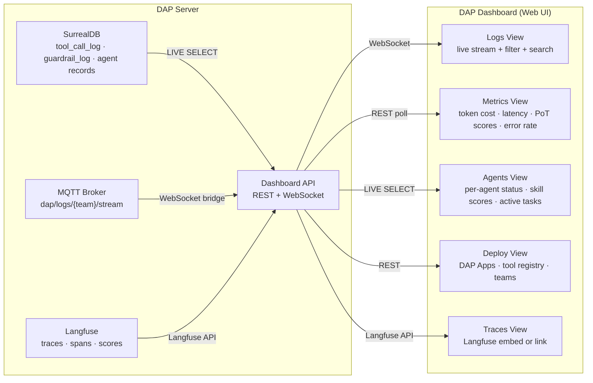
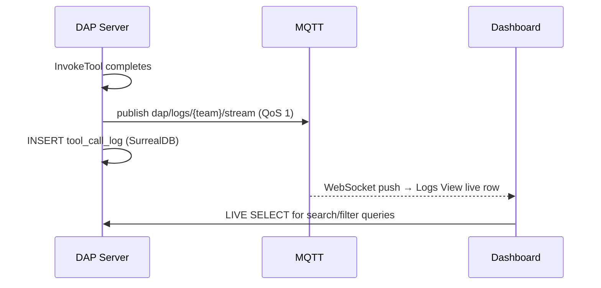
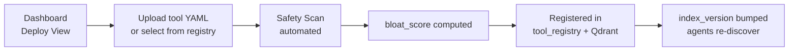

# DAP Dashboard — Reference

> **Status: Planned.** The DAP Dashboard is a designed application — not yet implemented.

The DAP Dashboard is a real-time web UI for monitoring and operating a DAP deployment. It provides live views of logs, agent metrics, tool performance, and deployment state — and lets operators deploy DAP Apps, register tools, and manage teams without touching config files.

> One UI for the full stack: see what every agent is doing, how much it costs, which tools are failing, and deploy new apps — all from a browser.

---

## Architecture



---

## Logs View

Real-time stream of every `tool_call_log` entry, filterable by agent, team, outcome, and tool:



**Filter options:**
- `outcome`: success / error / pot_failed / skill_insufficient / guardrail_blocked
- `agent_id`, `tool_name`, `team_id`
- Time range
- `pot_score` threshold (e.g. show only low-quality invocations)
- `token_cost` range (find expensive calls)

**Log row fields shown:**
`timestamp · agent · tool · outcome · pot_score · latency_ms · token_cost · trace_id →`

Clicking `trace_id` opens the Langfuse trace for that invocation.

---

## Metrics View

Aggregated analytics over `tool_call_log`. Updated on interval (configurable, default 30s) or on-demand:

### Token Cost

```surql
-- Top 10 most expensive agents (last 24h)
SELECT agent_id, math::sum(token_cost) AS total_tokens
FROM tool_call_log
WHERE created_at > time::now() - 24h
GROUP BY agent_id
ORDER BY total_tokens DESC
LIMIT 10;
```

### PoT Score Distribution

```surql
-- PoT score histogram per tool (last 7d)
SELECT tool_name,
    math::mean(pot_score)  AS avg_score,
    math::min(pot_score)   AS min_score,
    math::max(pot_score)   AS max_score,
    count()                AS invocations
FROM tool_call_log
WHERE pot_score IS NOT NONE
  AND created_at > time::now() - 7d
GROUP BY tool_name
ORDER BY avg_score ASC;
```

### Error Rate

```surql
SELECT tool_name,
    count() AS total,
    math::sum(IF outcome != "success" THEN 1 ELSE 0 END) AS errors,
    math::sum(IF outcome != "success" THEN 1 ELSE 0 END) / count() AS error_rate
FROM tool_call_log
WHERE created_at > time::now() - 24h
GROUP BY tool_name
ORDER BY error_rate DESC;
```

**Metric panels:**
| Panel | What it shows |
|---|---|
| Token cost / agent | Bar chart, last 24h |
| Latency p50/p95/p99 | Per tool, last 7d |
| PoT score trend | Line chart per tool over time |
| Error rate heatmap | Tool × outcome matrix |
| Skill gain velocity | Gain events per agent per hour |
| Guardrail block rate | Input vs output blocks per pipeline |

---

## Agents View

Live view of every agent in the deployment:

```surql
-- Live agent status via LIVE SELECT
LIVE SELECT id, status, current_task, skill_scores, token_used_today
FROM agent WHERE team_id = $team_id;
```

**Per-agent panel shows:**
- Status: `active / idle / blocked / offline`
- Current task (if any) with elapsed time
- Skill scores per dimension (bar chart 0–100)
- Token cost today
- Last 5 invocations with outcome badges
- `[Nudge]` button → inject instruction into running agent without stopping it

---

## Deploy View

Manage DAP Apps, tool registry, and teams from the UI — no config files required.

### Deploy a DAP App



**Deploy panel actions:**
| Action | What it does |
|---|---|
| **Upload Tool YAML** | Submit new tool definition → safety scan → register |
| **Deploy Worker** | Start a DAPQueue worker for async tool jobs |
| **Register Workflow** | Upload workflow YAML, link to existing tool |
| **Update Tool** | Upload new version → old deprecated, agents re-discover |
| **Deprecate Tool** | Mark old version — still callable, not returned by DiscoverTools |
| **Create Team** | Provision new DAP Team namespace (multi-tenant) |
| **Add Agent** | Create agent record with initial skill scores and roles |

### Tool Registry Table

Live view of all registered tools:

| Tool | Version | bloat_score | skill_min | Invocations 24h | Error rate | Actions |
|---|---|---|---|---|---|---|
| `market_analysis` | 1.2.0 | 66 (A) | 40 | 847 | 2.1% | Edit · Deprecate |
| `portfolio_optimizer` | 0.9.1 | 112 (B) | 60 | 203 | 0.5% | Edit · Deprecate |

Clicking a tool opens its full YAML, bloat breakdown, invocation history, and PoT score distribution.

### Team Management

```surql
-- Create new team namespace
CREATE team SET
    id       = team:ulid(),
    name     = "quant_desk",
    plan     = "pro",
    created_at = time::now();
```

From the UI: create team → set plan → assign agents → configure ACL roles. Teams are fully isolated — agents in `team:quant_desk` cannot see tools or logs from `team:algo_research`.

---

## Traces View

Embeds or links to Langfuse for deep LLM observability:

- Click any `trace_id` in Logs View → opens Langfuse trace detail
- Timeline: spans per phase (guardrail / artifact fetch / llm / PoT)
- Token breakdown per generation
- PoT score annotation on trace
- Dataset evaluation runs (compare model versions)

If Langfuse is self-hosted, the dashboard embeds it in an iframe. If external, links open in a new tab.

---

## API

The Dashboard API exposes the same queries as REST endpoints for external tooling (n8n, Grafana, custom scripts):

```
GET  /api/logs?team=quant_desk&outcome=pot_failed&limit=100
GET  /api/metrics/tokens?agent=market_analyst&since=24h
GET  /api/agents?team=quant_desk&status=active
GET  /api/tools?grade=A&team=quant_desk
POST /api/tools          — register new tool (YAML body)
POST /api/teams          — create team
POST /api/workers/deploy — start DAPQueue worker
PATCH /api/agents/{id}  — update agent (skills, status, nudge)
```

All endpoints require team-scoped auth (`Authorization: Bearer <agent_token>`). Admins see all teams; agents see only their own team.

---

## Deployment

The Dashboard is a standalone web app that connects to the DAP server's SurrealDB and MQTT:

```yaml
# docker-compose.yml addition
dap-dashboard:
  image: dap/dashboard:latest
  ports:
    - "3200:3000"
  environment:
    SURREAL_URL: ws://surrealdb:8000/rpc
    SURREAL_NS: dap
    SURREAL_DB: prod
    MQTT_URL: mqtt://emqx:1883
    LANGFUSE_URL: http://langfuse:3100
    DAP_GRPC_URL: grpc://dap-server:50051
    AUTH_SECRET: your-secret
```

No separate database — the Dashboard reads directly from `tool_call_log`, `agent`, `tool_registry`, and subscribes to the MQTT log stream.

---

*See also: [logs.md](logs.md) · [observability.md](observability.md) · [apps.md](apps.md) · [teams.md](teams.md) · [n8n.md](n8n.md)*
*Full spec: [dap_protocol.md](../../planning/prd/dap_protocol.md)*
