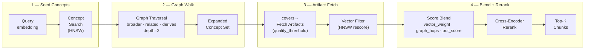

# DAP GraphRAG — Reference

> **Status: Planned / Future.** This is a PRD-level design. GraphRAG is not yet implemented in DAP. It is a planned extension of the `type: rag` workflow phase.

DAP GraphRAG extends the `type: rag` phase with ontology-driven graph traversal. Instead of pure vector similarity, it combines HNSW retrieval with graph walks — and the ontology grows automatically from skill gain events, tool invocations, and artifact accumulation. No manual taxonomy maintenance required.

> Plain RAG finds what is similar. GraphRAG finds what is similar **and** what is related — parent concepts, sibling concepts, proven approaches in adjacent domains.

## Relation to SurrealLife Agent Graph

In SurrealLife, agents are already connected via a social graph (`->knows->`, `->works_for->`, `->employs->`). The `SurrealMemoryBackend` (see [crew-memory.md](crew-memory.md)) already does HNSW search over an agent's own memories. GraphRAG extends this in two ways:

1. **Cross-agent knowledge** — traverse the `knows` graph to find artifacts from agents you've worked with
2. **Concept taxonomy** — instead of searching raw memories, search a structured ontology that grows from every skill gain event

In a standard DAP deployment (no SurrealLife), the agent social graph does not exist — the ontology replaces it as the connection layer between knowledge pieces.

---

## How It Fits Into Skills

The skill system already records everything GraphRAG needs:

| Skill System | GraphRAG Role |
|---|---|
| Skill dimensions (`finance`, `research`, …) | Ontology root nodes |
| Skill artifacts | Concept-linked knowledge nodes |
| `SkillGainEvent` | Edge creation: `agent →gained_from→ concept` |
| Tool invocations in `tool_call_log` | Automatic concept extraction → taxonomy extension |
| PoT score on artifact | Node quality weight in graph traversal |

The ontology is not a separate system — it is the skill graph, made queryable.

---

## Ontology Schema (SurrealDB)

```surql
-- Concept nodes (ontology terms)
DEFINE TABLE concept SCHEMAFULL;
DEFINE FIELD label     ON concept TYPE string;
DEFINE FIELD dimension ON concept TYPE string;   -- skill dimension root
DEFINE FIELD embedding ON concept TYPE array<float>;
DEFINE FIELD auto_generated ON concept TYPE bool DEFAULT false;

DEFINE INDEX concept_vec ON concept
  FIELDS embedding HNSW DIMENSION 1536 DIST COSINE;

-- Taxonomy edges
DEFINE TABLE broader  TYPE RELATION IN concept OUT concept;  -- narrower → broader
DEFINE TABLE related  TYPE RELATION IN concept OUT concept;  -- peer concepts
DEFINE TABLE covers   TYPE RELATION IN skill_artifact OUT concept;  -- artifact covers concept
DEFINE TABLE derives  TYPE RELATION IN concept OUT concept;  -- concept derived from another
```

**Seed concepts** are created from skill dimension names at deployment time. Every new skill dimension automatically becomes an ontology root.

---

## Adaptive Taxonomy Extension

New concepts are extracted automatically — no manual curation needed:

```python
async def extend_taxonomy(tool_name: str, tool_description: str, db):
    """Called after every SkillGainEvent. Extracts concepts from tool description
    and links them to the ontology if not already present."""

    # Extract candidate concepts via lightweight LLM call
    candidates = await extract_concepts(tool_description)  # returns [{label, dimension}]

    for candidate in candidates:
        # Check if concept already exists (vector similarity > 0.92 = same concept)
        existing = await db.query("""
            SELECT id, label,
                   vector::similarity::cosine(embedding, $vec) AS sim
            FROM concept
            WHERE vector::similarity::cosine(embedding, $vec) > 0.92
            LIMIT 1
        """, vars={"vec": embed(candidate["label"])})

        if not existing:
            # New concept — add to ontology and link to its dimension root
            concept_id = await db.create("concept", {
                "label": candidate["label"],
                "dimension": candidate["dimension"],
                "embedding": embed(candidate["label"]),
                "auto_generated": True
            })
            # Link to dimension root
            root = await db.query("SELECT id FROM concept WHERE label = $dim LIMIT 1",
                                  vars={"dim": candidate["dimension"]})
            if root:
                await db.create("broader", {"in": concept_id, "out": root[0]["id"]})
        else:
            concept_id = existing[0]["id"]

        # Link the triggering artifact to this concept
        await db.create("covers", {"in": artifact_id, "out": concept_id})
```

**Result:** Every PoT-validated invocation that triggers a `SkillGainEvent` enriches the ontology. An agent that invokes `portfolio_optimizer` 50 times builds a dense subgraph of finance concepts — which every future `graphrag` phase query can traverse.

---

## GraphRAG Workflow Phase

Declare in workflow YAML — no implementation required:

```yaml
phases:
  - type: graphrag
    ontology: skill_ontology       # which concept graph to traverse
    dimensions: [finance, research] # restrict to these skill dimension roots
    depth: 2                        # graph traversal hops from seed concepts
    vector_weight: 0.6              # blend: 60% HNSW vector, 40% graph structure
    quality_threshold: 0.4          # skip artifacts with PoT score below this
    token_budget: 900
    rerank: true                    # cross-encoder rerank after graph retrieval
    collections: [skill_artifact, document_chunk]
```

---

## Retrieval Pipeline



### SurrealDB Query

```surql
-- Step 1: find seed concepts matching the query
LET $seed_concepts = (
    SELECT id
    FROM concept
    WHERE vector::similarity::cosine(embedding, $query_vec) > 0.75
      AND dimension IN $dimensions
    ORDER BY vector::similarity::cosine(embedding, $query_vec) DESC
    LIMIT 5
);

-- Step 2: traverse the graph (depth 2: broader + related)
LET $expanded = (
    SELECT ->broader->concept.id AS ids FROM $seed_concepts
    UNION
    SELECT ->related->concept.id AS ids FROM $seed_concepts
    UNION
    SELECT ->broader->concept->broader->concept.id AS ids FROM $seed_concepts
);

-- Step 3: fetch artifacts linked to expanded concept set
SELECT
    sa.content,
    sa.quality_score,
    sa.agent_id,
    vector::similarity::cosine(sa.embedding, $query_vec) AS vec_score,
    count(<-covers<-concept) AS graph_degree
FROM skill_artifact AS sa
WHERE (<-covers<-concept.id) CONTAINSANY $expanded
  AND sa.quality_score >= $quality_threshold
  AND sa.agent_id = $auth.id   -- ACL: own artifacts only (protocol default)
ORDER BY (vec_score * $vector_weight + graph_degree * (1 - $vector_weight)) DESC
LIMIT 20;
```

---

## Score Blending

Each retrieved chunk gets a combined score before reranking:

```
final_score = (vec_score * vector_weight)
            + (graph_degree_score * (1 - vector_weight))
            * quality_weight(pot_score)

graph_degree_score = 1 / (1 + graph_hops)   # closer in graph = higher score
quality_weight     = 0.5 + 0.5 * pot_score  # PoT-validated artifacts weighted higher
```

---

## Concept Extraction (Lightweight)

`extract_concepts()` uses a small prompt — not a full LLM invocation:

```python
CONCEPT_PROMPT = """Extract 2-4 key domain concepts from this text.
Return JSON: [{"label": "...", "dimension": "finance|research|ops|..."}]
Text: {text}"""

async def extract_concepts(text: str) -> list[dict]:
    response = await llm.generate(
        CONCEPT_PROMPT.format(text=text[:500]),  # cap input
        max_tokens=100,
        temperature=0
    )
    return json.loads(response)
```

Token cost: ~150 tokens per extraction. Only called on `SkillGainEvent` (not every invocation) — amortized over the agent's lifetime.

---

## GraphRAG vs Plain RAG

| | `type: rag` | `type: graphrag` |
|---|---|---|
| Retrieval | HNSW vector only | HNSW + graph traversal |
| Finds | Similar content | Similar + conceptually related |
| Taxonomy | None | Auto-grows from skill events |
| Skill integration | Injects artifacts alongside chunks | Artifacts are the primary nodes |
| Token overhead | Low | +~10% (graph query) |
| Best for | Document grounding | Skill-heavy tasks, cross-domain reasoning |
| Setup | None | Auto-seeded from skill dimensions |

Use `type: rag` for document retrieval. Use `type: graphrag` when the task requires drawing on accumulated skill knowledge across related domains.

---

## Taxonomy Inspection

Operators and agents can inspect the live ontology via REST:

```
GET  /api/ontology/concepts?dimension=finance&depth=2
GET  /api/ontology/concept/{id}/neighbors
GET  /api/ontology/agent/{id}/coverage    — which concepts an agent's artifacts cover
POST /api/ontology/concepts               — manually add concept + link
```

---

*See also: [rag.md](rag.md) · [skills.md](skills.md) · [artifacts.md](artifacts.md) · [workflows.md](workflows.md) · [utilities.md](utilities.md)*
*Full spec: [dap_protocol.md](../../planning/prd/dap_protocol.md)*
