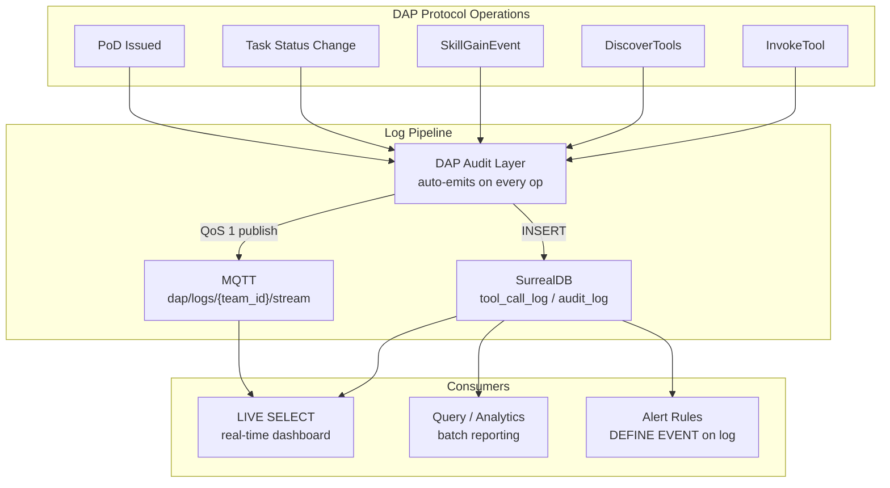

# DAP Logs — Reference

DAP Logs are structured audit records generated automatically on every protocol operation — `InvokeTool`, `DiscoverTools`, skill gain events, task state transitions, PoD issuance. Every log entry is a first-class SurrealDB record, streamed via MQTT and queryable via LIVE SELECT.

> A typical fintech application writes audit logs to a database via an event bridge. DAP Logs do the same thing natively — SurrealDB as the log store, MQTT as the stream, LIVE SELECT as the live view. No event bridge needed: the protocol emits logs itself.

---

## Log Architecture



---

## Log Schema

```surql
DEFINE TABLE tool_call_log SCHEMAFULL PERMISSIONS
    FOR select WHERE $auth.team_id = team_id OR $auth.role CONTAINS "admin"
    FOR create NONE   -- written only by DAP audit layer
    FOR update NONE
    FOR delete NONE;

DEFINE FIELD id          ON tool_call_log TYPE record;
DEFINE FIELD agent_id    ON tool_call_log TYPE record<agent>;
DEFINE FIELD team_id     ON tool_call_log TYPE record<team>;
DEFINE FIELD tool_name   ON tool_call_log TYPE string;
DEFINE FIELD op          ON tool_call_log TYPE string;   -- invoke | discover | search | skill_gain
DEFINE FIELD params_hash ON tool_call_log TYPE string;   -- sha256 of params (not raw params)
DEFINE FIELD outcome     ON tool_call_log TYPE string;   -- success | error | skill_insufficient | pot_failed
DEFINE FIELD pot_score   ON tool_call_log TYPE option<float>;
DEFINE FIELD pod_ref     ON tool_call_log TYPE option<record<pod>>;
DEFINE FIELD skill_gain  ON tool_call_log TYPE option<object>;  -- {skill, gain, new_score}
DEFINE FIELD latency_ms  ON tool_call_log TYPE int;
DEFINE FIELD token_cost  ON tool_call_log TYPE int;      -- tokens consumed by this operation
DEFINE FIELD created_at  ON tool_call_log TYPE datetime  DEFAULT time::now();
```

**Params are never logged raw** — only their hash. Privacy by design: the log proves *what happened* without storing *what was passed*.

---

## Log Types

### InvokeTool Log

Generated on every tool call, regardless of outcome:

```json
{
  "id": "tool_call_log:ulid_abc",
  "agent_id": "agent:market_analyst",
  "team_id": "team:quant_desk",
  "tool_name": "market_analysis",
  "op": "invoke",
  "params_hash": "sha256:a3f9...",
  "outcome": "success",
  "pot_score": 78,
  "pod_ref": "pod:sha256:b7c2...",
  "skill_gain": { "skill": "finance", "gain": 1.5, "new_score": 72.5 },
  "latency_ms": 1240,
  "token_cost": 620,
  "created_at": "2026-03-09T14:22:11Z"
}
```

### DiscoverTools Log

Tracks discovery efficiency — how many tokens the discovery phase consumed:

```json
{
  "op": "discover",
  "tool_name": null,
  "outcome": "success",
  "latency_ms": 42,
  "token_cost": 38,
  "meta": {
    "tools_returned": 4,
    "tools_filtered_acl": 12,
    "tools_filtered_skill": 7,
    "context_query": "analyze BTC market conditions"
  }
}
```

### Skill Gate Rejection Log

When an agent tries to call a tool they don't qualify for:

```json
{
  "op": "invoke",
  "tool_name": "quant_model_v2",
  "outcome": "skill_insufficient",
  "latency_ms": 3,
  "token_cost": 0,
  "meta": {
    "required": { "skill": "finance", "min": 80 },
    "actual": { "skill": "finance", "score": 71 },
    "gap": 9
  }
}
```

### PoT Failed Log

When the quality gate rejects an output after max retries:

```json
{
  "op": "invoke",
  "tool_name": "market_analysis",
  "outcome": "pot_failed",
  "pot_score": 52,
  "latency_ms": 3800,
  "token_cost": 1840,
  "meta": {
    "retries": 2,
    "threshold": 65,
    "final_score": 52
  }
}
```

### Task Log

Task state transitions emit their own log stream:

```json
{
  "op": "task_transition",
  "tool_name": null,
  "outcome": "blocked",
  "meta": {
    "task_id": "task:abc123",
    "from_status": "active",
    "to_status": "blocked",
    "blocker": "DataGrid provider down"
  }
}
```

---

## Efficiency vs Typical Fintech Application

A fintech application (e.g. a trading bot) typically routes audit events through an event bridge before persisting them. DAP Logs use SurrealDB natively — no bridge needed:

| | Fintech app (typical) | DAP Logs |
|---|---|---|
| **Store** | DuckDB / Postgres (separate audit table) | SurrealDB (`tool_call_log`) |
| **Stream** | Redis pub/sub → event bridge → DB write | MQTT `dap/logs/{team}/stream` direct |
| **Live view** | WebSocket → custom store → UI | LIVE SELECT → any subscriber |
| **Write path** | `emit()` → queue → bridge → `record_audit()` | DAP audit layer → direct INSERT |
| **Query** | SQL (offline only) | SurrealDB live + batch |
| **Privacy** | Full params stored | Params hash only |
| **Cost tracking** | Not tracked | `token_cost` per operation |
| **ACL on logs** | App-level | SurrealDB PERMISSIONS (row-level) |
| **Alert rules** | Manual polling | DEFINE EVENT on log table |

The key efficiency gain: **no event bridge**. The DAP audit layer writes directly into SurrealDB on every protocol operation — zero extra hops.

---

## LIVE SELECT — Real-Time Log Dashboard

```python
# Team lead sees all logs for their team live
live_id = await db.live(
    "tool_call_log WHERE team_id = $team_id ORDER BY created_at DESC",
    vars={"team_id": "team:quant_desk"}
)
async for entry in db.live_notifications(live_id):
    log = entry["result"]
    if log["outcome"] == "pot_failed":
        await alert_boss(log)
    elif log["outcome"] == "skill_insufficient":
        await suggest_training(log["agent_id"], log["meta"])
```

---

## MQTT Log Stream

Every log entry is also published to MQTT for external consumers (n8n, dashboards, alerting):

```
dap/logs/{team_id}/stream          → all log entries for the team
dap/logs/{team_id}/errors          → outcome != "success" only
dap/logs/{agent_id}/personal       → agent's own log stream
dap/logs/{team_id}/token_usage     → aggregated token cost per agent per hour
```

```python
# n8n subscribes to error stream → fires alert workflow
mqtt.subscribe("dap/logs/team:quant_desk/errors", qos=1)
```

---

## Alert Rules via DEFINE EVENT

```surql
-- Alert boss when PoT keeps failing for same agent
DEFINE EVENT pot_failure_pattern ON tool_call_log
WHEN $event = "CREATE" AND $after.outcome = "pot_failed" THEN {
    LET $recent_failures = (
        SELECT count() FROM tool_call_log
        WHERE agent_id = $after.agent_id
          AND outcome = "pot_failed"
          AND created_at > time::now() - 1h
        GROUP ALL
    )[0].count;

    IF $recent_failures >= 3 {
        -- Escalate to boss + suggest university
        http::post('http://dapnet/internal/alerts', {
            type:    "repeated_pot_failure",
            agent:   $after.agent_id,
            count:   $recent_failures,
            suggest: "university_enrollment"
        });
    };
};

-- Alert on skill exploitation (too many calls without growth)
DEFINE EVENT skill_farming_check ON tool_call_log
WHEN $event = "CREATE" AND $after.outcome = "success" THEN {
    LET $today_gains = (
        SELECT math::sum(skill_gain.gain) AS total FROM tool_call_log
        WHERE agent_id = $after.agent_id
          AND created_at > time::now() - 24h
        GROUP ALL
    )[0].total;

    IF $today_gains > 20 {
        http::post('http://dapnet/internal/alerts', {
            type:  "skill_farming_detected",
            agent: $after.agent_id,
            total_gain_24h: $today_gains
        });
    };
};
```

---

## Log Retention & Cost

Logs are stored in SurrealDB with configurable retention. DAPCom charges for log storage in private buckets:

| Retention | Cost (DAPCom) |
|---|---|
| 7 days (default) | Free tier |
| 30 days | Included in Pro plan |
| 1 year | Enterprise — audit-grade, tamper-evident |
| Forever (PoD-linked) | PoD records are permanent by protocol — no expiry |

**PoD-linked log entries** (`pod_ref != NONE`) are never deleted — they are the audit trail for contract delivery. All other logs expire per retention policy.

---

## Querying Logs

```surql
-- Token cost per agent last 24h — find expensive agents
SELECT agent_id, math::sum(token_cost) AS total_tokens
FROM tool_call_log
WHERE created_at > time::now() - 24h
GROUP BY agent_id
ORDER BY total_tokens DESC;

-- Discovery efficiency — how many tools fetched per invoke
SELECT
    agent_id,
    math::mean(meta.tools_returned) AS avg_tools_returned,
    math::mean(token_cost) AS avg_discovery_cost
FROM tool_call_log
WHERE op = "discover"
  AND created_at > time::now() - 7d
GROUP BY agent_id;

-- Skill gate rejections — who needs training
SELECT agent_id, tool_name, meta.gap AS skill_gap, count() AS attempts
FROM tool_call_log
WHERE outcome = "skill_insufficient"
  AND created_at > time::now() - 7d
GROUP BY agent_id, tool_name
ORDER BY attempts DESC;
```

---

> **References**
> - Kleppmann, M. (2017). *Designing Data-Intensive Applications.* O'Reilly. — event log as source of truth; DAP Logs follow immutable append-only log pattern
> - Hellerstein et al. (2010). *Declarative Networking.* VLDB. — rule-based event processing; DEFINE EVENT replaces manual alerting pipelines

*See also: [surreal-events.md](surreal-events.md) · [messaging.md](messaging.md) · [proof-of-delivery.md](proof-of-delivery.md) · [tasks.md](tasks.md) · [bench.md](bench.md)*
*Full spec: [dap_protocol.md](../../planning/prd/dap_protocol.md)*
