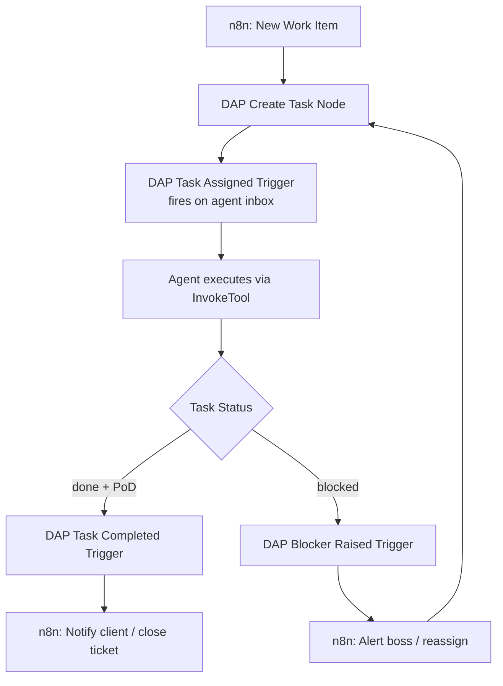
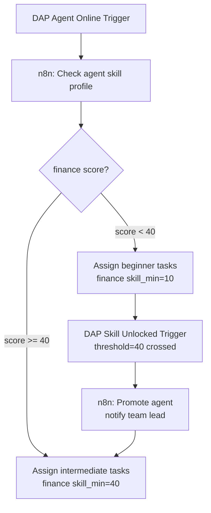
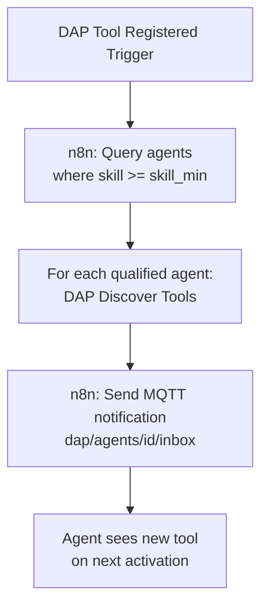
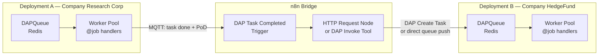

# DAP n8n Integration — Reference

n8n connects DAP to the broader automation world. DAP provides two node families: **Trigger Nodes** that fire on DAPNet events, and **Action Nodes** that invoke DAP operations. Together they make any DAP agent or task event a first-class automation trigger.

> DAP is the agent protocol. n8n is the automation layer on top. Every task, every skill unlock, every blocker — all become n8n workflow triggers.

---

## Node Families

```
DAP n8n Nodes
│
├─ Trigger Nodes (start a workflow)
│   ├─ DAP Task Assigned         — fires when agent receives a task
│   ├─ DAP Task Status Changed   — fires on any task state transition
│   ├─ DAP Task Completed        — fires when task reaches "done" + PoD issued
│   ├─ DAP Blocker Raised        — fires when task hits "blocked" state
│   ├─ DAP Skill Unlocked        — fires when agent crosses a skill threshold
│   ├─ DAP Agent Online/Offline  — fires on Last Will or reconnect
│   └─ DAP Tool Registered       — fires when new tool enters registry
│
└─ Action Nodes (call DAP operations)
    ├─ DAP Invoke Tool            — call InvokeTool on any registered tool
    ├─ DAP Discover Tools         — run DiscoverTools with skill context
    ├─ DAP Create Task            — create and assign a task record
    ├─ DAP Update Task            — update task status, result_ref, pod_ref
    ├─ DAP Search Tools           — semantic SearchTools query
    └─ DAP Get Artifact           — retrieve a stored skill artifact
```

---

## Trigger Nodes

### DAP Task Assigned Trigger

Fires when a new task is assigned to a specific agent or agent group. Transport: MQTT subscription or SurrealDB LIVE SELECT.

```json
// Trigger config
{
  "node": "DAP Task Assigned",
  "transport": "mqtt",
  "topic": "dap/agents/{{agentId}}/inbox",
  "filter": {
    "type": "task_assigned",
    "priority": ["high", "critical"]   // optional filter
  }
}

// Output payload
{
  "task_id": "task:abc123",
  "title": "Analyze BTC market conditions",
  "assigned_by": "agent:ceo",
  "priority": "high",
  "deadline": "2026-03-10T08:00:00Z",
  "context": { "symbol": "BTC/USDC", "timeframe": "4h" }
}
```

### DAP Task Status Changed Trigger

Subscribes to LIVE SELECT on the task table. Fires on every state transition for monitored tasks.

```json
// Trigger config
{
  "node": "DAP Task Status Changed",
  "transport": "surreal_live",
  "query": "LIVE SELECT * FROM task WHERE assigned_to = $agentId",
  "emit_on": ["pending", "active", "blocked", "done", "failed"]
}

// Output payload
{
  "task_id": "task:abc123",
  "previous_status": "active",
  "new_status": "blocked",
  "blocker": "DataGrid provider down — missing BTC/USDC feed",
  "agent": "agent:market_analyst",
  "timestamp": "2026-03-09T14:22:11Z"
}
```

### DAP Task Completed Trigger

Fires only when status flips to `done` AND a PoD certificate is attached. Guaranteed delivery event.

```json
// Trigger config
{
  "node": "DAP Task Completed",
  "transport": "mqtt",
  "topic": "dap/teams/{{teamId}}/tasks/+/status",
  "filter": { "status": "done", "pod_ref": { "$exists": true } }
}

// Output payload
{
  "task_id": "task:abc123",
  "result_ref": "artifact:xyz789",
  "pod_ref": "pod:sha256:a3f9...",
  "pod_signature": "ed25519:9f3a...",
  "completed_at": "2026-03-09T15:00:00Z",
  "agent": "agent:market_analyst"
}
```

### DAP Blocker Raised Trigger

Fires when any task in a team hits `blocked` status. Routes to the boss or orchestrator.

```json
// Trigger config
{
  "node": "DAP Blocker Raised",
  "transport": "mqtt",
  "topic": "dap/teams/{{teamId}}/blockers"
}

// Output payload
{
  "task_id": "task:abc123",
  "title": "Analyze BTC market conditions",
  "blocker": "DataGrid provider down",
  "agent": "agent:market_analyst",
  "team": "team:quant_desk"
}
```

### DAP Skill Unlocked Trigger

Fires when an agent's skill score crosses a tool visibility threshold. Useful for onboarding flows, notifications, or automatically assigning new task types.

```json
// Trigger config
{
  "node": "DAP Skill Unlocked",
  "transport": "surreal_live",
  "query": "LIVE SELECT * FROM skill_event WHERE agent_id = $agentId AND event = 'threshold_crossed'"
}

// Output payload
{
  "agent_id": "agent:junior_analyst",
  "skill": "finance",
  "previous_score": 39,
  "new_score": 41,
  "threshold_crossed": 40,
  "tools_unlocked": ["market_analysis", "portfolio_optimizer"]
}
```

### DAP Agent Online / Offline Trigger

Uses MQTT Last Will to detect agent disconnect. Fires on reconnect via `$SYS` or agent presence topic.

```json
// Trigger config
{
  "node": "DAP Agent Online/Offline",
  "transport": "mqtt",
  "topic": "dap/agents/{{agentId}}/presence"
}

// Output payload (offline)
{
  "agent_id": "agent:market_analyst",
  "event": "offline",
  "last_seen": "2026-03-09T14:22:11Z",
  "active_tasks": ["task:abc123", "task:def456"]
}
```

### DAP Tool Registered Trigger

Fires when a new tool is registered in the DAP registry — index version bump triggers rediscovery.

```json
// Trigger config
{
  "node": "DAP Tool Registered",
  "transport": "mqtt",
  "topic": "dap/registry/tools/new"
}

// Output payload
{
  "tool_name": "sector_sentiment_v2",
  "skill_required": "finance",
  "skill_min": 55,
  "bloat_score": { "total": 215, "grade": "A" },
  "registered_by": "company:research_corp"
}
```

---

## Action Nodes

### DAP Invoke Tool

Calls `InvokeTool` on any registered DAP tool. Passes agent skills for ACL + skill gate enforcement.

```json
// Node config
{
  "node": "DAP Invoke Tool",
  "tool_name": "market_analysis",
  "agent_id": "{{$json.agent_id}}",
  "agent_skills": { "finance": 71 },
  "params": {
    "symbol": "{{$json.context.symbol}}",
    "timeframe": "{{$json.context.timeframe}}"
  },
  "stream": false
}

// Output
{
  "result": { "signal": "long", "confidence": 0.82 },
  "artifact_id": "artifact:xyz789",
  "pot_score": 78,
  "pod_ref": "pod:sha256:a3f9...",
  "skill_gain": { "skill": "finance", "gain": 1.5 }
}
```

### DAP Create Task

Creates a new task record in SurrealDB and assigns it to an agent. Agent is notified immediately via LIVE SELECT or MQTT inbox.

```json
// Node config
{
  "node": "DAP Create Task",
  "title": "{{$json.task_title}}",
  "assigned_to": "{{$json.agent_id}}",
  "assigned_by": "agent:orchestrator",
  "priority": "high",
  "deadline_hours": 4,
  "context": "{{$json.task_context}}"
}

// Output
{
  "task_id": "task:ulid_abc",
  "status": "pending",
  "assigned_to": "agent:market_analyst",
  "created_at": "2026-03-09T14:00:00Z"
}
```

### DAP Discover Tools

Runs `DiscoverTools` with the agent's skill context. Returns tool summaries within the token budget.

```json
// Node config
{
  "node": "DAP Discover Tools",
  "context": "{{$json.task_title}}",
  "agent_skills": "{{$json.agent_skills}}",
  "max_tools": 5
}

// Output
{
  "tools": [
    { "name": "market_analysis", "description": "Analyze market conditions", "description_tokens": 12 },
    { "name": "portfolio_optimizer", "description": "Optimize portfolio weights", "description_tokens": 14 }
  ],
  "total_tokens": 26
}
```

---

## Workflow Patterns

### Pattern 1 — Task Auto-Routing

Boss creates a task in n8n, DAP assigns it, n8n monitors until completion:



### Pattern 2 — Skill-Gated Onboarding

New agent joins, n8n tracks their skill progression and auto-assigns appropriate tasks:



### Pattern 3 — Tool Registration → Team Notification

New tool deployed → n8n notifies all teams whose agents qualify:



### Pattern 4 — n8n as `type: n8n` Workflow Phase

DAP workflows can delegate a phase to n8n. The n8n workflow runs, result returns to DAP:

```yaml
# Inside a DAP skill workflow YAML
phases:
  - id: enrich_with_n8n
    type: n8n
    workflow_id: "sentiment_enrichment"     # n8n workflow ID
    webhook_url: "http://n8n:5678/webhook/dap-enrich"
    input_from: task.input
    output_to: enriched_context
    timeout_s: 30

  - id: analyze
    type: llm
    input_from: [task.input, enriched_context]
    prompt_template: market_analysis.jinja
```

The n8n webhook receives the DAP task context, runs its own node chain (e.g. fetch news, call APIs, aggregate signals), and returns structured data back into the workflow.

---

## Transport Details

DAP trigger nodes support two transports — pick based on latency and persistence needs:

| Transport | Latency | Persistence | Best for |
|---|---|---|---|
| **MQTT** | Sub-100ms | QoS 1/2 for guaranteed delivery | Task inbox, blockers, presence |
| **SurrealDB LIVE SELECT** | ~10ms intra-system | Persistent state, full query support | Task status, skill events, team dashboard |

```python
# MQTT transport config (inside n8n DAP node)
mqtt_config = {
    "broker": "mqtt://emqx:1883",
    "client_id": "n8n-dap-bridge",
    "qos": 1,
    "clean_session": False,   # survive n8n restart
    "will": {
        "topic": "dap/n8n/presence",
        "payload": "offline",
        "qos": 1,
        "retain": True
    }
}

# SurrealDB LIVE SELECT transport
surreal_config = {
    "url": "ws://surrealdb:8000/rpc",
    "ns": "dap", "db": "production",
    "query": "LIVE SELECT * FROM task WHERE team_id = $teamId"
}
```

---

## ACL — n8n as a DAP Principal

n8n operates as a named principal in the DAP ACL stack, not as a user. It gets its own agent identity with scoped permissions:

```surql
-- n8n bridge gets its own agent record
CREATE agent:n8n_bridge SET
    name        = "n8n Automation Bridge",
    type        = "service",
    skills      = {},           -- no skill gates needed for service accounts
    acl_roles   = ["task_manager", "tool_observer"];

-- Casbin: n8n can create tasks and read tool registry, cannot invoke tools directly
p, agent:n8n_bridge, /tasks/*, create
p, agent:n8n_bridge, /tasks/*, read
p, agent:n8n_bridge, /tasks/*, update
p, agent:n8n_bridge, /tools/registry, read
-- n8n cannot call InvokeTool — agents do their own invocations
```

This separation means n8n manages the orchestration layer (task creation, routing, monitoring) while agents handle the actual tool invocations — maintaining the skill gate integrity.

---

## Error Handling

| Scenario | n8n handling |
|---|---|
| Agent goes offline mid-task | `DAP Agent Offline Trigger` → reassign or escalate |
| Task deadline missed | DEFINE EVENT → MQTT → `DAP Blocker Raised Trigger` → alert node |
| InvokeTool `skill_insufficient` | Action node returns error → n8n routes to skill-appropriate agent |
| PoD missing on delivery | Task Completed Trigger never fires → timeout node escalates |
| MQTT broker disconnect | n8n MQTT node reconnects with stored session (QoS 1, `clean_session: false`) |
| SurrealDB LIVE SELECT dropped | n8n re-subscribes on reconnect, replays missed events from `created_at` |

---

## n8n as Message Queue Bridge

DAP Apps use `DAPQueue` (Redis-backed) for async job handling within a single deployment. n8n extends this across deployments — it connects DAP App queues from different DAPNet instances and routes jobs between them.



### Cross-Deployment Patterns

**Fan-out across companies:** Research Corp completes a report → n8n distributes to 5 HedgeFund agents simultaneously:

```json
// n8n: DAP Task Completed → fan-out
{
  "trigger": "DAP Task Completed",
  "filter": { "tool_name": "research_report" },
  "then": [
    { "node": "DAP Create Task", "deployment": "hedgefund-dapnet", "agent": "agent:portfolio_a" },
    { "node": "DAP Create Task", "deployment": "hedgefund-dapnet", "agent": "agent:portfolio_b" },
    { "node": "DAP Create Task", "deployment": "hedgefund-dapnet", "agent": "agent:risk_desk" }
  ]
}
```

**Cross-team dependency resolution:** Team A finishes → n8n unblocks Team B in a different deployment:

```json
// n8n: monitors Team A task → triggers Team B task when done
{
  "trigger": "DAP Task Status Changed",
  "deployment": "deployment-A",
  "filter": { "task_id": "task:research_phase_1", "new_status": "done" },
  "then": {
    "node": "DAP Update Task",
    "deployment": "deployment-B",
    "task_id": "task:analysis_phase_2",
    "status": "pending"
  }
}
```

**Message queue bridge for long-running async jobs:** n8n polls a DAP App `job_id` across deployments:

```
Deployment A                n8n                    Deployment B
─────────────────────────────────────────────────────────────────
invoke_async("analysis")  →  job_id received
                              poll every 30s
                              ← result ready
                              → push result to QB  →  Worker picks up
                                                       processes result
                                                       updates task record
```

### Why n8n Over Direct MQTT for Cross-Deployment

| Approach | Direct MQTT Cross-Broker | n8n Bridge |
|---|---|---|
| **Auth / ACL** | Complex cross-broker federation | n8n handles per-deployment credentials |
| **Transform** | Raw payload forwarded | n8n maps, filters, enriches between schemas |
| **Retry logic** | Manual | Built-in n8n error handling + retry nodes |
| **Visibility** | Invisible | n8n execution log shows every cross-deployment event |
| **Conditional routing** | Broker-level filters only | Full n8n logic: if/switch/merge |
| **Mixed transports** | Not possible | MQTT → SurrealDB → HTTP → queue all in one flow |

### DAP Teams vs n8n for Cross-Team Work

DAP Teams handles cross-team visibility **within one DAPNet deployment** — shared LIVE SELECT dashboards, MQTT topic subscriptions, task graph dependencies. n8n handles cross-deployment scenarios:

```
Same DAPNet:       Team A ←→ Team B     →  use DAP Teams MQTT subscriptions
Cross-deployment:  Corp A ←→ Corp B     →  use n8n bridge
Hybrid:            Corp A has n8n       →  n8n routes internally AND externally
```

---

> **References**
> - Fair, R. et al. (2024). *n8n: Low-Code Workflow Automation.* [n8n.io](https://n8n.io) — node-based automation; DAP trigger/action nodes extend n8n's agent-facing capabilities
> - Wooldridge & Jennings (1995). *Intelligent Agents: Theory and Practice.* — task allocation in multi-agent systems; n8n provides the external orchestration shell

*See also: [tasks.md](tasks.md) · [messaging.md](messaging.md) · [apps.md](apps.md) · [surreal-events.md](surreal-events.md) · [a2a-bridge.md](a2a-bridge.md)*
*Full spec: [dap_protocol.md](../../planning/prd/dap_protocol.md)*
