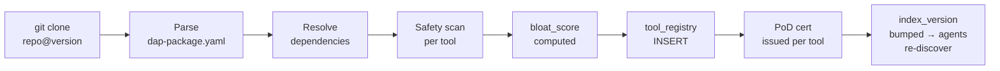

# DAP Packages — Reference

A DAP Package is a git repository containing tool definitions, workflows, and artifacts. `dap install` pulls the repo, registers all tools, and issues a PoD certificate per registration — no separate signing infrastructure needed.

> PoD already provides cryptographic delivery proof for every tool registration. Packages build on this.

---

## Package Structure

```
my-finance-tools/
├── dap-package.yaml        ← package manifest
├── tools/
│   ├── market_analysis.yaml
│   ├── portfolio_optimizer.yaml
│   └── risk_calculator.yaml
├── workflows/
│   ├── full_analysis_flow.yaml.j2
│   └── rebalance_flow.yaml.j2
└── artifacts/
    └── rsi_strategy.py
```

---

## `dap-package.yaml`

```yaml
name: finance-tools
version: 1.2.0
description: "Market analysis and portfolio optimization tools"
author: quant_desk
license: MIT
repository: https://github.com/org/finance-tools
dap_version_min: "2.0"

# Tools in this package
tools:
  - tools/market_analysis.yaml
  - tools/portfolio_optimizer.yaml
  - tools/risk_calculator.yaml

# Workflows bundled with the package
workflows:
  - workflows/full_analysis_flow.yaml.j2
  - workflows/rebalance_flow.yaml.j2

# Artifacts pre-seeded into the skill store on install
artifacts:
  - path: artifacts/rsi_strategy.py
    skill: finance
    artifact_type: script
    quality_score: 0.82

# Optional: declare dependencies on other packages
dependencies:
  - name: dap-core-utils
    version: ">=1.0"
    source: https://github.com/dap-org/core-utils

tags: [finance, trading, portfolio]
```

---

## Install

```bash
# From git repo
dap install https://github.com/org/finance-tools

# Specific version / tag
dap install https://github.com/org/finance-tools@v1.2.0

# Local path (development)
dap install ./my-finance-tools

# From DAPNet public registry
dap install finance-tools
```

All three steps happen atomically:
1. Clone repo (or pull if already installed)
2. Register each tool → safety scan → bloat score → `tool_registry`
3. **PoD certificate issued per tool** — Ed25519-signed proof of registration

---

## PoD as Delivery Proof

Every tool registration produces a PoD certificate stored in `tool_call_log`:

```json
{
  "operation": "tool_register",
  "tool_name": "market_analysis",
  "version": "1.2.0",
  "package": "finance-tools",
  "result_hash": "sha256:a3f9...",
  "pod_cert": "ed25519:...",
  "registered_at": "2026-01-15T10:23:00Z"
}
```

This means:
- You can verify any tool's install provenance at any time
- Tampered tool files → hash mismatch → registration rejected
- Audit trail: who installed what, when, from which repo commit

```bash
# Verify installed package integrity
dap verify finance-tools

# Output:
# market_analysis     v1.2.0  ✓  PoD cert valid  sha256:a3f9...
# portfolio_optimizer v1.2.0  ✓  PoD cert valid  sha256:7b2c...
# risk_calculator     v1.2.0  ✓  PoD cert valid  sha256:d41a...
```

---

## Install Flow



Dependency resolution is shallow — DAP packages declare deps but do not nest arbitrarily. Circular deps are rejected at parse time.

---

## Versioning

Tools inside a package carry their own version in their YAML (`version: 1.2.0`). When a package is updated:

- Old tool versions are **deprecated** (still callable, not returned by `DiscoverTools`)
- New versions are registered fresh
- Agents re-discover automatically via `index_version` bump

```bash
dap upgrade finance-tools          # pull latest, re-register all tools
dap upgrade finance-tools@v1.3.0   # pin to specific version
```

---

## Publish to DAPNet Registry

```bash
# Publish package to DAPNet public registry
dap publish --registry dapnet

# Requires:
# - Valid DAPNet identity (agent token)
# - All tools pass safety scan
# - dap-package.yaml present and valid
```

Published packages are indexed in the DAPNet `tool_registry` bucket and discoverable by all DAPNet agents via `SearchTools`.

---

## Private Packages

```yaml
# dap-package.yaml
visibility: private          # not published to DAPNet registry
team: quant_desk             # only agents in this team can install
```

Private packages install into a team-scoped namespace — tools are only visible to agents in that team. ACL enforced via Casbin team policies.

---

*See also: [tool-registration.md](tool-registration.md) · [proof-of-delivery.md](proof-of-delivery.md) · [bloat-score.md](bloat-score.md) · [teams.md](teams.md)*
