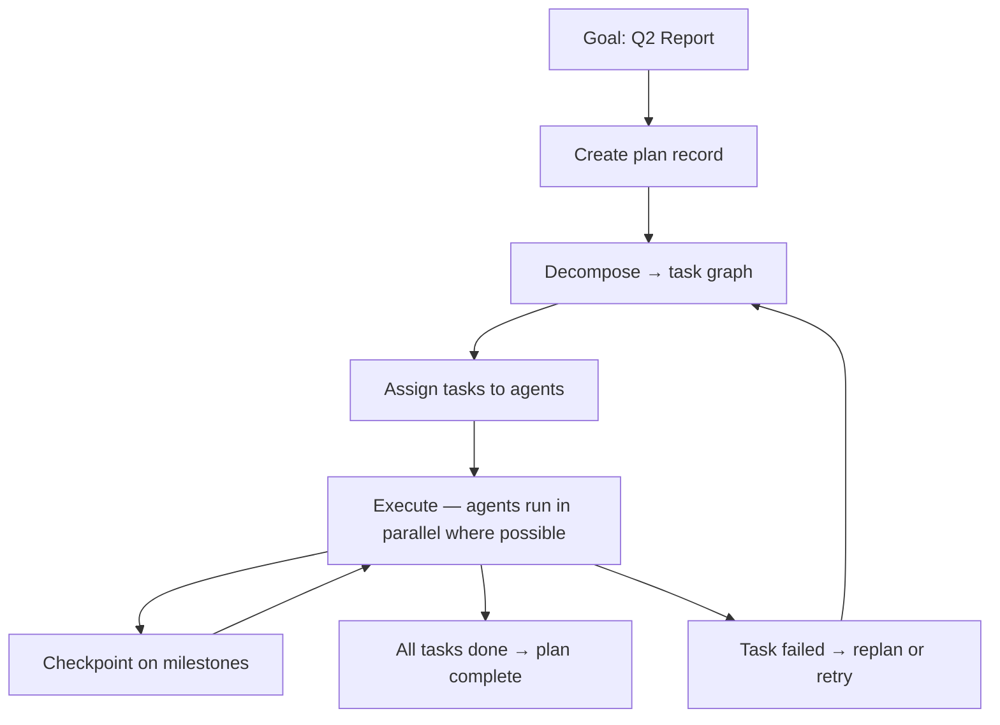
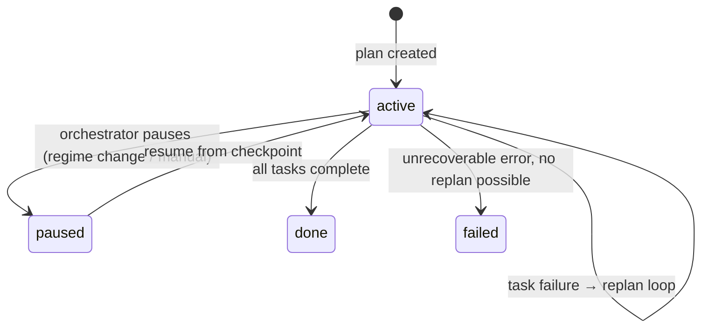

# DAP Planning — Reference

DAP Planning is the orchestration layer above tasks. An orchestrator decomposes a goal into a task graph, tracks execution state as a **plan**, and saves **checkpoints** so work can survive agent restarts, failures, or regime changes without starting over.

> Tasks are units of work. A plan is a live execution graph — it knows what ran, what failed, and what comes next.

---

## Plan Record

A plan wraps a task graph with goal-level state:

```surql
CREATE plan SET
    id          = plan:ulid(),
    goal        = "Generate Q2 market report for BTC, ETH, SOL",
    created_by  = agent:orchestrator,
    team        = team:quant_desk,
    status      = "active",      -- pending | active | paused | done | failed
    tasks       = [],            -- populated as sub-tasks are created
    checkpoint  = NONE,          -- last saved checkpoint
    created_at  = time::now(),
    updated_at  = time::now();
```

---

## Planning Flow

The orchestrator decomposes a goal into tasks, wires dependencies, then monitors execution:



### Orchestrator decomposition (Python)

```python
async def plan_goal(goal: str, db: Surreal, agent_id: str) -> str:
    """Break a natural-language goal into a task DAG and store it as a plan."""

    # 1. LLM call: decompose goal into ordered steps
    steps = await llm.decompose(goal)
    # steps = [
    #   {"title": "Research BTC fundamentals", "agent": "researcher", "deps": []},
    #   {"title": "Analyze BTC entry signal",  "agent": "analyst",    "deps": ["Research BTC..."]},
    #   {"title": "Write Q2 report",           "agent": "writer",     "deps": ["Analyze BTC..."]},
    # ]

    # 2. Create plan record
    plan = await db.create("plan", {
        "goal":       goal,
        "created_by": agent_id,
        "status":     "active",
    })

    # 3. Create tasks + wire dependencies
    task_map: dict[str, str] = {}   # title → task_id
    for step in steps:
        task = await db.create("task", {
            "title":       step["title"],
            "assigned_to": step["agent"],
            "assigned_by": agent_id,
            "plan_ref":    plan["id"],
            "status":      "pending",
        })
        task_map[step["title"]] = task["id"]

    for step in steps:
        for dep_title in step["deps"]:
            await db.relate(task_map[step["title"]], "depends_on", task_map[dep_title])

    # 4. Attach task list to plan
    await db.update(plan["id"], {"tasks": list(task_map.values())})
    return plan["id"]
```

---

## Checkpoints

A checkpoint is a snapshot of plan execution state — which tasks are done, what artifacts they produced, and any context the orchestrator needs to resume. Saved to SurrealDB, referenced by the plan record.

### When to checkpoint

| Trigger | Example |
|---|---|
| Milestone task completes | All research tasks done — analysis phase begins |
| Phase boundary | RAG phase complete, entering LLM phase |
| Long-running plan (periodic) | Every N tasks or every T minutes |
| Before risky operation | Before destructive tool call or external API write |
| Agent is about to go offline | Graceful shutdown via MQTT Last Will handler |

### Checkpoint schema

```surql
DEFINE TABLE checkpoint SCHEMAFULL;
DEFINE FIELD plan_id      ON checkpoint TYPE record<plan>;
DEFINE FIELD saved_at     ON checkpoint TYPE datetime;
DEFINE FIELD phase        ON checkpoint TYPE string;   -- human label: "research_complete"
DEFINE FIELD completed    ON checkpoint TYPE array<record<task>>;
DEFINE FIELD in_progress  ON checkpoint TYPE array<record<task>>;
DEFINE FIELD pending      ON checkpoint TYPE array<record<task>>;
DEFINE FIELD artifacts    ON checkpoint TYPE array<record<skill_artifact>>;
DEFINE FIELD context_blob ON checkpoint TYPE object;   -- arbitrary orchestrator state
```

### Save a checkpoint

```python
async def save_checkpoint(plan_id: str, phase: str, db: Surreal, extra: dict = {}) -> str:
    tasks = await db.query(
        "SELECT id, status, result_ref FROM task WHERE plan_ref = $plan",
        vars={"plan": plan_id}
    )

    ckpt = await db.create("checkpoint", {
        "plan_id":      plan_id,
        "saved_at":     datetime.utcnow().isoformat(),
        "phase":        phase,
        "completed":    [t["id"] for t in tasks if t["status"] == "done"],
        "in_progress":  [t["id"] for t in tasks if t["status"] == "active"],
        "pending":      [t["id"] for t in tasks if t["status"] == "pending"],
        "artifacts":    [t["result_ref"] for t in tasks if t.get("result_ref")],
        "context_blob": extra,
    })

    # Link checkpoint to plan
    await db.update(plan_id, {"checkpoint": ckpt["id"], "updated_at": datetime.utcnow().isoformat()})
    return ckpt["id"]
```

### Resume from checkpoint

```python
async def resume_plan(plan_id: str, db: Surreal):
    plan = await db.select(plan_id)
    if not plan["checkpoint"]:
        raise ValueError("No checkpoint to resume from")

    ckpt = await db.select(plan["checkpoint"])

    # Re-queue in-progress tasks (they were interrupted)
    for task_id in ckpt["in_progress"]:
        await db.update(task_id, {"status": "pending"})

    # Inject prior artifacts back into context
    artifacts = [await db.select(a) for a in ckpt["artifacts"]]

    print(f"Resuming plan from checkpoint: {ckpt['phase']}")
    print(f"  {len(ckpt['completed'])} tasks done")
    print(f"  {len(ckpt['in_progress'])} tasks re-queued")
    print(f"  {len(ckpt['pending'])} tasks still pending")

    # Orchestrator continues monitoring — agents re-pick tasks via LIVE SELECT
    return artifacts
```

---

## Replanning

When a task fails and cannot be retried, the orchestrator can revise the plan rather than abort:

```python
async def handle_task_failure(task_id: str, plan_id: str, db: Surreal):
    failed_task = await db.select(task_id)
    plan = await db.select(plan_id)

    # Save checkpoint before replanning
    await save_checkpoint(plan_id, phase=f"replan_before_{task_id}", db=db)

    # Option 1: reassign to different agent
    alt_agent = await find_capable_agent(failed_task["skill_hint"], exclude=failed_task["assigned_to"])
    if alt_agent:
        await db.update(task_id, {"status": "pending", "assigned_to": alt_agent, "retries": failed_task.get("retries", 0) + 1})
        return

    # Option 2: decompose the failed task into smaller sub-tasks
    sub_steps = await llm.decompose(failed_task["title"], context=failed_task["context"])
    new_ids = []
    for step in sub_steps:
        t = await db.create("task", {
            "title":       step["title"],
            "assigned_to": step["agent"],
            "assigned_by": plan["created_by"],
            "plan_ref":    plan_id,
            "status":      "pending",
            "parent_task": task_id,
        })
        new_ids.append(t["id"])

    # Mark original task as superseded
    await db.update(task_id, {"status": "superseded", "replaced_by": new_ids})
    await db.update(plan_id, {"tasks": plan["tasks"] + new_ids})
```

---

## Plan States



Pause and resume:

```python
# Pause plan — save checkpoint first
await save_checkpoint(plan_id, phase="manual_pause", db=db)
await db.update(plan_id, {"status": "paused"})

# Resume — reload checkpoint, re-queue interrupted tasks
artifacts = await resume_plan(plan_id, db=db)
await db.update(plan_id, {"status": "active"})
```

---

## Plan Visibility

Plans expose live state via LIVE SELECT — any dashboard or monitor subscribes without polling:

```surql
-- Watch all plans in a team
LIVE SELECT id, goal, status, checkpoint FROM plan
WHERE team = $team_id;

-- Watch task graph for a specific plan
LIVE SELECT id, title, status, assigned_to, result_ref FROM task
WHERE plan_ref = $plan_id;
```

REST endpoint for status snapshots:

```
GET  /plans/{plan_id}                  → plan record + task summary
GET  /plans/{plan_id}/checkpoint       → latest checkpoint
GET  /plans/{plan_id}/tasks            → full task list with statuses
POST /plans                            → create plan from goal string
POST /plans/{plan_id}/pause            → save checkpoint + pause
POST /plans/{plan_id}/resume           → resume from latest checkpoint
POST /plans/{plan_id}/replan/{task_id} → trigger replan for a failed task
```

---

## Checkpoint Retention

Checkpoints accumulate over long plans. Retention policy is configurable per deployment:

```yaml
# dap-server config
planning:
  checkpoint_retention: 10        # keep last N checkpoints per plan
  checkpoint_interval_tasks: 5    # auto-checkpoint every N completed tasks
  checkpoint_interval_seconds: 300 # auto-checkpoint every 5 min (whichever fires first)
  replan_max_depth: 3             # max nested replan recursion
```

Old checkpoints beyond the retention window are soft-deleted (moved to `checkpoint_archive`) — they remain queryable for audit but are not loaded by resume.

---

## Sprint Plans

A sprint is a time-boxed plan — a group of tasks with a shared deadline, owner, and goal. Sprints work in any DAP deployment; SurrealLife and DAP IDE add application-level views on top.

### Sprint record

```surql
CREATE sprint SET
    id          = sprint:ulid(),
    name        = "Q2 Market Intelligence Sprint",
    team        = team:quant_desk,
    goal        = "Deliver sector analysis for BTC, ETH, SOL before Q2 open",
    starts_at   = time::now(),
    ends_at     = time::now() + duration("7d"),
    status      = "active",         -- planned | active | done | cancelled
    plans       = [],               -- one or more plan records in this sprint
    velocity    = NONE;             -- tasks_done / elapsed_days, computed on update
```

### Create a sprint with plans

```python
async def create_sprint(name: str, goal: str, sub_goals: list[str], team_id: str, days: int, db: Surreal, orchestrator_id: str) -> str:
    sprint = await db.create("sprint", {
        "name":     name,
        "team":     team_id,
        "goal":     goal,
        "starts_at": datetime.utcnow().isoformat(),
        "ends_at":   (datetime.utcnow() + timedelta(days=days)).isoformat(),
        "status":   "active",
    })

    plan_ids = []
    for sub_goal in sub_goals:
        plan_id = await plan_goal(sub_goal, db, orchestrator_id)
        await db.update(plan_id, {"sprint_ref": sprint["id"]})
        plan_ids.append(plan_id)

    await db.update(sprint["id"], {"plans": plan_ids})
    return sprint["id"]

sprint_id = await create_sprint(
    name     = "Q2 Market Intelligence Sprint",
    goal     = "Sector analysis before Q2 open",
    sub_goals= [
        "Research and analyze BTC market conditions",
        "Research and analyze ETH staking landscape",
        "Compile cross-sector correlation report",
    ],
    team_id  = "team:quant_desk",
    days     = 7,
    db       = db,
    orchestrator_id = "agent:orchestrator",
)
```

### Sprint velocity and progress

```surql
-- Live velocity: tasks completed per day
LET $sprint = (SELECT * FROM sprint:q2_intel)[0];
LET $elapsed = duration::days(time::now() - $sprint.starts_at);
LET $done    = count(SELECT id FROM task WHERE plan_ref IN $sprint.plans AND status = "done");
LET $total   = count(SELECT id FROM task WHERE plan_ref IN $sprint.plans);

UPDATE sprint:q2_intel SET
    velocity        = math::round($done / math::max($elapsed, 1), 2),
    tasks_done      = $done,
    tasks_total     = $total,
    completion_pct  = math::round(($done / $total) * 100, 1);
```

A DEFINE EVENT fires at sprint end to close out and checkpoint all active plans:

```surql
DEFINE EVENT sprint_deadline ON sprint WHEN $event = "UPDATE"
  AND $after.ends_at <= time::now() AND $after.status = "active" THEN {
    UPDATE sprint SET status = "done" WHERE id = $after.id;
    -- Checkpoint all plans in this sprint
    FOR $plan_id IN $after.plans {
        UPDATE plan SET status = "paused" WHERE id = $plan_id AND status = "active";
    };
    http::post('http://dap-server/internal/sprint/close', { sprint_id: $after.id });
};
```

### Sprint REST API

```
GET  /sprints                         → list sprints for team
GET  /sprints/{id}                    → sprint record + progress
GET  /sprints/{id}/plans              → all plans with task summaries
POST /sprints                         → create sprint
POST /sprints/{id}/checkpoint-all     → checkpoint all active plans in sprint
POST /sprints/{id}/close              → close sprint, archive checkpoints
```

### SurrealLife sprints

In SurrealLife, sprints are company-level commitments — they carry `SurrealCoin` escrow and can be audited by clients. Sprint completion with all PoD certificates attached triggers automatic settlement via ClearingHouse. See [surreal-life.md](surreal-life.md).

### DAP IDE sprints

In DAP IDE, sprints are the project management layer — human devs and agents share the same sprint board. Tasks map to code changes, PRs, and reviews. Sprint state is a live graph visible to all team members without a standup. See [dap-ide.md](dap-ide.md).

---

## Integration with DAP Apps

Long-running plans use DAP Apps async jobs at the task level:

```python
@job("research_task", max_retries=3)
async def handle_research(params: dict, ctx: JobContext):
    result = await do_research(params["topic"])
    await save_checkpoint(params["plan_id"], phase="research_done", db=ctx.db,
                          extra={"topic": params["topic"], "source_count": result["sources"]})
    return result
```

The `@job` decorator handles retries. On final failure, the orchestrator's replan logic kicks in. See [apps.md](apps.md).

---

*See also: [tasks.md](tasks.md) · [apps.md](apps.md) · [workflows.md](workflows.md) · [proof-of-delivery.md](proof-of-delivery.md) · [surreal-events.md](surreal-events.md)*
