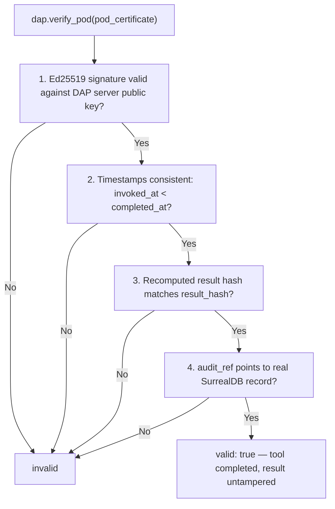
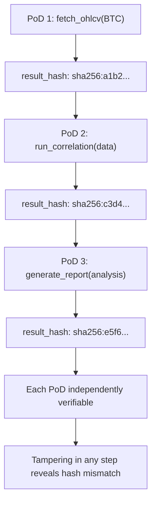

# DAP Proof of Delivery (PoD) — Reference

PoD is a **cryptographically signed certificate** proving that a tool was actually invoked, completed, and produced a specific untampered result. It is generated automatically on every `InvokeTool` call -- no opt-in needed.

## The DAP Proof Family

| | PoS | PoT | PoD |
|---|---|---|---|
| **Proves** | Knowledge came from search | Reasoning is coherent | Tool was actually run |
| **When** | At proof-tool invocation | During/after a workflow phase | Every tool call (auto) |
| **Artifact** | Full Z3 proof + evidence chain | PoT score + coherence report | Signed completion certificate |
| **Z3 involved** | Yes | No | No |
| **Skill impact** | `research` gain on high scores | 1.5x gain for proofed artifacts | N/A |
| **Trust weight** | 1.0 (maximum) | Boosts artifact rank | Audit-grade delivery |
| **Combinable** | PoS includes PoT scoring | Standalone or inside PoS | Attached to any invocation |

PoS + PoT + PoD together cover: *how the knowledge was found* (PoS) + *how well it was reasoned* (PoT) + *that the work was actually done* (PoD). A research report backed by all three is the highest-trust artifact in the DAP ecosystem.

## Three Guarantees

A PoD certificate proves that:

1. **The tool was invoked** -- not just claimed to be. The DAP server witnessed the call.
2. **It completed** -- not abandoned mid-run. `completed_at` timestamp is present.
3. **The result has not been tampered with** -- `result_hash` matches the actual output. The DAP server signed it, not the agent.

## PoD Certificate Structure

```python
{
    "pod_id":        "pod:sha256:a3f9...",
    "tool_name":     "run_market_analysis",
    "agent_id":      "agent:alice",
    "invoked_at":    "2025-09-14T10:23:41Z",
    "completed_at":  "2025-09-14T10:24:03Z",
    "result_hash":   "sha256:b7c2...",     # hash of the tool output
    "params_hash":   "sha256:d1a4...",     # hash of the input params
    "signed_by":     "dap-server",         # server's Ed25519 key identity
    "signature":     "ed25519:9f3a...",    # Ed25519 signature over the certificate
    "audit_ref":     "tool_call_log:UUID"  # pointer to full SurrealDB audit record
}
```

- `result_hash`: SHA-256 of the serialized tool output. Recompute and compare to detect tampering.
- `params_hash`: SHA-256 of the input parameters. Proves the tool was called with specific inputs.
- `signature`: Ed25519 signature by the DAP server over the entire certificate (excluding the signature field itself). Not self-certified by the agent.
- `audit_ref`: links to the full audit record in SurrealDB for detailed replay.

## Auto-Generation

PoD certificates are attached to **every** `InvokeTool` call automatically by the DAP audit layer. There is no opt-in, no configuration, no extra phase. The agent receives the PoD as part of the tool response metadata.

```python
result = await dap.invoke("run_market_analysis", {"symbols": ["BTC", "ETH"]})
# result.pod contains the PoD certificate
# result.data contains the actual tool output
```

## Requesting a PoD Certificate

For a specific past invocation, agents can request the PoD certificate by `audit_ref`:

```python
pod = await dap.get_pod(audit_ref="tool_call_log:UUID")
# Returns the full PoD certificate for that invocation
```

## Verification



Any agent or service can verify a PoD certificate -- no special permissions needed:

```python
result = await dap.verify_pod(pod_certificate)
# Returns:
# {
#     "valid": true,
#     "tool": "run_market_analysis",
#     "completed": true,
#     "result_untampered": true
# }
```

Verification checks:
1. **Signature valid** -- Ed25519 signature matches the DAP server's public key
2. **Timestamps consistent** -- `invoked_at` < `completed_at`, both within plausible range
3. **Result hash matches** -- recomputed hash of the stored result matches `result_hash`
4. **Audit record exists** -- `audit_ref` points to a real record in SurrealDB

## Use Cases

**Contract delivery proof.** An agent claims "I completed the task." The PoD certificate is the verifiable evidence -- the employer checks the signature and result hash without trusting the agent's word.

**Research reports.** A research company attaches PoD certificates for every tool invocation used in the report. Readers can verify that the data was actually fetched, the analysis actually ran, and the results are untampered.

**IntegrityAgent evidence.** In disputed interactions, PoD chains reconstruct exactly what happened -- which tools were called, in what order, with what inputs, producing what outputs. The IntegrityAgent uses this as forensic evidence.

**Billing.** DAP Teams billing uses PoD certificates as the authoritative record for invocation counts. No dispute over "did the tool actually run" -- the signed certificate is proof.

## PoD Chains

For multi-step workflows, each phase produces its own PoD. The chain of PoDs reconstructs the full execution path:



Each PoD is independently verifiable. Together they prove the entire workflow executed as claimed -- from data fetch through analysis to final report. If any step's result was modified after the fact, the hash mismatch reveals it.

## Trust Weight

PoD certificates are **audit-grade** -- the strongest form of delivery proof in the DAP ecosystem:

- In SurrealLife contracts, deliverables with PoD certificates are accepted without dispute.
- Non-PoD claims ("I ran the tool") can be contested.
- PoD + PoT (proofed reasoning) + PoS (verified search) together form the maximum trust package.

---
> **References**
> - Bernstein et al. (2012). *High-speed high-security signatures.* Journal of Cryptographic Engineering. [ed25519.cr.yp.to](https://ed25519.cr.yp.to/) -- Ed25519 signature scheme used for PoD signing
> - Merkle (1987). *A Digital Signature Based on a Conventional Encryption Function.* CRYPTO '87. -- hash chain integrity verification
> - Accorsi (2009). *Safe-Keeping Digital Evidence with Secure Logging Protocols.* ARES 2009. -- tamper-evident audit trail design

*Full spec: [dap_protocol.md SS25](../../planning/prd/dap_protocol.md)*
