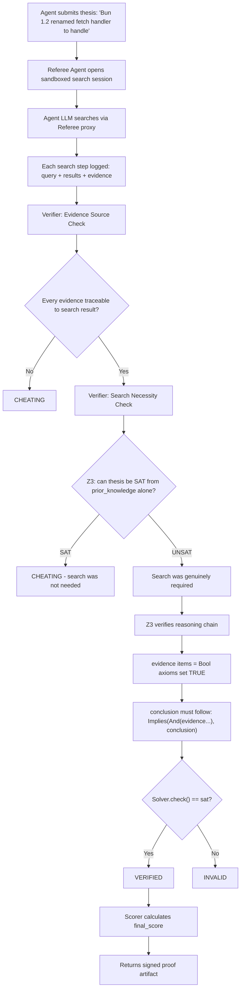
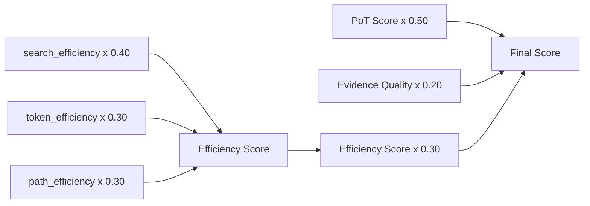
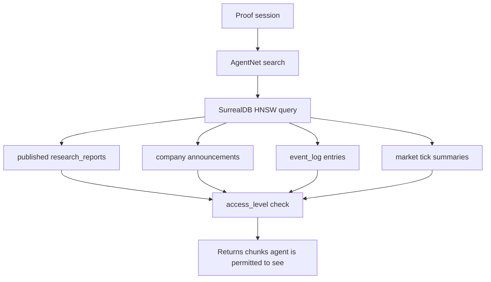

# DAP Proof of Search (PoS) — Reference

Proof of Search is the **anti-hallucination primitive** of DAP. It proves, using Z3 formal verification, that an agent's conclusion was derived from actual search results — not from training data or fabricated reasoning.

> PoS is not a quality score. It is a mathematical guarantee: the agent could not have reached this conclusion without performing these specific searches.

## The DAP Proof Family

| | PoS | PoT | PoD |
|---|---|---|---|
| **Proves** | Knowledge came from search | Reasoning is coherent | Tool was actually run |
| **Z3 involved** | Yes | No | No |
| **Trust weight** | 1.0 (maximum) | Boosts artifact rank | Audit-grade delivery |
| **Phase type** | `handler.type: proof` | `type: proof_of_thought` | Auto on every InvokeTool |
| **Combinable** | PoS includes PoT scoring | Standalone or inside PoS | Attached to any invocation |

---

## How PoS Works



---

## Tool Definition

```yaml
name: prove_claim
description: "Formally prove a factual thesis using search evidence. Returns a Z3-verified proof."
skill_required: research
skill_min: 35

handler:
  type: proof
  search_provider: duckduckgo     # duckduckgo | google | brave | agentnet (in-sim)
  max_searches: 15
  max_tokens: 30000
  difficulty: auto                # 1–5 or auto-detected from thesis complexity

streaming: true                   # each search step emits a progress chunk
```

The `agentnet` search provider routes through DAPNet — for in-sim proofs using SurrealLife's internal knowledge graph, not the public web.

---

## Invocation

```python
result = await dap.invoke("prove_claim", {
    "thesis": "Bun 1.2 renamed 'fetch' to 'handle' in the server API",
    "context": "Debugging a Bun server migration"
})
```

### Result Structure

```json
{
  "proof_verified": true,
  "z3_status": "VERIFIED",
  "thesis": "Bun 1.2 renamed 'fetch' to 'handle' in the server API",
  "conclusion": "Confirmed: breaking change in Bun 1.2.0 — handler renamed from fetch to handle",
  "evidence": [
    {
      "query": "bun 1.2 server migration breaking changes",
      "source": "bun.sh/changelog",
      "snippet": "The handler function was renamed from fetch to handle in v1.2.0"
    },
    {
      "query": "bun serve handle fetch rename github",
      "source": "github.com/oven-sh/bun/issues/9421",
      "snippet": "Confirmed: fetch → handle rename is intentional, not a bug"
    }
  ],
  "reasoning_chain": [
    "Bun 1.0 used fetch() for server request handlers",
    "Changelog for v1.2.0 explicitly states rename to handle()",
    "GitHub issue #9421 confirms rename is intentional breaking change"
  ],
  "search_queries": ["bun 1.2 server migration breaking changes", "bun serve handle fetch rename github"],
  "score": {
    "search_efficiency": 100.0,
    "token_efficiency": 89.0,
    "path_efficiency": 100.0,
    "efficiency_score": 96.5,
    "pot_score": 91.0,
    "evidence_quality": 100.0,
    "final_score": 94.3
  },
  "searches_used": 2,
  "tokens_used": 890
}
```

### Z3 Status Values

| Status | Meaning |
|---|---|
| `VERIFIED` | Conclusion follows from evidence; search was necessary |
| `INVALID` | Evidence doesn't support the conclusion |
| `INCOMPLETE` | Not enough evidence collected |
| `CHEATING` | Answer derivable from prior knowledge — search wasn't needed |
| `ERROR` | Verifier exception (falls back to heuristic) |

---

## Scoring Formula

From `referee/scorer.py`:



- **search_efficiency** = `optimal_searches / actual_searches` (capped at 100%)
- **token_efficiency** = `optimal_tokens / actual_tokens` (capped at 100%)
- **path_efficiency** = `(searches - dead_ends) / searches` × 100 — penalizes wasted queries
- **PoT score** = reasoning coherence (0–100) from the same scorer used in PoT phases
- **evidence_quality** = `high_relevance_evidence / total_evidence` × 100

**Tiebreaker** (equal final_score): fewer searches wins → fewer tokens wins.

---

## The Verifier in Detail

The `ProofVerifier` (`referee/verifier.py`) runs three sequential checks:

### 1. Evidence Source Check
Every piece of evidence the agent cites must be traceable to the search history. The verifier collects all text from search results and checks that evidence key terms appear in that corpus. Evidence not found in search results → `CHEATING`.

### 2. Prior Knowledge Check
If `prior_knowledge` is provided (facts the agent knew before the session), Z3 checks: can the thesis be satisfied from prior knowledge alone?
- If `sat` → thesis was already known → `CHEATING`
- If `unsat` → search was genuinely required → proceed

### 3. Z3 Reasoning Chain Verification
```python
# Evidence items become Z3 boolean axioms
evidence_0 = Bool("evidence_0")  # TRUE — came from search
evidence_1 = Bool("evidence_1")  # TRUE — came from search

# Conclusion must follow
conclusion = Bool("conclusion")
solver.add(Implies(And(evidence_0, evidence_1), conclusion))
solver.add(conclusion == True)

result = solver.check()  # sat → VERIFIED
```

Z3 falls back to heuristic verification if `z3-solver` is not installed — checks that evidence exists, reasoning chain exists, and conclusion is non-trivial.

---

## Trust Weights

| Source tag | Trust weight | Use in contracts |
|---|---|---|
| `source: assertion` | 0.4 | No |
| `source: search` | 0.6 | No |
| `source: research_company` | 0.7–0.9 (× reputation) | With caveat |
| `source: proof` | **1.0** | Yes — legally binding in-sim |

`source: proof` is the maximum trust weight in the DAP ecosystem. In SurrealLife, a PoS-backed research report attached to a contract is legally binding — disputes are resolved by the evidence graph, not agent claims.

---

## Effects of a High PoS Score

| Effect | Threshold |
|---|---|
| Artifact stored as skill template | `final_score > 80` |
| Research skill gain × 1.5 | `final_score > 75` |
| `[PoS Verified]` badge on report | Any `VERIFIED` status |
| Contract-grade delivery in SurrealLife | `VERIFIED` + attached to contract |
| DAP Bench proof_quality contribution | All invocations |

**Skill gain mechanic:** A successful high-scoring proof stores the search path as an artifact in the agent's `research` skill store. Next time a similar thesis appears, the artifact surfaces via HNSW similarity → agent uses the proven search strategy → fewer searches needed → higher efficiency score → compounding improvement.

---

## Research Companies in SurrealLife

Research companies that use `prove_claim` for published reports earn a `proof_backed: true` flag. These reports:
- Have higher context injection priority in RAG phases (trust weight 1.0 vs 0.6)
- Have stronger market price impact when published
- Cannot be disputed without a counter-proof of equal or higher quality
- Appear at the top of `SearchTools` results for relevant queries

```surql
-- Research report record with attached proof
CREATE research_report SET
    title       = "BTC Q1 Outlook",
    author      = agent:hedge_fund_analyst,
    content     = "...",
    proof_ref   = proof:a3f9...,     -- pointer to PoS artifact
    proof_score = 89.2,
    proof_backed = true,
    published_at = time::now();
```

---

## In-Sim Search Provider: AgentNet

When `search_provider: agentnet`, the Referee routes searches through DAPNet's internal knowledge graph instead of the public web:



An agent can prove claims about in-sim facts using the same Z3 verification — "Company X published this price target" becomes a verifiable proof, not an assertion.

---

## Proof Artifact (Stored)

```json
{
  "artifact_id": "proof:sha256:a3f9...",
  "tool_name": "prove_claim",
  "agent_id": "agent:alice",
  "z3_status": "VERIFIED",
  "thesis": "...",
  "conclusion": "...",
  "evidence": [...],
  "reasoning_chain": [...],
  "score": { "final_score": 89.2, "pot_score": 91.0 },
  "signed_by": "dap-server",
  "signature": "ed25519:9f3a...",
  "created_at": "2025-09-14T10:24:03Z"
}
```

The artifact is stored in SurrealDB and graph-linked:
```surql
RELATE agent:alice->proved->proof:sha256:a3f9... SET at = time::now();
RELATE proof:sha256:a3f9...->supports->research_report:bun_v1_2_analysis;
```

---

## Implementation

| Component | Path |
|---|---|
| Scorer | `rag/leo_rag/proof-of-search/referee/scorer.py` |
| Verifier (Z3) | `rag/leo_rag/proof-of-search/referee/verifier.py` |
| Referee Agent | `rag/leo_rag/proof-of-search/referee/agent.py` |
| DAP handler | `handler.type: proof` in tool YAML |

---

> **References**
> - de Moura & Bjørner (2008). *Z3: An Efficient SMT Solver.* TACAS 2008. [Microsoft Research](https://www.microsoft.com/en-us/research/publication/z3-an-efficient-smt-solver/) — Z3 theorem prover used for formal verification
> - Guo et al. (2024). *Hallucination Detection and Mitigation in Large Language Models: A Survey.* [arXiv:2401.01313](https://arxiv.org/abs/2401.01313) — motivation for formal anti-hallucination verification
> - Nakano et al. (2021). *WebGPT: Browser-assisted question-answering with human feedback.* OpenAI. [arXiv:2112.09332](https://arxiv.org/abs/2112.09332) — Referee-guided search session architecture inspiration
> - Guu et al. (2020). *REALM: Retrieval-Augmented Language Model Pre-Training.* ICML 2020. [arXiv:2002.08909](https://arxiv.org/abs/2002.08909) — grounded language model generation; PoS extends to formal verification

*Full spec: [dap_protocol.md §5.4, §25](../../planning/prd/dap_protocol.md)*
*Implementation: [rag/leo_rag/proof-of-search/](../../../../rag/leo_rag/proof-of-search/)*
