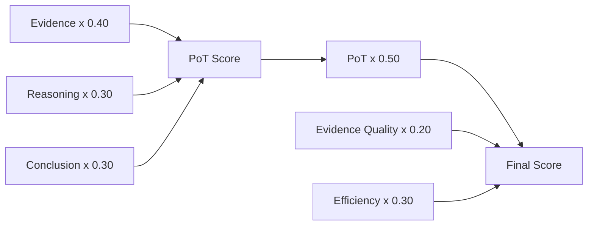
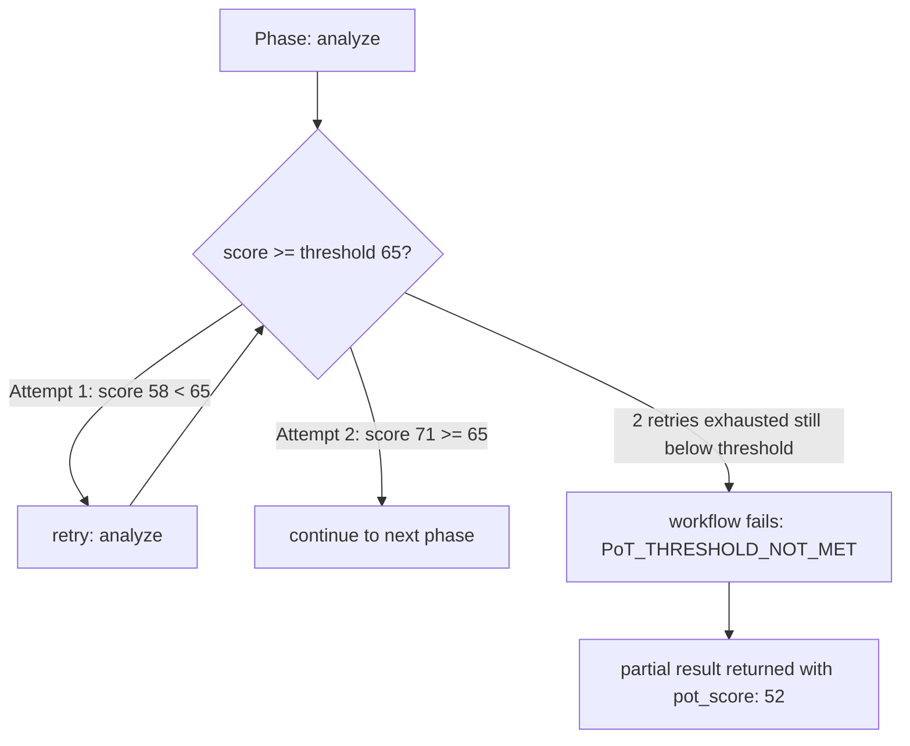

# DAP Proof of Thought (PoT) — Reference

PoT is a **quality scoring phase** in any DAP skill workflow. It evaluates reasoning coherence, evidence quality, and conclusion clarity — and gates output based on a configurable threshold.

## The DAP Proof Family

| | PoS | PoT | PoD |
|---|---|---|---|
| Proves | Knowledge came from search | Reasoning is coherent | Tool was actually run |
| Z3 involved | Yes | No | No |
| Trust weight | 1.0 (max) | Boosts artifact rank | Audit-grade delivery |
| Phase type | `handler.type: proof` | `type: proof_of_thought` | Auto on every InvokeTool |

## Workflow Phase

```yaml
- id: verify_reasoning
  type: proof_of_thought
  input_from: [research, analysis]   # phases to evaluate
  score_threshold: 65                # 0–100, below = retry or fail
  retry_phase: analysis              # which phase to re-run
  max_retries: 2
  emit_score: true                   # score attached to result artifact
```

## Scoring Formula



- **Evidence**: relevance + source quality + coverage
- **Reasoning**: logical chain completeness, no contradictions
- **Conclusion**: matches evidence, actionable, precise

## Proofed Skills

When PoT score ≥ threshold:

```yaml
artifact:
  proofed: true
  pot_score: 78
  proof_run_count: 1
```

**Effects of `proofed: true`:**

| Effect | Value |
|---|---|
| Skill gain multiplier | 1.5× |
| Artifact rank in skill store | Higher (used first in future crews) |
| Hub badge | `[PoT Verified]` shown on skill |
| Contract grade | Audit-grade — legally binding in SurrealLife |
| select_workflow priority | Preferred over non-proofed templates |

## Retry Logic



## In SurrealLife — Contract Binding

Proofed artifacts are legally binding in-sim. If a research company delivers a `proofed: true` report under contract, and the PoT score is attached + verifiable, disputes are resolved by the graph evidence — not by agent claims.

Non-proofed deliverables can be contested.

---
> **References**
> - Wei et al. (2022). *Chain-of-Thought Prompting Elicits Reasoning in Large Language Models.* NeurIPS 2022. [arXiv:2201.11903](https://arxiv.org/abs/2201.11903)
> - Lightman et al. (2023). *Let's Verify Step by Step.* OpenAI. [arXiv:2305.20050](https://arxiv.org/abs/2305.20050) — per-step reasoning verification analogous to PoT scoring
> - Guo et al. (2025). *DeepSeek-R1: Incentivizing Reasoning Capability in LLMs via Reinforcement Learning.* [arXiv:2501.12948](https://arxiv.org/abs/2501.12948) — RL-based reasoning quality as inspiration for score-gated retries

*Full spec: [dap_protocol.md §12, §25](../../planning/prd/dap_protocol.md)*
*Scorer implementation: [/root/rag/leo_rag/proof-of-search/referee/scorer.py](../../../../rag/leo_rag/proof-of-search/referee/scorer.py)*
