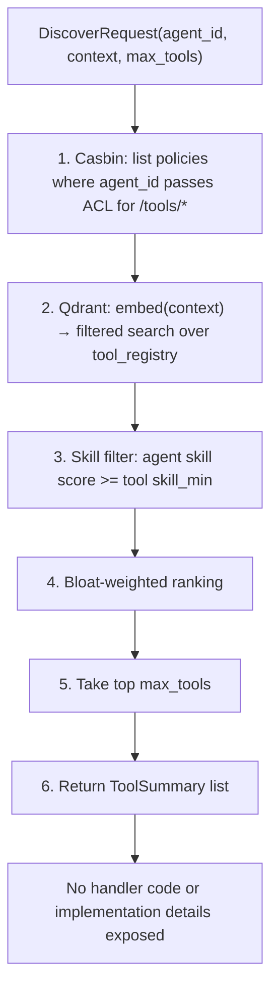
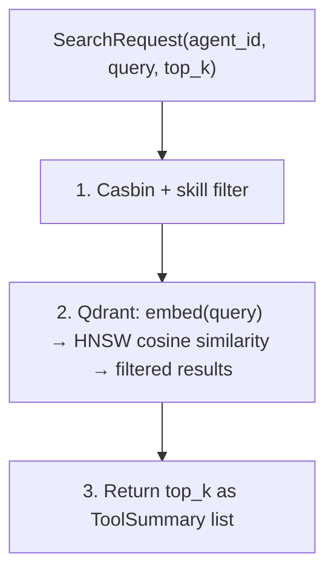

# DAP Protocol — Reference

DAP (Dynamic Agent Protocol) is a gRPC service for tool discovery and invocation in multi-agent systems. It replaces static tool lists with live, ACL-gated, semantically indexed discovery over protobuf.

## Core Service

DAP defines a single gRPC service `ToolService` with four RPCs:

```protobuf
service ToolService {
  rpc DiscoverTools  (DiscoverRequest)  returns (DiscoverResponse);
  rpc SearchTools    (SearchRequest)    returns (SearchResponse);
  rpc GetToolSchema  (SchemaRequest)    returns (ToolSchema);
  rpc InvokeTool     (InvokeRequest)    returns (stream InvokeResponse);
}
```

### DiscoverTools

Returns tools the agent is permitted to call, ranked by context relevance. Called at each agent activation.

**Request:** `agent_id`, `context` (current task description), `max_tools` (budget hint, 0 = no limit)

**Response:** `ToolSummary[]` (name + description + tags), `index_version`, `total_available`

**Flow:**



The agent's LLM receives clean, context-ranked summaries. Handler code is never exposed.

### SearchTools

On-demand semantic search for tools the agent doesn't yet know about.

**Request:** `agent_id`, `query` (natural language intent), `top_k`

**Flow:**



Example: "I need to file a legal complaint" → returns `file_lawsuit`, `create_dispute_record`, `notify_agentcourt`.

### GetToolSchema

Returns full parameter/return JSON Schema for a specific tool. Only called when the agent decides to use a tool — lazy loading keeps context lean.

**Response:** `tool_name`, `description` (full), `parameter_schema`, `return_schema`, `acl_path`, `skill_required`, `skill_min`, `handler_type`, `version`, `examples[]`

### InvokeTool

Server-streaming RPC for tool execution.

**Request:** `agent_id`, `tool_name`, `parameters` (JSON bytes), `task_context`, `trace_id`

**Response stream:**
- Short tools: single `InvokeResponse(result=..., is_final=true)`
- Long-running tools: multiple `stream_chunk` messages, then final `result`
- Errors: `ToolError` within the stream (never as gRPC status codes)

## ToolSummary vs ToolSchema

| Field | ToolSummary (DiscoverTools) | ToolSchema (GetToolSchema) |
|---|---|---|
| name | yes | yes |
| description | one sentence | full |
| tags | yes | — |
| parameter_schema | — | yes (JSON Schema) |
| return_schema | — | yes (JSON Schema) |
| handler_type | yes | yes |
| version | — | yes |
| examples | — | yes |

## Structured Errors

All errors return as `ToolError` in the response stream:

| error_type | Meaning | hint |
|---|---|---|
| `permission_denied` | ACL check failed | "This tool requires a different role or warrant" |
| `skill_insufficient` | Skill score below minimum | "Increase your {skill} skill to access this tool" |
| `invalid_params` | Parameter validation failed | "Check parameter schema with GetToolSchema" |
| `execution_error` | Handler failed during execution | "Try SearchTools for alternatives" |
| `timeout` | Handler exceeded time limit | "Consider breaking into smaller steps" |

Persistent `permission_denied` on the same path triggers anomaly flags in oversight.

## Index Version Change Detection

When a tool is registered, modified, or deprecated, `index_version` changes. The agent runtime checks this at each activation — if changed, it re-runs `DiscoverTools` automatically. No prompt regeneration or restart needed.

## Why gRPC

| Consideration | gRPC (DAP) | REST/JSON |
|---|---|---|
| Schema | Protobuf — typed, compile-time validated | JSON — runtime validated |
| Performance | Binary, multiplexed HTTP/2 | Text, one connection per request |
| Streaming | Native bidirectional | SSE or WebSocket — bolted on |
| Documentation | `.proto` file IS the spec | Separate OpenAPI spec required |
| Clients | Generated stubs: Python, Go, JS, Rust, Java | Manual per language |

For a system where every agent activation triggers multiple discovery + invocation calls across a fleet, binary protocol performance matters.

## DAP vs MCP

| Capability | MCP | DAP |
|---|---|---|
| Tool set | Fixed at session start | Dynamic — changes with ACL, skill tier, registrations |
| Discovery | Listed in system prompt | Live gRPC query at each activation |
| Access control | Not built in | Casbin ACL is part of the protocol |
| Tool search | None | Semantic Qdrant search filtered by ACL |
| Streaming | Not native | gRPC native streaming |
| Multi-tenancy | Single agent | Fleet of agents — each sees different tool sets |
| Dynamic registration | Requires session restart | Index version bump → auto re-discover |
| Context efficiency | All tools in prompt | `max_tools` budget hint, lazy search |
| Audit log | External | Built into every `InvokeTool` call |

MCP and DAP are complementary. MCP solves "connect a developer's LLM assistant to local tools." DAP solves "give a fleet of autonomous agents access to an evolving, identity-aware, access-controlled tool ecosystem."

> **References**
> - [gRPC Core Concepts](https://grpc.io/docs/what-is-grpc/core-concepts/)
> - [Protocol Buffers Language Guide](https://protobuf.dev/programming-guides/proto3/)
> - [Anthropic MCP Specification](https://modelcontextprotocol.io/)

*Full spec: [dap_protocol.md §3, §10, §11](../../planning/prd/dap_protocol.md)*
