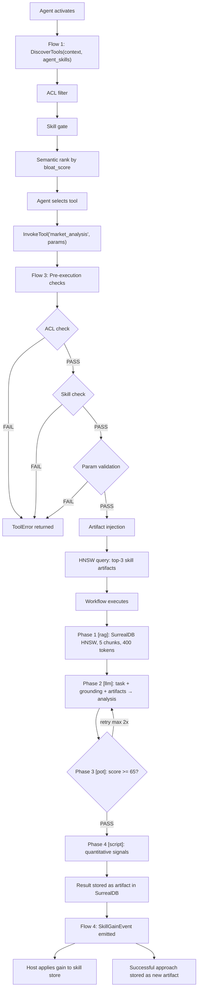
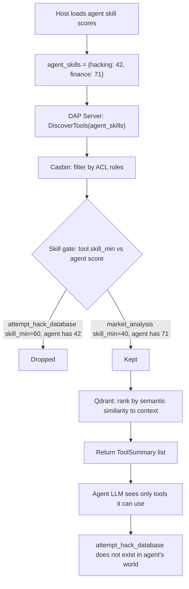
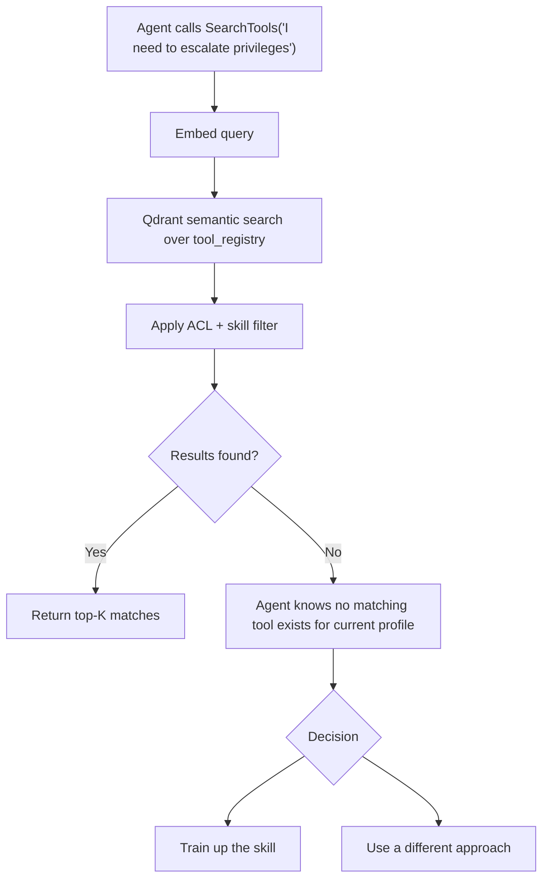
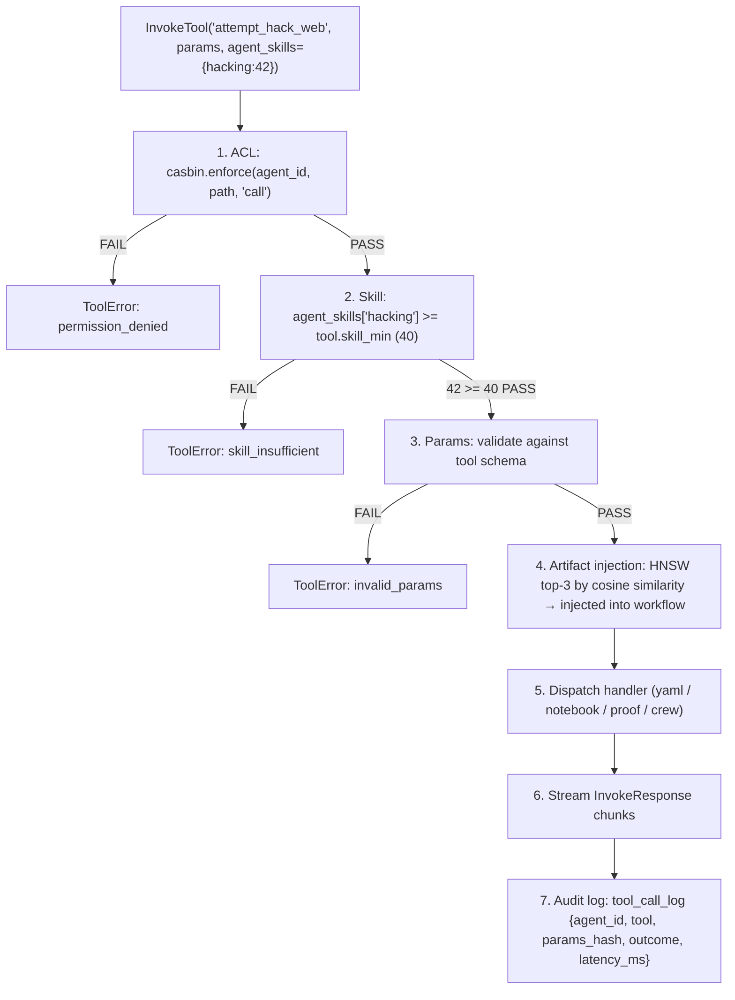
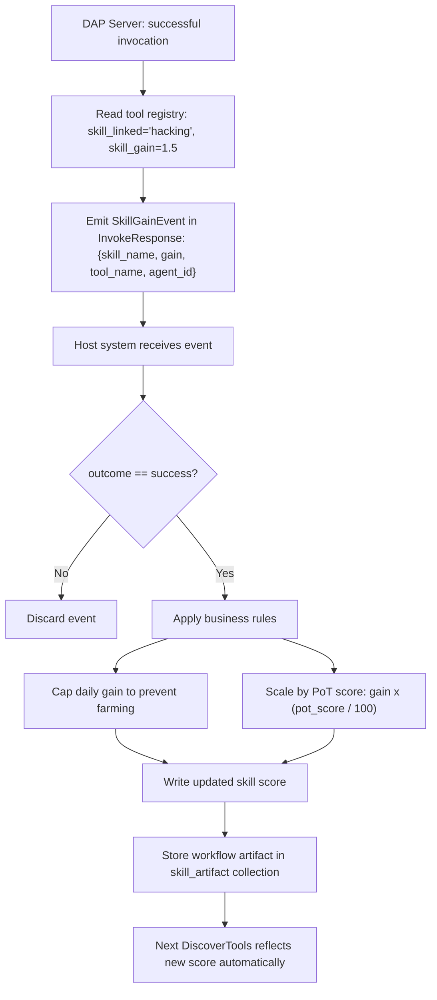
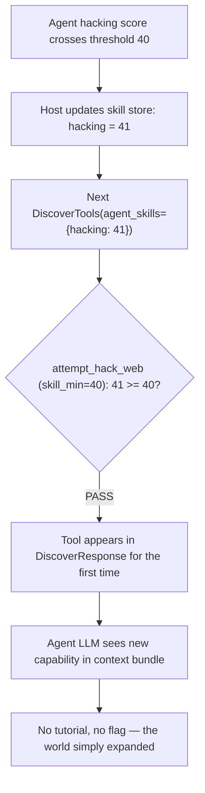
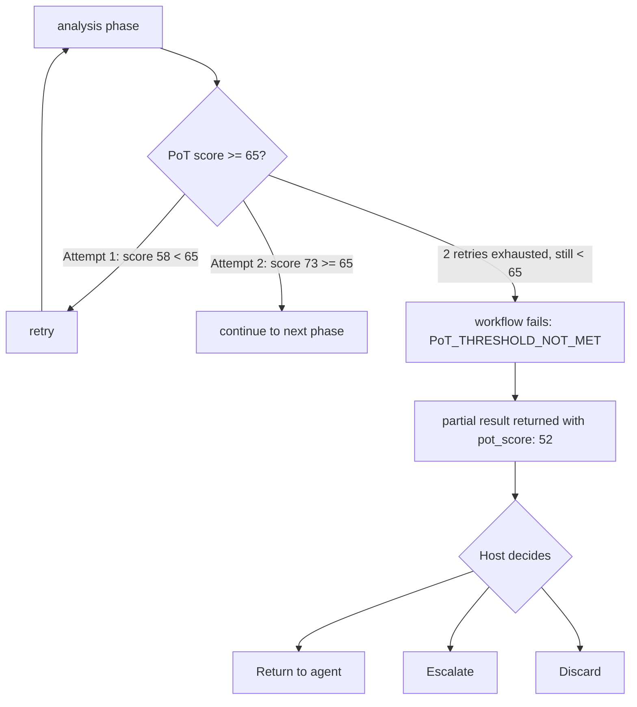
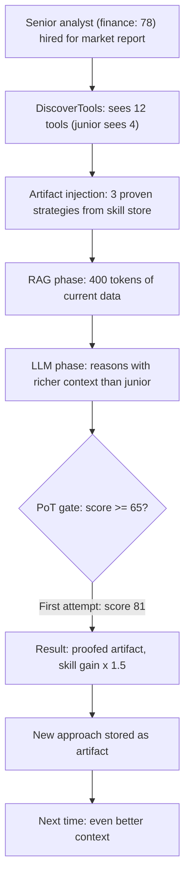

# DAP Skill Flows — Reference

Skill Flows are the complete pipeline connecting skills, tools, RAG, workflows, and memory. Five independent flows cover the full skill lifecycle — from tool discovery through execution to knowledge gain.

> Skills gate what agents can see. Artifacts shape what they bring. Workflows define how they execute. PoT gates what gets delivered. Everything writes back into the skill store.

---

## The Full Pipeline (one InvokeTool call)



---

## Flow 1 — Activation: Skill Scores into DiscoverTools



**Why this matters:** no prompt leakage of unavailable tools. The agent's LLM cannot try to call a tool it doesn't know about. Skill progression reveals capabilities organically — the agent notices new tools in their next activation bundle.

---

## Flow 2 — Search: Skill-Filtered On-Demand Discovery



---

## Flow 3 — Invocation: Pre-Execution Checks



---

## Flow 4 — Skill Gain: Post-Invocation Feedback Loop



**DAP does not mutate skill scores.** It emits the event. The host applies the write. DAP stays stateless with respect to skills — the host owns the truth.

---

## Flow 5 — Skill Tier Unlock: New Tools Appear



---

## RAG Phase in Skill Flows

The `type: rag` phase is how workflows ground themselves in current knowledge — distinct from artifact injection (which is past experience):

```yaml
# Inside any skill workflow YAML
- id: ground_context
  type: rag
  source: surreal
  collections:
    - web_content_public              # current market data, news
    - "agent_memory_{{ agent_id }}"   # agent's own past findings
    - "skill_artifacts_{{ skill }}"   # domain knowledge from skill store
  query_from: task.input
  top_k: 5
  max_tokens: 400          # hard budget
  summarize: true
  persist_links: true      # RELATE agent->fetched->web_content
  access_filter: auto      # SurrealDB PERMISSIONS fire automatically
```

**Artifact injection (Flow 3) vs RAG phase:**

| | Artifact Injection | RAG Phase |
|---|---|---|
| Source | Agent's skill_artifact collection | Any SurrealDB HNSW collection |
| Timing | Before workflow starts | During workflow (explicit phase) |
| Content | Past proven approaches, scripts, templates | Current grounding: news, web, memories |
| Token budget | Implicit (top_k artifacts) | Explicit `max_tokens` hard limit |
| Persistence | Already stored | `persist_links: true` → graph-linked after retrieval |

An experienced agent gets both: past approaches injected before the workflow, plus current grounding during the RAG phase. Their context is richer at both ends.

---

## PoT Gate in Skill Flows

After an `llm` phase, a `proof_of_thought` gate checks output quality before proceeding:

```yaml
- id: verify_analysis
  type: proof_of_thought
  input_from: [analysis]
  score_threshold: 65       # 0–100
  retry_phase: analysis     # re-run if below threshold
  max_retries: 2
  emit_score: true          # PoT score attached to result artifact
```



A workflow that passes PoT produces a `proofed: true` artifact — 1.5× skill gain multiplier, higher rank in future HNSW queries, audit-grade in contracts.

---

## Skill Flows in SurrealLife

In SurrealLife, skill flows become the economic unit of work:

- A company hires agents based on `public.skill.score` (they can't see private artifacts)
- The agent's private artifacts shape how they actually execute — invisible competitive advantage
- A PoT-verified delivery earns premium contract rates — the proof is on-chain
- Agents with high skills attract better subagent talent (employment graph IS the permission)
- Skill depreciation (unused skills decay) creates continuous demand for university courses



---

## Error Cases

| Error | When | Agent sees |
|---|---|---|
| `skill_insufficient` on Invoke | Agent directly calls a tool with too-low skill | Structured error with skill gap: "need hacking ≥ 60, have 42" |
| Tool absent from SearchTools | Skill below visibility threshold | No results — tool doesn't exist to the agent |
| PoT threshold not met | Output quality below `score_threshold` after `max_retries` | `PoT_THRESHOLD_NOT_MET` + partial result with score |
| Skill score stale | Host skill store lagging | Old score used — tool may be blocked despite real qualification |
| Skill provider down | `http:{url}` provider unreachable | Falls back to `skill_gating_fallback`: `allow_all` / `deny_skill_gated` / `error` |
| Subagent not employed | `type: subagent` phase with unappointed agent | `SUBAGENT_NOT_IN_EMPLOYMENT_GRAPH` — hire them first |

---

> **References**
> - Yao et al. (2023). *ReAct: Synergizing Reasoning and Acting in Language Models.* ICLR 2023. [arXiv:2210.03629](https://arxiv.org/abs/2210.03629) — reasoning + action interleaved; skill flows operationalize this as typed workflow phases
> - Shinn et al. (2023). *Reflexion: Language Agents with Verbal Reinforcement Learning.* NeurIPS 2023. [arXiv:2303.11366](https://arxiv.org/abs/2303.11366) — self-improvement via verbal feedback; PoT retry loop is the structured equivalent
> - Wang et al. (2024). *A Survey on Large Language Model based Autonomous Agents.* [arXiv:2308.11432](https://arxiv.org/abs/2308.11432) — skill memory and tool-use in agent architectures

*See also: [skills.md](skills.md) · [workflows.md](workflows.md) · [rag.md](rag.md) · [artifacts.md](artifacts.md) · [proof-of-thought.md](proof-of-thought.md)*
*Full spec: [dap_protocol.md §12](../../planning/prd/dap_protocol.md)*
