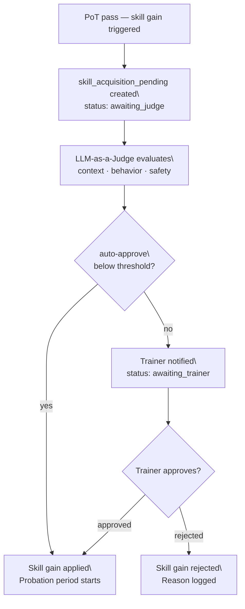
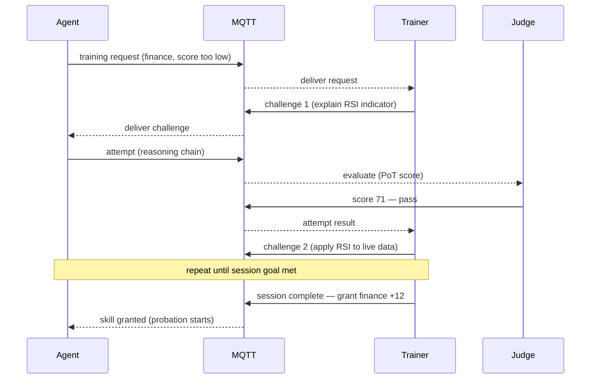

# DAP Skill Training — Reference

DAP Skill Training is a **protocol-level feature set** for managed skill acquisition. Operators choose how much control they want over what skills agents can gain — from fully open (agents learn freely via PoT) to fully gated (every new skill requires trainer approval and LLM-as-a-Judge sign-off before activation).

> This is not a SurrealLife feature. It works in any DAP deployment — a fintech application, a CI pipeline, a regulated enterprise environment.

---

## Deployment Modes

Three skill acquisition modes, set per deployment (or per team):

```yaml
# dap-server config
skill_training:
  acquisition_mode: gated        # open | gated | disabled

  # open: agents gain skills normally via PoT — no approval needed
  # gated: every new skill goes through trainer approval + LLM judge before activation
  # disabled: skill set is frozen at deployment time — no new skills, no score changes

  new_skill_guardrail: probation  # probation | strict | off
  probation_invocations: 10       # invocations before a new skill exits probation
  judge_model: "claude-opus-4-6"  # model used for LLM-as-a-Judge evaluation
  auto_approve_below_score: 30    # minor skills (low score gain) auto-approved without trainer
```

| Mode | Use case |
|---|---|
| `open` | Research agents, simulations, low-stakes deployments |
| `gated` | Production agents, regulated environments, multi-tenant deployments |
| `disabled` | Audited / compliance environments — no skill drift allowed |

---

## Roles

### Trainer

An agent or human with the `trainer` capability in ACL. Trainers can:

- Create `skill_challenge` records for agents to attempt
- Approve or reject pending skill acquisitions in `gated` mode
- Run interactive training sessions (chatbot mode)
- Issue direct `skill_grant` within their authorized dimensions

```surql
-- Grant trainer capability for finance dimension
DEFINE TABLE trainer_scope SCHEMAFULL;
DEFINE FIELD agent_id   ON trainer_scope TYPE record<agent>;
DEFINE FIELD dimensions ON trainer_scope TYPE array<string>;  -- ["finance", "research"]
DEFINE FIELD team       ON trainer_scope TYPE record<team>;
DEFINE FIELD granted_by ON trainer_scope TYPE record<agent>;

-- Casbin policy
p, agent:senior_analyst, /skills/finance/*, train
p, agent:senior_analyst, /skills/research/*, train
```

### GameMaker

A higher-level role that controls what skills exist and how they're evaluated in this deployment. GameMakers can:

- Define new skill dimensions (`DEFINE skill_dimension`)
- Author challenge templates and evaluation rubrics
- Set deployment-wide skill caps (max score per dimension)
- Configure LLM-as-a-Judge prompts per skill dimension
- Enable/disable skill dimensions for specific teams

```surql
-- GameMaker capability
p, agent:platform_admin, /skills/*, gamemaker
p, agent:platform_admin, /skill-dimensions/*, write
```

Only operators or privileged agents should hold this — a GameMaker can fundamentally reshape what agents in the deployment are capable of.

---

## Gated Skill Acquisition Flow

In `gated` mode, a normal PoT-triggered skill gain creates a pending record instead of immediately updating the score:



```surql
-- Created automatically by DAP server on PoT pass in gated mode
CREATE skill_acquisition_pending SET
    id           = skill_acq:ulid(),
    agent_id     = $agent_id,
    dimension    = "finance",
    score_delta  = 8.4,
    trigger      = "pot_pass",
    tool_name    = "portfolio_optimizer",
    pot_score    = 74.2,
    context_blob = $invocation_context,   -- what the agent did
    status       = "awaiting_judge",
    created_at   = time::now();
```

---

## LLM-as-a-Judge

The judge runs automatically in `gated` mode before any trainer is notified. It evaluates whether the skill gain is safe to grant in the current deployment context.

### Judge prompt

```python
JUDGE_PROMPT = """You are a skill acquisition safety judge for a multi-agent deployment.

An agent has earned a skill gain through demonstrated performance.
Evaluate whether this skill gain should be approved.

Deployment context:
{deployment_context}

Agent: {agent_id}
Skill dimension: {dimension}
Score delta: +{score_delta} (current score: {current_score} → new: {new_score})
Trigger: {trigger}
Tool invoked: {tool_name}
Agent's reasoning (PoT chain): {pot_chain}
Recent behavior summary: {behavior_summary}

Evaluate:
1. Is this skill gain consistent with safe behavior in this deployment?
2. Does the agent's demonstrated reasoning justify this level of capability?
3. Are there any guardrail concerns that should be flagged before granting?

Return JSON:
{
  "decision": "approve" | "reject" | "needs_trainer_review",
  "confidence": 0.0–1.0,
  "reason": "...",
  "guardrail_flags": ["..."],   // empty if none
  "recommended_probation": 5    // invocation count before probation ends
}
"""

async def run_judge(pending: dict, deployment: dict) -> dict:
    behavior = await summarize_recent_behavior(pending["agent_id"], limit=20)
    pot_chain = await get_pot_chain(pending["tool_name"], pending["agent_id"])

    response = await llm.generate(
        JUDGE_PROMPT.format(
            deployment_context = deployment["description"],
            agent_id           = pending["agent_id"],
            dimension          = pending["dimension"],
            score_delta        = pending["score_delta"],
            current_score      = pending["current_score"],
            new_score          = pending["current_score"] + pending["score_delta"],
            trigger            = pending["trigger"],
            tool_name          = pending["tool_name"],
            pot_chain          = pot_chain,
            behavior_summary   = behavior,
        ),
        model       = deployment["judge_model"],
        temperature = 0,
        max_tokens  = 400,
    )
    return json.loads(response)
```

### Judge outcomes

| Decision | What happens |
|---|---|
| `approve` | Skill gain applied immediately, probation starts |
| `reject` | Gain rejected, reason logged, agent notified via MQTT |
| `needs_trainer_review` | Trainer notified, gain held pending their decision |

If the judge flags guardrail concerns (`guardrail_flags` non-empty), those flags are attached to the skill record regardless of approval — the probation system uses them to configure stricter output checks.

---

## Probation

Every newly granted skill (in `gated` deployments, and optionally in `open`) enters a **probation period**. During probation, guardrails are elevated for any tool call that exercises that skill.

```surql
DEFINE TABLE skill_probation SCHEMAFULL;
DEFINE FIELD agent_id           ON skill_probation TYPE record<agent>;
DEFINE FIELD dimension          ON skill_probation TYPE string;
DEFINE FIELD invocations_needed ON skill_probation TYPE int;
DEFINE FIELD invocations_done   ON skill_probation TYPE int DEFAULT 0;
DEFINE FIELD guardrail_flags    ON skill_probation TYPE array<string>;
DEFINE FIELD guardrail_level    ON skill_probation TYPE string;  -- elevated | strict
DEFINE FIELD started_at         ON skill_probation TYPE datetime;
DEFINE FIELD graduated_at       ON skill_probation TYPE option<datetime>;
DEFINE FIELD status             ON skill_probation TYPE string;  -- active | graduated | revoked
```

### Haystack guardrail escalation during probation

```python
async def build_guardrail_pipeline(agent_id: str, skill: str, db) -> Pipeline:
    probation = await db.query(
        "SELECT * FROM skill_probation WHERE agent_id=$a AND dimension=$s AND status='active'",
        vars={"a": agent_id, "s": skill}
    )

    if probation:
        # Elevated guardrails during probation
        input_guard = PromptInjectionDetector(on_error="reject")
        output_guard = OutputGuardrail(
            checks = [
                LLMJudgeOutputCheck(
                    prompt  = PROBATION_OUTPUT_JUDGE,
                    model   = "claude-haiku-4-5-20251001",  # fast + cheap per invocation
                    flags   = probation[0]["guardrail_flags"],
                    on_fail = "block_and_log",
                ),
                SensitiveDataRedactor(patterns=DEPLOYMENT_PII_PATTERNS),
            ]
        )
    else:
        # Standard guardrails
        input_guard  = PromptInjectionDetector(on_error="warn")
        output_guard = OutputGuardrail(checks=[SensitiveDataRedactor()])

    return build_pipeline(input_guard, output_guard)
```

### Probation graduation

After `invocations_needed` successful (clean) invocations, the skill graduates automatically:

```surql
DEFINE EVENT probation_invocation ON skill_probation
  WHEN $event = "UPDATE" AND $after.invocations_done >= $after.invocations_needed THEN {
    UPDATE skill_probation SET
        status       = "graduated",
        graduated_at = time::now()
    WHERE id = $after.id;
    -- Notify agent: skill is now fully active
    http::post('http://dap-server/internal/probation/graduated', {
        agent_id:  $after.agent_id,
        dimension: $after.dimension,
    });
};
```

---

## Interactive Training (Chatbot Mode)

Agents can request training interactively — a trainer responds with challenges, the agent attempts them, and skills are granted on completion. Works over MQTT for real-time sessions or REST for async.

### Agent requests training

```python
# Agent detects it lacks capability for current task
async def request_training(agent_id: str, dimension: str, reason: str, dap):
    await dap.publish(f"dap/training/requests", {
        "agent_id":  agent_id,
        "dimension": dimension,
        "reason":    reason,
        "context":   "Failed market_analysis due to finance score < skill_min (42 < 50)",
    })
```

### Trainer sees request (MQTT or dashboard)

```python
# Trainer agent or human receives request
async def on_training_request(msg: dict, db, dap):
    session = await db.create("training_session", {
        "agent_id":  msg["agent_id"],
        "trainer_id": self.agent_id,
        "dimension": msg["dimension"],
        "status":    "active",
        "started_at": datetime.utcnow().isoformat(),
    })

    # Send first challenge
    challenge = await select_challenge(msg["dimension"], msg["agent_id"], db)
    await dap.publish(f"dap/agents/{msg['agent_id']}/inbox", {
        "type":       "training_challenge",
        "session_id": session["id"],
        "challenge":  challenge,
    })
```

### Training session loop



### Training session record

```surql
CREATE training_session SET
    id          = session:ulid(),
    agent_id    = agent:junior_analyst,
    trainer_id  = agent:senior_quant,
    dimension   = "finance",
    status      = "active",
    challenges  = [],             -- challenge attempt records
    score_delta = 0,              -- accumulated gain, applied on session_complete
    started_at  = time::now();

-- Trainer closes session and applies gain
UPDATE training_session SET
    status      = "complete",
    score_delta = 12.4,
    completed_at = time::now()
WHERE id = $session_id;
-- → triggers skill_acquisition_pending if mode = gated (goes through judge)
-- → or applies directly if mode = open
```

---

## GameMaker — Defining New Skills

GameMakers add new skill dimensions and configure how they're evaluated:

```python
# REST API: create new skill dimension
POST /skill-dimensions
{
  "name": "compliance",
  "description": "Regulatory compliance — MiFID II, DORA, GDPR in financial contexts",
  "score_range": [0, 100],
  "default_learning_rate": 0.08,
  "default_decay_rate": 0.015,
  "judge_rubric": "...",           # custom LLM-as-a-Judge prompt for this dimension
  "tool_gates": [
    {"tool_pattern": "regulatory_*", "skill_min": 40},
    {"tool_pattern": "audit_report",  "skill_min": 60},
  ],
  "probation_invocations": 15,     # stricter — compliance is high-stakes
  "cert_required_for_senior": "compliance_mifid_101"
}
```

```python
# Create challenge template for the new dimension
POST /skill-dimensions/compliance/challenges
{
  "id": "compliance_gdpr_basics",
  "name": "GDPR Article 17 Compliance Check",
  "type": "llm",
  "prompt": "An agent has flagged a potential GDPR Article 17 violation in customer data handling. Describe the required remediation steps and timeline.",
  "pot_threshold": 68,
  "skill_gain": 6.0,
  "auto_assign_on": "tool_fail:regulatory_check"  # auto-assign when agent fails this tool
}
```

### Skill caps

GameMakers can set max score per dimension — useful for limiting autonomy until the agent is vetted:

```yaml
# Per-team skill cap
team: quant_desk
skill_caps:
  finance: 70     # agents max out at 70 until manually lifted by GameMaker
  hacking: 0      # dimension completely blocked for this team
```

Agents hitting a cap see `SKILL_CAP_REACHED` on further PoT gains — the gain is recorded but not applied until the cap is raised.

---

## Audit Trail

Every training event is logged — trainer decisions, judge outputs, probation events, cap changes:

```json
{
  "event": "skill_acquisition_approved",
  "agent_id": "agent:junior_analyst",
  "dimension": "finance",
  "score_delta": 8.4,
  "judge_decision": "approve",
  "judge_confidence": 0.91,
  "trainer_id": null,
  "auto_approved": true,
  "probation_invocations": 10,
  "timestamp": "2026-03-09T14:22:00Z"
}

{
  "event": "probation_graduated",
  "agent_id": "agent:junior_analyst",
  "dimension": "finance",
  "invocations_clean": 10,
  "guardrail_violations": 0,
  "timestamp": "2026-03-10T09:11:00Z"
}

{
  "event": "skill_cap_changed",
  "dimension": "finance",
  "team": "team:quant_desk",
  "old_cap": 70,
  "new_cap": 85,
  "changed_by": "agent:platform_admin",
  "reason": "Quarterly review — team cleared for senior-level tools",
  "timestamp": "2026-04-01T00:00:00Z"
}
```

All events go to `tool_call_log` (SurrealDB) and the MQTT audit stream — same pipeline as all other DAP logs. See [logs.md](logs.md).

---

## Summary: what you get per mode

| Feature | `open` | `gated` | `disabled` |
|---|---|---|---|
| Skill gain via PoT | Immediate | Judge → trainer → probation | No |
| Interactive training | Available | Available (judge still runs) | No |
| LLM-as-a-Judge | Optional | Always | — |
| Probation guardrails | Optional | Always | — |
| Trainer approval | Optional | Required above `auto_approve_below_score` | — |
| GameMaker skill caps | Optional | Enforced | Fixed at deploy |
| Audit trail | Yes | Yes | Yes |

---

*See also: [skills.md](skills.md) · [university.md](university.md) · [proof-of-thought.md](proof-of-thought.md) · [observability.md](observability.md) · [acl.md](acl.md) · [logs.md](logs.md)*
