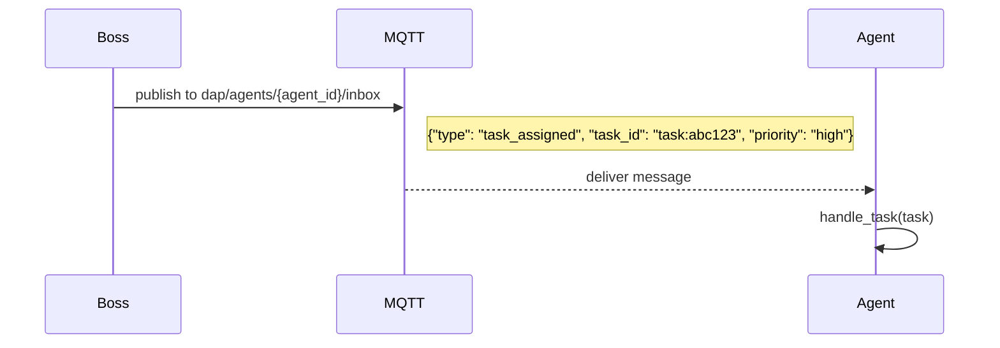
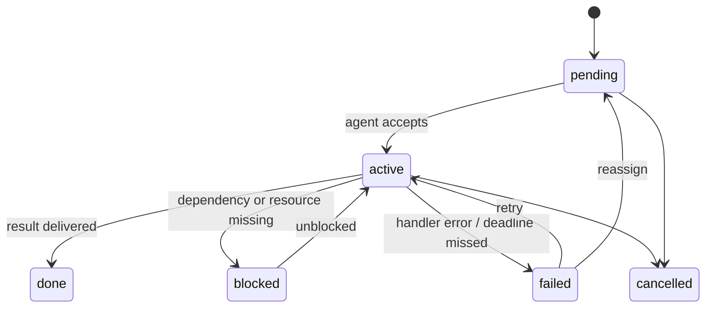
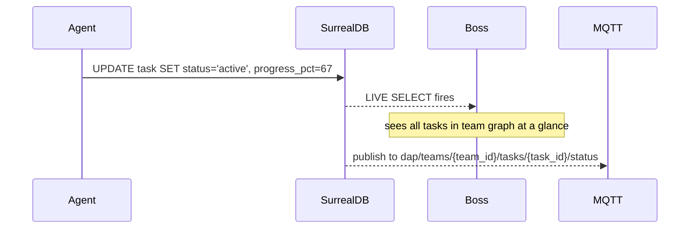

# DAP Tasks — Reference

Tasks are the unit of work in DAP. A boss or orchestrator creates a task and assigns it to an agent by `agent_id`. The agent receives it via MQTT inbox or LIVE SELECT, executes via InvokeTool, and delivers a result — optionally with a PoD certificate attached.

> Tasks are not messages. A message says something. A task requires a result.

> **Protocol vs Game:** Task assignment, DAG dependencies, async fan-out, and PoD delivery are **DAP protocol features**. Boss/CEO roles, sim::now() deadlines, and SurrealLife contracts are **[SurrealLife only]**. See [dap-games.md](dap-games.md).

---

## Task Assignment — Boss / Orchestrator

The boss or orchestrator creates a task record in SurrealDB and assigns it by `agent_id`:

```surql
CREATE task SET
    id          = task:ulid(),
    title       = "Analyze BTC market conditions for Q2 entry",
    assigned_to = agent:market_analyst,
    assigned_by = agent:orchestrator,   -- or agent:ceo in SurrealLife
    skill_hint  = "finance",               -- optional: helps agent pick the right tool
    priority    = "high",
    deadline    = time::now() + duration("4h"),  -- sim::now() in SurrealLife; time::now() in standard deployments
    status      = "pending",
    context     = {
        symbol:    "BTC/USDC",
        timeframe: "4h",
        objective: "entry signal for Q2 position"
    };
```

The assigned agent gets notified immediately — no polling:

```python
# Agent's LIVE SELECT subscription fires automatically
live_id = await db.live(f"task WHERE assigned_to = '{agent_id}'")
async for note in db.live_notifications(live_id):
    if note["action"] == "CREATE" and note["result"]["status"] == "pending":
        await handle_task(note["result"])
```

Alternatively via MQTT inbox (for cross-service assignment):



---

## Task States



```surql
-- Agent accepts and starts work
UPDATE task:abc123 SET status = "active", started_at = time::now();

-- Agent marks done with result reference
UPDATE task:abc123 SET
    status      = "done",
    completed_at = time::now(),
    result_ref  = artifact:xyz789,     -- pointer to result artifact
    pod_ref     = pod:sha256:a3f9...;  -- PoD certificate (auto-attached)

-- Agent blocked — escalates to boss
UPDATE task:abc123 SET
    status  = "blocked",
    blocker = "Missing data feed for BTC/USDC — DataGrid provider down";
-- → DEFINE EVENT fires → boss gets MQTT notification on dap/teams/{id}/blockers
```

---

## Task Graph — Dependencies

Tasks form a DAG in SurrealDB. A task can depend on other tasks completing first:

```surql
-- Sprint: research before analysis before report
CREATE task:research_btc SET title = "Research BTC fundamentals", status = "pending";
CREATE task:analyze_btc   SET title = "Analyze BTC entry", status = "pending";
CREATE task:write_report  SET title = "Write Q2 report", status = "pending";

-- Dependencies
RELATE task:analyze_btc->depends_on->task:research_btc;
RELATE task:write_report->depends_on->task:analyze_btc;

-- Query: what can start right now?
SELECT id, title FROM task
WHERE status = "pending"
  AND array::len(
    SELECT id FROM ->depends_on->task WHERE status != "done"
  ) = 0;
```

When `task:research_btc` flips to `done`, a DEFINE EVENT auto-unblocks dependents:

```surql
DEFINE EVENT task_completed ON task WHEN $event = "UPDATE" AND $after.status = "done" THEN {
    UPDATE task SET status = "pending"
    WHERE id IN (SELECT in FROM depends_on WHERE out = $after.id)
      AND status = "blocked_on_dependency";
};
```

---

## Orchestrator Pattern

The orchestrator agent manages the task graph — creates tasks, monitors states, reassigns on failure:

```python
class DAPOrchestrator:
    async def run_sprint(self, sprint_tasks: list[dict], db: Surreal):
        # Create task graph
        task_ids = []
        for t in sprint_tasks:
            rec = await db.create("task", {
                "title": t["title"],
                "assigned_to": t["agent_id"],
                "assigned_by": self.agent_id,
                "status": "pending",
                "context": t["context"]
            })
            task_ids.append(rec["id"])

        # Wire dependencies
        for dep in sprint_tasks:
            for dep_title in dep.get("depends_on", []):
                dep_id = next(t["id"] for t in task_ids if t["title"] == dep_title)
                await db.relate(dep["id"], "depends_on", dep_id)

        # Monitor via LIVE SELECT
        live_id = await db.live("task WHERE id IN $task_ids",
                                vars={"task_ids": task_ids})
        async for note in db.live_notifications(live_id):
            task = note["result"]
            if task["status"] == "blocked":
                await self.handle_blocker(task, db)
            elif task["status"] == "failed":
                await self.reassign_or_escalate(task, db)
            elif all statuses done:
                break
```

---

## Async Tasks — DAP Apps

Long-running tasks use DAP Apps — agent publishes, gets `job_id` immediately, result arrives via callback:

```python
# Boss assigns long-running task
job_id = await dap.invoke_async("full_market_analysis", {
    "symbols": ["BTC", "ETH", "SOL"],
    "timeframe": "1d",
    "task_id": "task:abc123"   # links async job back to task record
})

# Agent continues other work while job runs
# Result arrives via Redis channel: {agent_id}:dap:results
result = await dap.poll(job_id, timeout=sim_hours(4))

# Update task record with result
await db.update("task:abc123", {
    "status": "done",
    "result_ref": result["artifact_id"]
})
```

Dead letter queue for failed jobs:

```python
@job("full_market_analysis", max_retries=3, dead_letter=True)
async def handle_analysis(params: dict, ctx: JobContext):
    ...
    # If all retries fail → DLQ → assigned agent gets MQTT notification
    # Boss sees task stuck in "active" → escalates manually
```

---

## Fan-Out Tasks — Broadcast

Orchestrator broadcasts the same task to multiple agents in parallel:

```python
# Analyze 10 sectors simultaneously
sectors = ["finance", "tech", "energy", "healthcare", ...]
job_ids = await dap.broadcast("analyze_sector", sectors, workers=len(sectors))
results = await dap.gather(job_ids)   # waits for all

# Create one task per agent
for sector, result in zip(sectors, results):
    await db.update(f"task:sector_{sector}", {
        "status": "done",
        "result_ref": result["artifact_id"]
    })
```

---

## Task Delivery — PoD Certificate

When a task is completed, the PoD certificate is auto-attached to the task record:

```surql
-- Auto-generated by DAP audit layer on every InvokeTool
SELECT * FROM task:abc123.pod_ref.*;
-- → {
--     pod_id: "pod:sha256:a3f9...",
--     tool_name: "market_analysis",
--     result_hash: "sha256:b7c2...",
--     signed_by: "dap-server",
--     signature: "ed25519:9f3a..."
--   }
```

In SurrealLife, a contract task delivered with a PoD certificate is legally binding — the client cannot claim the work wasn't done. Without PoD, the agent's word vs the client's word.

---

## SurrealLife — Tasks as Contracts

In SurrealLife, tasks that cross company boundaries become contracts:

```surql
-- External client hires a company to complete a task
CREATE contract SET
    client      = company:hedge_fund,
    provider    = company:research_corp,
    task_ref    = task:btc_report_q2,
    payment     = 500,           -- A$
    currency    = "A$",
    deadline    = sim::now() + sim::days(3),
    delivery    = {
        format:    "research_report",
        proofed:   true,         -- PoT verification required
        pod:       true          -- PoD certificate required
    };

-- On task completion → contract auto-settles via ClearingHouse
DEFINE EVENT task_completed ON task WHEN $after.status = "done" THEN {
    IF $after.contract_ref != NONE {
        http::post('http://clearinghouse.agentnet/settle', {
            contract_id: $after.contract_ref,
            result_ref:  $after.result_ref,
            pod_ref:     $after.pod_ref
        });
    };
};
```

---

## Task Visibility (DAP Teams)

In DAP Teams, task state is a live data stream — no meeting to ask for status:



---

## Error Cases

| Situation | Handling |
|---|---|
| Agent goes offline mid-task | MQTT Last Will → status = "agent_offline" → orchestrator reassigns |
| Task deadline missed | DEFINE EVENT → boss notified via `dap/teams/{id}/blockers` |
| Skill too low for assigned tool | `skill_insufficient` error → task status = "blocked" + hint |
| Async job DLQ | All retries failed → MQTT notification → orchestrator escalates |
| Dependency cycle | Detected at graph creation time — `CREATE` rejected |
| PoD missing on contract delivery | Contract auto-dispute → ClearingHouse holds payment pending resolution |

---

> **References**
> - Wooldridge & Jennings (1995). *Intelligent Agents: Theory and Practice.* — task allocation and multi-agent coordination; DAP task graph operationalizes BDI task delegation
> - Durfee (1999). *Distributed Problem Solving and Planning.* — dependency graphs in multi-agent task decomposition

*See also: [apps.md](apps.md) · [messaging.md](messaging.md) · [proof-of-delivery.md](proof-of-delivery.md) · [surreal-events.md](surreal-events.md)*
*Full spec: [dap_protocol.md](../../planning/prd/dap_protocol.md) · [dap_teams.md](../../planning/prd/dap_teams.md)*
