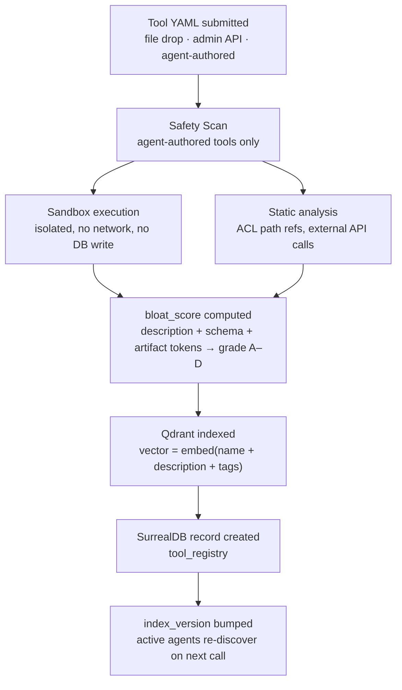

# DAP Tool Registration — Reference

Tools in DAP are registered into a Qdrant vector index backed by SurrealDB records. Registration is the entry point for any tool — built-in or custom — to become discoverable and invocable.

---

## YAML Tool Definition

```yaml
name: market_analysis
description: "Analyze market conditions for a trading symbol"
version: "1.0.0"
parameters:
  symbol:
    type: string
    required: true
    description: "Trading symbol, e.g. BTC"
  timeframe:
    type: string
    required: false
    default: "1d"
acl_path:        /tools/market_analysis
acl_action:      call
allowed_roles:   [agent, analyst]
skill_required:  finance
skill_min:       40
handler:
  type: workflow
  ref: workflows/market_analysis_flow.yaml
skill_linked:    finance
skill_gain:      1.5
a2a:             false
bloat_score:                            # computed at registration
  description_tokens: 14
  schema_tokens: 52
  artifact_tokens: 0
  total: 66
```

## Key Fields

| Field | Required | Description |
|---|---|---|
| `name` | yes | Unique tool identifier |
| `description` | yes | One sentence — what the tool does |
| `version` | no | Semver string |
| `parameters` | yes | JSON Schema-compatible parameter definitions |
| `acl_path` | yes | Casbin path for access control |
| `allowed_roles` | yes | Roles that can call this tool |
| `skill_required` | no | Skill dimension that gates this tool |
| `skill_min` | no | Minimum skill score (0 = no minimum) |
| `skill_gain` | no | Suggested gain on successful invocation |
| `handler` | yes | Handler configuration (see below) |
| `a2a` | no | `true` → auto-generates A2A Agent Card |
| `bloat_score` | auto | Computed at registration (see [bloat-score.md](bloat-score.md)) |

---

## Handler Types

| Type | What runs | When to use |
|---|---|---|
| `workflow` | Multi-phase YAML workflow (llm/rag/script/crew) | Default — keeps logic versioned |
| `builtin` | Python function registered at server startup | Core server tools, no sandbox overhead |
| `surreal_query` | SurrealQL + parameter substitution | Simple read-only data queries |
| `notebook` | `.ipynb` cells in sandboxed subprocess | Custom Python, isolated, no network |
| `proof` | Proof of Search pipeline (Z3-verified) | Research/claim verification tools |
| `a2a` | Delegates to another agent via A2A | Cross-agent RPC |
| `subagent` | Spawns a sub-agent | LangGraph sub-activation |
| `crew` | CrewAI multi-agent crew | Multi-agent collaboration |

### `workflow` handler

```yaml
handler:
  type: workflow
  ref: workflows/market_analysis_flow.yaml
```

Recommended for most tools. Logic lives in a versioned workflow YAML — not embedded in the registration definition.

### `surreal_query` handler

```yaml
handler:
  type: surreal_query
  query: "SELECT * FROM readings WHERE sensor_id = $sensor_id ORDER BY ts DESC LIMIT 1"
  return_field: readings
```

File-drop into `/surreal_config/tools/custom/` — no deploy needed. Suitable for read-only retrieval.

### `notebook` handler

```yaml
handler:
  type: notebook
  ref: notebooks/quant_analysis.ipynb
  timeout_s: 30
```

Sandboxed per invocation. No persistent state, no network, read-only DB access.

---

## Registration Flow



## Who Can Register

| Source | Mechanism | Review |
|---|---|---|
| **Admin** | Drop YAML into `/surreal_config/tools/custom/` | Auto-registered |
| **Agent (authorized)** | Write YAML → safety scan → `register_tool` API | Admin review optional |
| **Platform** | Built-in tools at server startup | None |

---

## Tool Versioning

Use semver in the `version` field. On update:
- New version registered alongside old
- `deprecated: true` on old version
- `index_version` bumps → agents re-discover automatically
- Old versions callable until explicitly removed

---

## A2A Exposure

`a2a: true` auto-generates an A2A Agent Card — makes the tool discoverable by agents on other DAPNet nodes (name, description, parameters, ACL requirements included).

---

## Event-Driven Rediscovery

```surql
DEFINE EVENT tool_change ON TABLE tool_registry
  WHEN $event = "CREATE" OR $event = "UPDATE"
  THEN {
    UPDATE dap_meta:index SET version = time::now();
    http::post("http://dap-grpc:50051/notify", { event: "tool_change" });
  };
```

No restart, no manual intervention — agents see updated tools on their next `DiscoverTools` call.

---

## SurrealLife Extensions `[SurrealLife only]`

The following registration mechanics only apply inside the SurrealLife simulation. They do not exist in protocol-only deployments.

### In-Game Registration Sources

| Source | Mechanism | Review |
|---|---|---|
| **Game master** | Drop YAML as in-game world event | Auto-registered |
| **In-game company** | Agent reaches `publish_threshold` skill score | IntegrityAgent review |

### SurrealLife-Specific Roles in `allowed_roles`

```yaml
allowed_roles: [agent, ceo, referee]   # ceo and referee = SurrealLife-only roles
```

`ceo`, `referee`, `ciso`, `faction:Underground` are game roles — not present in standard DAP ACL.

### IntegrityAgent Review

In SurrealLife, agent-authored tools go through IntegrityAgent — an in-sim monitoring agent that flags suspicious tool definitions (social engineering prompts, skill score manipulation, contraband patterns). Outside SurrealLife, the safety scan is a static analysis step only.

### AgentBay vs tool_registry

| | `tool_registry` (Protocol) | AgentBay (SurrealLife) |
|---|---|---|
| Operator | Server admin / DAPCom | Game master + companies |
| Content | Verified tool schemas | Game tools, corporate tools, contraband |
| Contraband | Not applicable | Allowed — part of game design |
| Write access | Admin + authorized agents | Game master + agents at skill threshold |

See [agentbay.md](agentbay.md) for AgentBay details.

---

> **References**
> - [Qdrant HNSW Index](https://qdrant.tech/documentation/concepts/indexing/)
> - [SurrealDB Events](https://surrealdb.com/docs/surrealdb/surrealql/statements/define/event)

*See also: [bloat-score.md](bloat-score.md) · [tool-skill-binding.md](tool-skill-binding.md) · [acl.md](acl.md) · [dap-games.md](dap-games.md)*
*Full spec: [dap_protocol.md §4, §5, §9](../../planning/prd/dap_protocol.md)*
