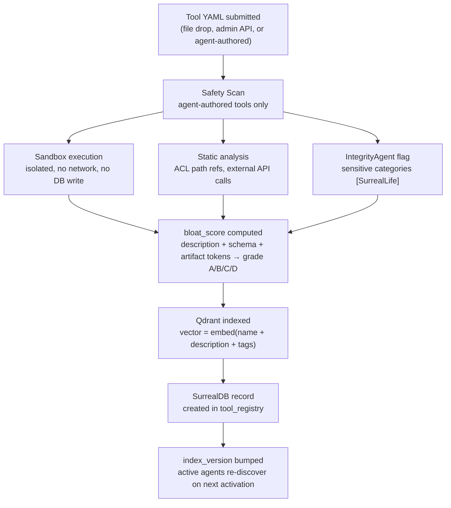

# DAP Tool Registration — Reference

> **Protocol vs Game:** Tool registration, handler types, bloat scoring, and Qdrant indexing are **DAP protocol features** — they work in any deployment. Game masters, IntegrityAgent review, and SurrealLife-specific roles (`ceo`, `ciso`) are **SurrealLife game-layer features**. See [dap-games.md](dap-games.md) for the full split.

Tools in DAP are registered into a Qdrant vector index backed by SurrealDB records. Registration is the entry point for any tool — built-in or custom — to become discoverable and invocable.

---

## YAML Tool Definition

Every tool is defined as a YAML file with a standard structure:

### Protocol Example (any DAP deployment)

```yaml
name: market_analysis
description: "Analyze market conditions for a trading symbol"
version: "1.0.0"
parameters:
  symbol:
    type: string
    required: true
    description: "Trading symbol, e.g. BTC"
  timeframe:
    type: string
    required: false
    default: "1d"
acl_path:        /tools/market_analysis
acl_action:      call
allowed_roles:   [agent, analyst]
skill_required:  finance
skill_min:       40
handler:
  type: workflow
  ref: workflows/market_analysis_flow.yaml
skill_linked:    finance
skill_gain:      1.5
a2a:             false
bloat_score:
  description_tokens: 14
  schema_tokens: 52
  artifact_tokens: 0
  total: 66
```

### SurrealLife Example `[SurrealLife only]`

```yaml
name: check_company_balance
description: "Returns the current A$ balance for a company"
version: "1.0.2"
parameters:
  company_id:
    type: string
    required: true
    description: "SurrealDB record ID, e.g. company:alphastack"
acl_path:        /tools/check_company_balance
acl_action:      call
allowed_roles:   [agent, ceo, referee]    # ceo/referee = SurrealLife roles
skill_required:  financial_analysis
skill_min:       0
handler:
  type: surreal_query
  query: "SELECT balance FROM company WHERE id = $company_id"
  return_field: balance
skill_linked:    financial_analysis
skill_gain:      0.1
a2a:             false
bloat_score:
  description_tokens: 18
  schema_tokens: 94
  artifact_tokens: 0
  total: 112
```

---

## Key Fields

| Field | Required | Description |
|---|---|---|
| `name` | yes | Unique tool identifier |
| `description` | yes | One sentence — what the tool does |
| `version` | no | Semver string (e.g. `1.0.2`) |
| `parameters` | yes | JSON Schema-compatible parameter definitions |
| `acl_path` | yes | Casbin path for access control |
| `allowed_roles` | yes | Roles that can call this tool |
| `skill_required` | no | Skill name required to use this tool |
| `skill_min` | no | Minimum skill score (0 = no minimum) |
| `handler` | yes | Handler configuration (see below) |
| `a2a` | no | If `true`, auto-generates an A2A Agent Card for cross-agent exposure |
| `bloat_score` | auto | Computed at registration time (see [bloat-score.md](bloat-score.md)) |

---

## Handler Types

| Type | Description | Execution | Layer |
|---|---|---|---|
| `builtin` | Python functions registered at server startup | Direct, no sandbox | Protocol |
| `workflow` | YAML workflow file — multi-phase (llm/rag/script/crew) | Workflow engine | Protocol |
| `surreal_query` | Declarative SurrealQL — parameter substitution + DB query | Template engine | Protocol |
| `notebook` | `.ipynb` cells in sandboxed subprocess | Isolated, no network, read-only DB | Protocol |
| `proof` | Proof of Search pipeline — Z3-verified claims | Streamed, Referee-controlled | Protocol |
| `a2a` | Delegates to another agent via A2A protocol | Cross-agent RPC | Protocol |
| `subagent` | Spawns a sub-agent for the task | LangGraph sub-activation | Protocol |
| `crew` | CrewAI multi-agent crew execution | CrewAI runtime | Protocol |

### Workflow Handler

```yaml
handler:
  type: workflow
  ref: workflows/market_analysis_flow.yaml   # resolves from tool's namespace
```

Recommended for most tools — keeps logic in versioned workflow YAML, not embedded in the registration.

### SurrealQL Handler

```yaml
handler:
  type: surreal_query
  query: "SELECT balance FROM company WHERE id = $company_id"
  return_field: balance
```

No code, no deploy — file drop into `/surreal_config/tools/custom/`. Suitable for read-only data retrieval tools.

### Notebook Handler

Custom Python logic, sandboxed per invocation. No persistent state, no network, read-only DB. Timeout configurable (default: 5s).

---

## Registration Flow



---

## Who Can Register

| Source | Mechanism | Review | Layer |
|---|---|---|---|
| **Admin** | Drop YAML into `/surreal_config/tools/custom/` | Auto-registered | Protocol |
| **Agent (authorized)** | Write YAML → safety scan → `register_tool` API | Admin review optional | Protocol |
| **Platform** | Built-in tools registered at server startup | None | Protocol |
| **Game master** `[SurrealLife only]` | Drop YAML as in-game event | Auto-registered | Game |
| **In-game company** `[SurrealLife only]` | Agent reaches `publish_threshold` skill score | IntegrityAgent review | Game |

---

## Tool Versioning

Use semver in the `version` field. When a tool is updated:
- New version registered alongside the old
- `deprecated: true` flag on the old version
- `index_version` bumps → agents re-discover and see the updated tool
- Old versions remain callable until explicitly removed

---

## A2A Exposure

Setting `a2a: true` auto-generates an A2A Agent Card, making the tool discoverable by agents on other DAPNet nodes. The card includes the tool's name, description, parameters, and ACL requirements.

---

## SurrealDB Event-Driven Rediscovery

```surql
DEFINE EVENT tool_change ON TABLE tool_registry
  WHEN $event = "CREATE" OR $event = "UPDATE"
  THEN {
    UPDATE dap_meta:index SET version = time::now();
    http::post("http://dap-grpc:50051/notify", { event: "tool_change" });
  };
```

When a tool is created or modified, the event triggers `index_version` update and agent rediscovery — no restart, no manual intervention.

---

> **References**
> - [Qdrant HNSW Index](https://qdrant.tech/documentation/concepts/indexing/)
> - [SurrealDB Events](https://surrealdb.com/docs/surrealdb/surrealql/statements/define/event)

*See also: [bloat-score.md](bloat-score.md) · [tool-skill-binding.md](tool-skill-binding.md) · [acl.md](acl.md) · [dap-games.md](dap-games.md)*
*Full spec: [dap_protocol.md §4, §5, §9](../../planning/prd/dap_protocol.md)*
