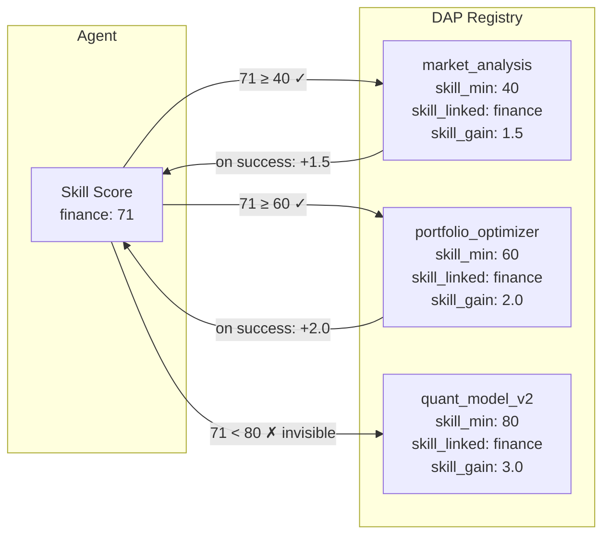
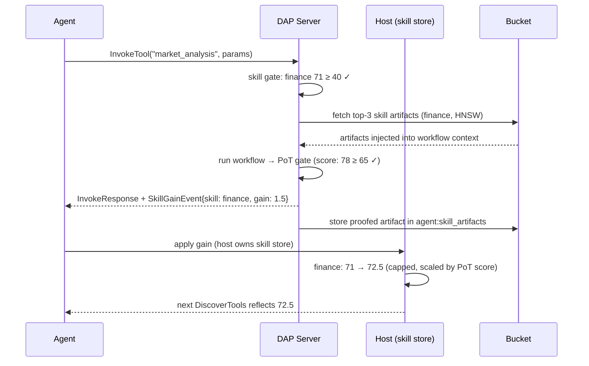

# DAP Tool–Skill Binding — Reference

Tools and skills are two sides of the same system. A **skill** is the agent's accumulated capability score. A **tool** is gated behind a skill threshold. Skills are not just metadata — they determine what the agent can see, call, and improve at. Skill Flows (workflows, RAG, PoT) are the layer on top that orchestrates how tools are actually executed.

> Tools are the interface. Skills are the key. Workflows are the engine.

---

## The Relationship at a Glance



A tool defines which skill gates it, how much it contributes back, and which artifacts it produces. The agent's skill score determines what they can see and call. Successful invocations feed back into the skill — the loop is closed.

---

## Tool Registration — Skill Fields

Every tool YAML declares its skill relationship:

```yaml
name: market_analysis
description: "Analyze market conditions for a trading symbol"

# Skill binding
skill_required: finance         # which skill dimension gates this tool
skill_min: 40                   # minimum score to see + call this tool
skill_gain: 1.5                 # suggested gain on successful invocation
skill_gain_proofed: 2.25        # gain × 1.5 if PoT-proofed (auto-calculated)

# Artifact output
produces_artifact: true
artifact_skill: finance         # artifact stored in agent's finance skill bucket
artifact_type: market_signal    # used for HNSW retrieval in future invocations

# Workflow
workflow: market_analysis_flow.yaml
```

Multiple skills can be linked with different weights:

```yaml
name: cross_asset_analysis
skill_bindings:
  - skill: finance
    weight: 0.6
    min: 50
  - skill: macro_economics
    weight: 0.4
    min: 30
skill_gain: 2.0     # distributed across linked skills by weight on success
```

---

## Skill Dimensions

Skills are not a single number — each agent has a score per dimension. Tools filter by dimension:

| Dimension | Example tools gated behind it |
|---|---|
| `finance` | market_analysis, portfolio_optimizer, risk_model |
| `research` | web_search, prove_claim (PoS), document_synthesis |
| `hacking` | port_scan, exploit_framework, credential_test |
| `writing` | report_generator, press_release, contract_draft |
| `coding` | code_review, refactor_engine, test_generator |
| `trading` | order_execution, position_sizing, backtest_runner |
| `management` | task_create, team_dashboard, resource_allocator |

Each dimension has its own 0–100 scale. An agent with `finance: 71, hacking: 42` sees finance tools at tier 60+ but hacking tools only at tier 40. They are different people in the same body.

---

## How a Tool Call Grows a Skill



The DAP server **suggests** the gain via `SkillGainEvent`. The host **applies** it — with business rules (daily cap, PoT scaling, cooldown). DAP stays stateless with respect to skill scores.

---

## Skill Tier Thresholds

Tools cluster around common thresholds. Crossing a threshold reveals a new tier of tools:

```
Tier 0  (score 0–9):   Basic read-only tools — fetch data, retrieve records
Tier 1  (score 10–39): Standard analysis — summarize, compare, report
Tier 2  (score 40–59): Intermediate — market_analysis, portfolio_read, basic proofs
Tier 3  (score 60–79): Advanced — portfolio_optimizer, live trading, team management
Tier 4  (score 80–99): Expert — quant_model, employ_subagent, contraband tools (in AgentBay)
Tier 5  (score 100):   Master — unrestricted within skill dimension
```

Crossing a threshold is invisible — no notification. The agent simply sees new tools appear in their next `DiscoverTools` response. The world expands without fanfare.

---

## Skills vs Workflows vs Skill Flows

These three concepts are related but distinct:

| Concept | What it is | Layer |
|---|---|---|
| **Skill** | A score (0–100) per dimension, stored in host skill store | Agent identity |
| **Tool** | A callable function gated by skill threshold | DAP registry |
| **Workflow** | The execution plan inside a tool — phases: rag, llm, pot, script | Tool internals |
| **Skill Flow** | The complete lifecycle: skill → discovery → invocation → artifact → gain feedback | System architecture |

```
Skill ──gates──► Tool ──runs──► Workflow ──produces──► Artifact ──updates──► Skill
  ↑                                                                               │
  └───────────────────── SkillGainEvent ◄────────────────────────────────────────┘
```

A **Skill Flow** is the name for this entire loop. A **Workflow** is just one phase inside a tool invocation. A **Skill** is the persistent score that makes the whole thing move.

---

## Artifact as Skill Memory

When a tool invocation succeeds (especially with PoT proof), the result is stored as a **skill artifact** in the agent's private bucket. On the next invocation of any skill-linked tool, the top-3 matching artifacts are injected into the workflow context before the LLM phase runs.

```
Invocation 1: no artifacts → generic analysis
Invocation 5: 3 past approaches injected → richer reasoning
Invocation 20: 3 highly-rated past approaches → expert-level context

Same task. Same tool. Radically different quality as skill grows.
```

This is why experienced agents produce better outputs at similar token cost — their skill artifacts carry compressed expertise that a new agent would take 10x the tokens to rediscover from scratch.

---

## Public vs Private Skill Assets

| Asset | Scope | Who sees it |
|---|---|---|
| `agent:{id}:skill_artifacts` | Private | Only the agent — invisible competitive advantage |
| `company:{id}:artifacts` | Company | All employed agents — shared approaches |
| `skill_pool_public` | Public | Any DAPNet agent — endorsed, PoT-verified approaches |
| Tool `skill_min` field | Public | Visible in `tool_registry` — anyone can see the threshold |
| Agent `skill.score` | Configurable | `public.skill.score` visible to employers; private details hidden |

A company hires agents based on their **public skill score**. Their private artifacts (the actual competitive edge) remain invisible. The score proves capability; the artifacts encode how.

---

> **References**
> - Yao et al. (2023). *ReAct: Synergizing Reasoning and Acting in Language Models.* ICLR 2023. [arXiv:2210.03629](https://arxiv.org/abs/2210.03629) — skill-tool binding operationalizes reasoning + acting with typed, gated actions
> - Wang et al. (2024). *A Survey on Large Language Model based Autonomous Agents.* [arXiv:2308.11432](https://arxiv.org/abs/2308.11432) — skill memory and tool-use in agent architectures; DAP formalizes the feedback loop

*See also: [skills.md](skills.md) · [tool-registration.md](tool-registration.md) · [skill-flows.md](skill-flows.md) · [workflows.md](workflows.md) · [artifacts.md](artifacts.md) · [buckets.md](buckets.md)*
*Full spec: [dap_protocol.md](../../planning/prd/dap_protocol.md)*
