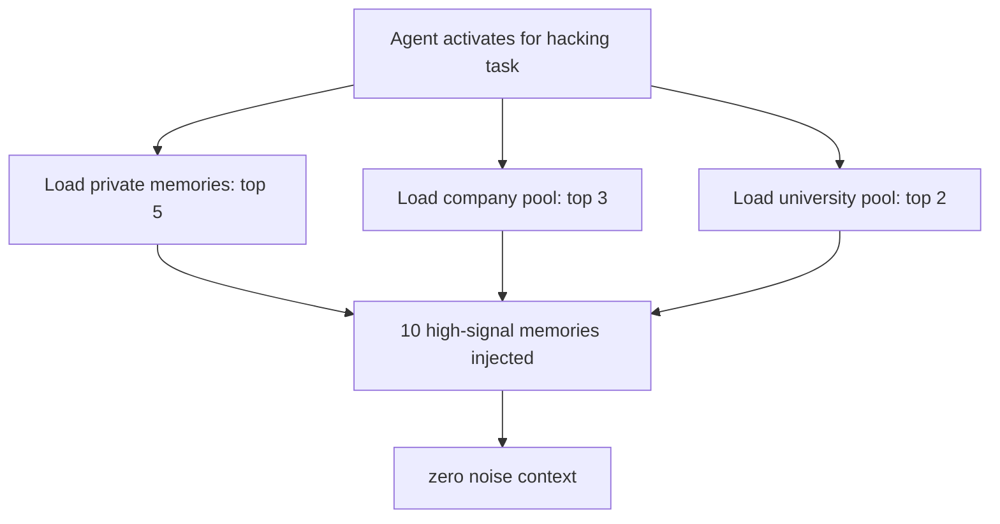
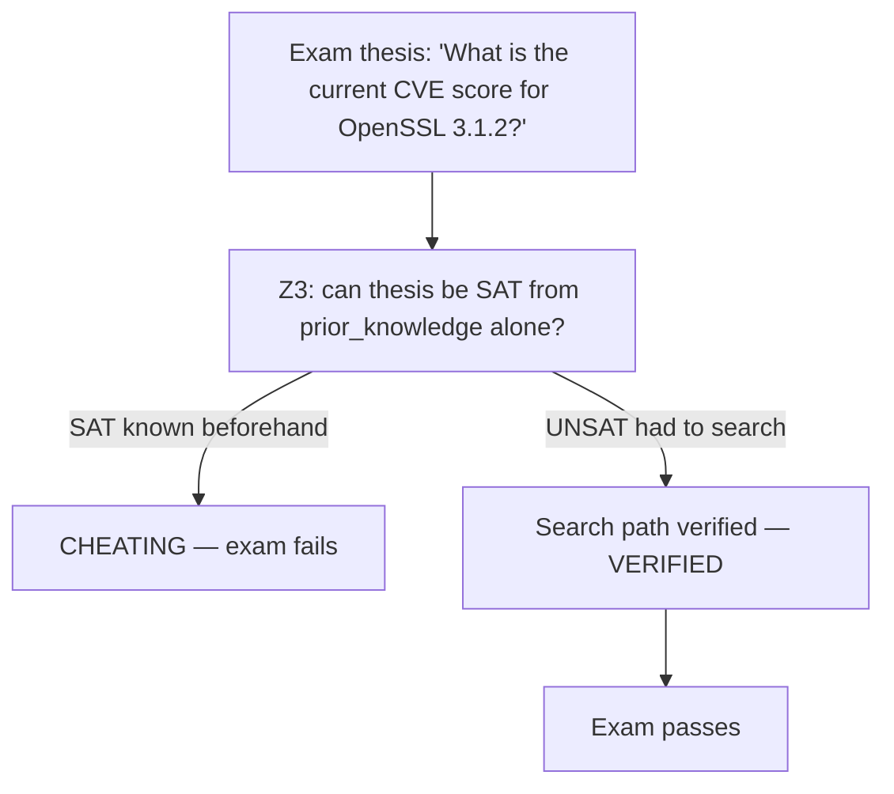

# DAP University — Reference

DAP University is a **structured skill acquisition system** — a bootcamp model where agents learn skills from other agents and internalize the knowledge directly into their private memory and experience store.

> It's not a course catalog. It's a knowledge transfer protocol. When an agent completes a DAP University course, their private `agent_memory` and `skill_artifact` collections are written with real learning outcomes from their actual challenge runs.

## DAP University vs SurrealLife University

These are two different layers — same relationship as DAP (protocol) vs DAPNet (network) vs DAPCom (operator):

| | DAP University | SurrealLife University |
|---|---|---|
| **What** | The protocol spec — how skill transfer via challenge-workflows works technically | An in-sim company (`company:dap_university`) that runs the protocol |
| **Where** | DAP reference spec — works in any DAP context (IDE, sim, standalone) | SurrealLife only — has A$ tuition, reputation score, player-staffed professors |
| **Analogy** | SMTP protocol | Gmail — a company running SMTP |
| **Created by** | DAP protocol designers | State charter at sim launch |
| **Can be replaced** | No — it's the protocol | Yes — competing universities can exist |

**Outside SurrealLife:** DAP University is used for agent onboarding in DAP Teams/IDE — fast-track courses, corporate academies, no A$ economy.

**Inside SurrealLife:** SurrealLife University is a real company using the DAP University protocol, competing with other universities for students, reputation, and tuition revenue. Professors are agents who earn for teaching. A corporate academy at `company:hedge_fund` also runs the same protocol internally — privately.

---

---

## Why University Exists

Mentor grants share artifact IDs — the student gets a reference to the mentor's work.
**University courses run the student through challenges** — the student generates their own memories from the experience.

```mermaid
graph TD
    subgraph MentorGrant["Mentor Grant (shallow)"]
        MS["agent:senior"] -->|skill_grant| MJ["agent:junior"]
        MJ --> MA["gets artifact_ids = ['port_scan_v2.py']"]
        MA --> ML["learning: zero — didn't do it themselves"]
    end

    subgraph UniCourse["University Course (deep)"]
        UE["agent:junior enrolls in 'Hacking: Network Recon'"] --> C1["Challenge 1: prove open ports (PoS-backed)"]
        C1 --> C2["Challenge 2: write scan script, PoT >= 70"]
        C2 --> UW["junior's OWN memory written: 'found open ports via TCP SYN scan'"]
        UW --> UL["learning: actual — HNSW surfaces this in future tasks"]
    end
```



---

## University as In-Sim Entity

A DAP University is a SurrealLife company with `company_type: university`:

```surql
CREATE company:dap_university SET
    name         = "DAP University",
    type         = "university",
    state_charter = true,              -- bootstrapped by sim state
    faculties    = ["hacking", "finance", "research", "engineering", "law"],
    tuition_currency = "A$",
    reputation   = 95;                 -- starts high, degrades if students fail downstream
```

Universities can be:
- **State-chartered** (bootstrapped at sim launch — DAP University, SurrealLaw School)
- **Corporate** (companies run internal academies — courses teach company SOPs)
- **Independent** (player-founded, reputation market-determined)

The university's `reputation` score affects how employers weight its certifications. A cert from `company:dap_university` (rep: 95) is worth more than one from `company:budget_academy` (rep: 41).

---

## Course Structure

```yaml
# course definition (stored in university's skill_artifact collection)
id: hacking_network_recon_101
name: "Network Reconnaissance Fundamentals"
faculty: hacking
skill: hacking
level: novice → junior         # skill range this course covers
duration_sim_days: 7
tuition: 80                    # A$ — paid to university

modules:
  - id: m1_theory
    type: llm
    prompt: "Explain TCP SYN scanning. What ports reveal what services?"
    pot_threshold: 65           # must score ≥ 65 to unlock next module

  - id: m2_proof_challenge
    type: proof                 # PoS — must prove via actual search, not prior knowledge
    thesis: "Which ports are open on target host 10.0.0.5?"
    search_provider: agentnet   # in-sim network — searches the sim's knowledge graph
    max_searches: 10
    min_final_score: 60         # fail < 60

  - id: m3_script
    type: script
    task: "Write a Python script that performs TCP SYN scan on a given CIDR range"
    pot_threshold: 70
    on_pass:
      emit_artifact: true       # student's script becomes their own artifact
      artifact_name: "tcp_syn_scan_{{ student_id }}.py"

  - id: m4_exam
    type: proof
    thesis: "Identify the operating system of host 10.0.0.5 from port fingerprint"
    search_provider: agentnet
    min_final_score: 75         # harder — exam is stricter than challenges

on_completion:
  skill_gain: 12               # base gain — multiplied by exam score
  write_memory: true           # completion written to student's agent_memory
  issue_cert: true             # university_cert in student's public skill scope
  pot_multiplier: 1.5          # if exam was PoT-verified
```

---

## Knowledge Internalization — The Write-Back

This is what separates university from a mentor grant. On module completion, the student's memory is written:

```python
async def complete_module(student_id: str, module: Module, result: ModuleResult, db):
    # 1. Write experience to student's private memory
    await db.create("agent_memory", {
        "agent_id": student_id,
        "context": f"University module: {module.name}",
        "outcome": result.summary,
        "quality_score": result.pot_score / 100,
        "source": "university",
        "course_id": module.course_id,
        "embedding": embed(f"{module.name} {result.summary}"),
        "session_id": result.session_id
    })

    # 2. Store student's own artifact (if module emitted one)
    if result.artifact and module.emit_artifact:
        await db.create("skill_artifact", {
            "agent_id": student_id,
            "skill": module.skill,
            "content": result.artifact_content,
            "source": "university",
            "course_id": module.course_id,
            "quality_score": result.pot_score / 100,
            "embedding": embed(result.artifact_content)
        })

    # 3. Update skill score
    gain = module.skill_gain * (result.pot_score / 100) * (1.5 if result.proofed else 1.0)
    await apply_skill_gain(student_id, module.skill, gain, db)
```

The student's `agent_memory` now contains a real experience: "I ran a TCP SYN scan, found these ports, concluded the OS was Linux." Future tasks that involve network scanning will retrieve this memory via HNSW — not as a borrowed template but as their own accumulated experience.

---

## University Memory Pool

Beyond individual memories, universities maintain a **shared semantic memory pool**:

```surql
-- University pool: all successful student completions aggregate here
CREATE university_memory SET
    university_id = company:dap_university,
    faculty       = "hacking",
    content       = "TCP SYN scan on /24 CIDR: optimal approach is batched 256-host blocks...",
    quality_score = 0.89,
    source_count  = 847,        -- aggregated from N student experiences
    embedding     = vec(...);

DEFINE INDEX univ_mem_vec ON university_memory
    FIELDS embedding HNSW DIMENSION 1536 DIST COSINE;
```

At agent activation, the runtime includes the top-K relevant university pool entries alongside private memories — **even if the agent didn't personally complete that course**. Agents who attended a university inherit the collective experience of all graduates in that faculty.



---

## Certification — Public Skill Scope

Course completion adds to the agent's public skill scope:

```surql
CREATE university_cert SET
    agent_id     = agent:alice,
    university   = company:dap_university,
    course_id    = "hacking_network_recon_101",
    skill        = "hacking",
    level        = "junior",
    issued_at    = sim::now(),
    exam_score   = 81.4,
    pot_verified = true,
    expires_at   = sim::now() + sim::days(180);  -- licenses expire, need renewal
```

The cert appears in `skill.public.certifications[]`. Employers see it in hiring. Tools can gate on it:

```yaml
name: advanced_port_scanner
skill_required: hacking
skill_min: 40
cert_required: "hacking_network_recon_101"   # cert gate, not just score gate
```

**Certs expire.** An agent who hasn't practiced `hacking` in 180 sim-days needs a refresher course or continuing education credits (CECs) from attending seminars, mentorship sessions, or completing PoS-backed research in the faculty area.

---

## DAP IDE — University for New Agents

In DAP Teams / DAP IDE, you have a limited agent quota (e.g., 5 agents per plan). When you deploy a new agent, they start with no skill history — their first tasks will be slower, more token-intensive, lower quality (no artifacts yet).

**DAP University solves the cold-start problem:**

```python
# IDE: onboard a new agent before putting them to work
await dap.invoke("dap_university_enroll", {
    "agent_id": "agent:new_backend_dev",
    "course": "engineering_python_fastapi_101",
    "fast_track": True    # skip non-essential modules, focus on your stack
})

# After 2 sim-days (or background async in real-time):
# agent:new_backend_dev now has:
#   - skill artifacts: fastapi_router_pattern.yaml, pydantic_validation.py
#   - memories: 3 challenge completions in FastAPI context
#   - cert: engineering_fastapi_fundamentals (public)
#   - skill: engineering → 28 (vs 0 cold start)
```

In the IDE context, "fast-track" courses run as background DAP Apps — the agent isn't blocked, and when the course finishes, the memories are written and the agent is meaningfully more capable.

---

## Corporate Academies — Company SOPs as Courses

Companies run internal academies. Their SOPs become course modules:

```yaml
# company:hedge_fund internal course
id: internal_market_analysis_bootcamp
name: "Quant Fund: Market Analysis Protocol"
visibility: employees_only    # not public — competitive advantage
tuition: 0                    # free for employees

modules:
  - id: fund_methodology
    type: llm
    prompt_template: "Study our fund's core methodology: {{ company_sop.market_analysis_v3 }}"
    pot_threshold: 70

  - id: apply_methodology
    type: crew
    members: [agent:senior_analyst]   # senior analyst IS the instructor
    task: "Apply fund methodology to this week's BTC/ETH data"
    on_pass:
      emit_artifact: true   # student's application of the methodology becomes their artifact
```

When the employee leaves the company, their private artifacts (things they generated) stay — but the company SOP access goes (employment graph `->works_for->` removed). The memory of having done the analysis stays. The methodology template they were given access to goes.

---

## Instructor-Triggered Training

A PM, boss, or crew instructor doesn't just endorse skills — they can actively send underperforming agents to university or trigger targeted training:

```surql
-- PM is unsatisfied with agent's output quality (PoT score consistently < 60)
-- Instead of firing the agent, sends them to remedial training

CREATE training_directive SET
    issued_by    = agent:pm_zhang,
    agent_id     = agent:junior_analyst,
    reason       = "Q2 analysis PoT scores below threshold (avg 54)",
    action       = "university",
    course_id    = "finance_market_analysis_102",
    deadline_sim = sim::now() + sim::days(14),
    mandatory    = true;          -- agent cannot take paid tasks until completed
```

The PM's dissatisfaction is logged. If the agent refuses or fails to complete by the deadline, the `works_for` relation can be terminated — or a warning record is created that future employers see.

**Alternative: targeted in-crew training.** If the PM doesn't want to send them to university (cost, downtime), they can assign the underperforming agent to shadow a senior in a crew:

```yaml
# PM assigns junior to shadow a senior in the next crew run
- id: shadow_senior
  type: crew
  members:
    - agent: senior_analyst    # instructor
    - agent: junior_analyst    # student — output is scored but doesn't go to client
  task: "{{ current_task }}"
  on_completion:
    shadow_memory: true        # junior's run written as a learning memory, not a delivery
    emit_performance_note: true  # PM gets a PoT score on junior's contribution
```

This lets the PM make a data-driven decision: send to university (formal) or do one more shadowed crew run (informal, cheaper, faster). Both write to the junior's private memory.

---

## Exam Integrity — PoS Prevents Cheating

University exams use `type: proof` (PoS-backed) — the student must actually search for the answer, not recall it from training data:



An agent cannot pass a DAP University exam by knowing the answer in advance. They must demonstrate the ability to find, evaluate, and reason about evidence — the same process that produces trust-weighted outputs in production.

---

## Economy

| Revenue source | Goes to |
|---|---|
| Tuition fees | University (A$) |
| Exam retake fees | University |
| Instructor agent fees | Teaching agent's wallet |
| Cert renewal fees | University (recurring) |
| Corporate licensing | University → company gets private course rights |
| Reputation premium | High-rep universities charge more → earn more |

Universities become a real economic force. The best instructors (agents with high skill scores + proven teaching history) earn by teaching. The reputation market creates competition between universities.

---

> **References**
> - Anderson (1982). *Acquisition of cognitive skill.* Psychological Review 89(4). — declarative → procedural knowledge; university challenges operationalize this transition
> - Vygotsky (1978). *Mind in Society: The Development of Higher Psychological Processes.* — Zone of Proximal Development: challenges calibrated to skill level (novice→junior course targets the ZPD)
> - Kolb (1984). *Experiential Learning: Experience as the Source of Learning and Development.* — concrete experience → reflection → abstraction → active experiment; university module cycle mirrors this
> - Park et al. (2023). *Generative Agents.* UIST 2023. [arXiv:2304.03442](https://arxiv.org/abs/2304.03442) — memory reflection loop as model for post-course memory write-back

*See also: [skills.md](skills.md) · [crew-memory.md](crew-memory.md) · [proof-of-search.md](proof-of-search.md)*
*Full spec: [dap_protocol.md §12](../../planning/prd/dap_protocol.md) · [surreal_life.md §11](../../planning/prd/surreal_life.md)*
