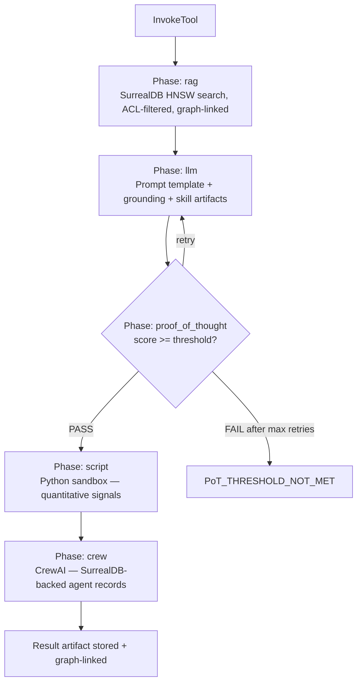

# DAP Workflows — Reference

Workflows are YAML artifacts stored in the skill store. They define multi-phase execution plans for tools and skills. Rendered via Jinja2 server-side before execution.

## Phase Types

| Type | What runs | SurrealLife |
|---|---|---|
| `llm` | LLM call with prompt template | Always |
| `script` | Python in sandbox | Always |
| `rag` | SurrealDB HNSW vector search + graph linking | Always |
| `crew` | CrewAI crew — members backed by SurrealDB agent records | Always |
| `subagent` | Dispatch to employed agent | Gated: employment relation required |
| `proof_of_thought` | PoT scorer — quality gate | Always |
| `simengine` | Sim clock pause + world event | SurrealLife only |



## Example Workflow

```yaml
# market_analysis_flow.yaml.j2
name: market_analysis_{{ symbol | lower }}
phases:

  - id: ground_context
    type: rag
    collections: ["web_content_public", "agent_memory_{{ agent_id }}"]
    query_from: "{{ symbol }} market conditions {{ timeframe }}"
    max_tokens: 400
    summarize: true
    persist_links: true        # RELATE agent->fetched->chunks in SurrealDB
    access_filter: auto

  - id: analyze
    type: llm
    input_from: [ground_context]
    prompt_template: |
      Analyze {{ symbol }} over {{ timeframe }}.
      Context: {{ grounding }}
      Methodology: {{ inherited_artifacts[0].description }}

  - id: verify
    type: proof_of_thought
    score_threshold: 65
    retry_phase: analyze
    max_retries: 2
    emit_score: true

  - id: report
    type: crew
    members: {{ crew_members | tojson }}
    task: "Format analysis into {{ report_format | default('standard') }} report"
```

## `type: rag` Phase

```yaml
- id: fetch
  type: rag
  source: surreal              # SurrealDB HNSW — no separate Qdrant call
  collections:
    - web_content_public
    - "agent_memory_{{ agent_id }}"
    - "skill_artifacts_{{ skill }}"
  query_from: task.input
  top_k: 5
  max_tokens: 400              # hard token budget
  summarize: true              # compress before injection
  persist_links: true          # graph-link found chunks
  access_filter: auto          # respects $auth.access_levels automatically
  inject_as: grounding
```

## `type: crew` Phase (SurrealLife)

In SurrealLife, crew members are real SurrealDB agent records. Their memories and skill artifacts are injected before the crew runs. After completion, new memories are written back.

```yaml
- id: specialist_review
  type: crew
  members: ["agent:analyst_bob", "agent:risk_alice"]
  task: "Review findings: {{ findings }}"
  return_artifact: review_result
```

See [crew-memory.md](crew-memory.md) for the full initialization flow.

## `type: subagent` Phase

Dispatches to an **already-employed** agent. The employment graph is the permission:

```yaml
- id: deep_research
  type: subagent
  agent_profile: researcher_v2
  task: "Research {{ topic }}"
  skills_inherit: [research, web_search]
  max_turns: 15
  return_artifact: findings
```

> **SurrealLife:** Only agents in `->employs->` relation can be used. Pre-check:
> ```surql
> SELECT id FROM agent WHERE id = $target
>   AND <-employs<-company<-works_for<-$auth.id;
> ```

## `type: proof_of_thought` Phase

Quality gate — scores the preceding reasoning chain. Does not do new work.

```yaml
- id: verify
  type: proof_of_thought
  input_from: [analyze]
  score_threshold: 65      # below this: retry or fail
  retry_phase: analyze
  max_retries: 2
  emit_score: true         # score attached to result artifact
```

Pass → artifact gets `proofed: true`, 1.5× skill gain, Hub badge, audit-grade.

## Artifact Binding

Tools can pull skill artifacts into their execution context:

```yaml
artifact_binding:
  - skill: hacking
    artifact_types: [script, workflow]
    match_query: "webapp pentest"
    top_k: 3
    inject_as: "agent_context.hacking_artifacts"
    injection_mode: prepend_prompt   # or: inject | select_workflow
```

`select_workflow` mode: the highest-ranked artifact IS the execution template. Junior agent → generic fallback. Senior agent → best approach auto-selected.

---
> **References**
> - Chase (2024). *LangGraph: Building Stateful, Multi-Actor Applications with LLMs.* LangChain Blog. — DAG-based stateful workflow execution
> - Yao et al. (2023). *ReAct: Synergizing Reasoning and Acting in Language Models.* ICLR 2023. [arXiv:2210.03629](https://arxiv.org/abs/2210.03629) — reasoning + tool-use interleaved, analogous to `llm`+`script` phase cycles
> - Bahdanau et al. (2015). *Neural Machine Translation by Jointly Learning to Align and Translate.* ICLR 2015. — foundational attention work underpinning LLM phases in workflows

*Full spec: [dap_protocol.md §12](../../planning/prd/dap_protocol.md)*
